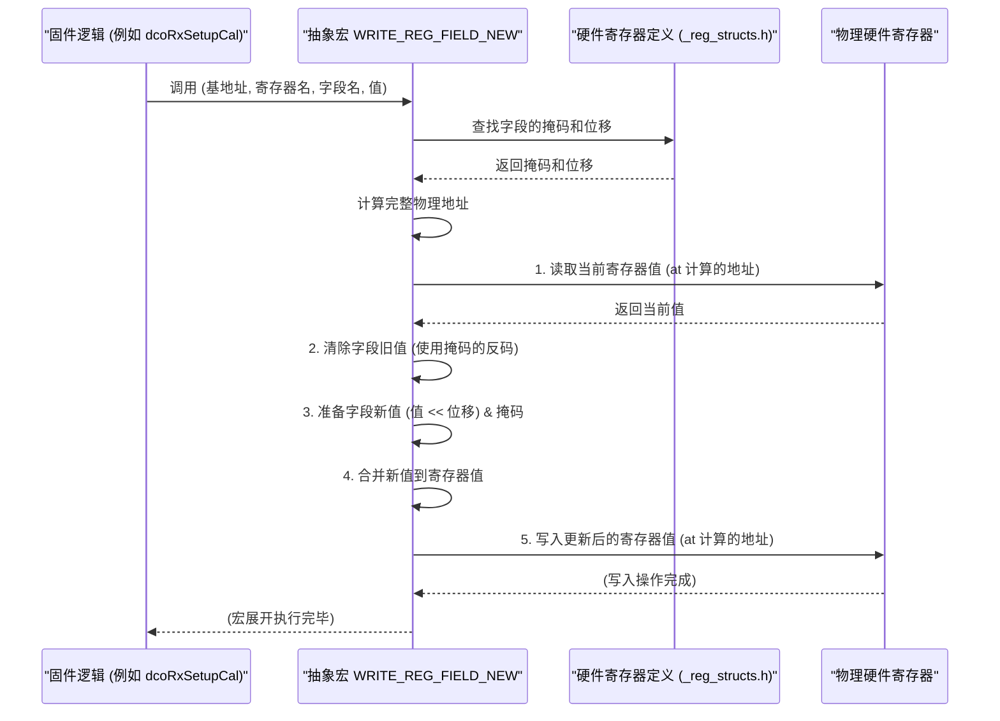

# Chapter 6: 硬件抽象与控制函数


欢迎来到 `source` 项目固件教程的第六章！在上一章 [信道估计 (Channel Estimation)](05_信道估计__channel_estimation__.md) 中，我们学习了固件如何通过状态机来分析信号传输路径的特性，获取信道抽头。我们看到了像 `rxControl_ReadChnEstReq()` 或 `rxControl_SetChnEstEnInd()` 这样的函数被调用来与硬件交互。但是，这些 `rxControl_` 或 `pmdLaneRxControl_` 之类的函数究竟是如何与硬件的“神经末梢”——那些微小的寄存器——进行对话的呢？

本章，我们将揭开这层神秘的面纱，深入了解**硬件抽象与控制函数**。它们是固件与硬件寄存器之间至关重要的桥梁。

## 6.1 为什么要用“遥控器”操作硬件？

想象一下，你家里的电视机。你想调高音量时，你会拿起遥控器，按下“音量+”按钮。你不需要知道电视机内部哪个芯片的哪个引脚需要接收什么样的电信号才能把音量调高。遥控器为你封装了这些复杂的细节。

在固件开发中，我们也需要类似的“遥控器”。固件需要频繁地与硬件的各种**寄存器 (Registers)** 打交道。寄存器是硬件芯片内部的一些特殊存储单元，通过读取或写入这些单元的值，固件可以控制硬件的行为（比如启动一个模块、设置一个参数）或获取硬件的状态（比如一个操作是否完成、一个传感器的读数是多少）。

如果我们直接在代码的各个角落使用原始的内存地址来读写这些寄存器，会怎么样呢？

*   **代码像天书**：到处都是 `*(volatile unsigned int *)0x40012004 = 0x01;` 这样的“魔法数字”，可读性极差。几个月后，连你自己都可能看不懂这行代码是在干什么。
*   **容易出错**：记错一个地址，或者写错一个位操作，都可能导致硬件行为异常，而且这种错误很难排查。
*   **维护噩梦**：如果硬件设计发生变化，寄存器地址或布局改变了，你就需要在成百上千行代码中找到所有相关的直接访问点进行修改，费时费力还容易遗漏。
*   **移植性差**：如果想把固件移植到稍微不同的硬件平台上，几乎所有的硬件访问代码都得重写。

**硬件抽象与控制函数 (Hardware Abstraction and Control Functions)** 就是为了解决这些问题而生的。它们将底层的、具体的寄存器地址和位操作封装起来，提供了一套更高级、更易于理解和使用的函数接口（通常是C预处理器宏或者内联函数的形式）。

就像汽车的仪表盘和控制杆一样（这个比喻在概念描述中提到过），驾驶员（固件逻辑）不需要了解引擎内部复杂的机械运作，只需要操作这些标准化的接口（硬件抽象函数），就能安全、有效地控制汽车（硬件）。

## 6.2 核心概念解析

让我们来认识一下与硬件抽象相关的几个核心概念：

### 6.2.1 硬件寄存器 (Hardware Registers)

这是硬件芯片内部的特殊内存位置。每个寄存器都有一个唯一的地址。通过向这些地址写入特定的数据位（0或1），或者从这些地址读取数据位，固件可以控制硬件模块的功能或获取其状态。例如，一个寄存器可能控制着某个LED灯的开关，另一个寄存器可能存储着温度传感器的最新读数。

### 6.2.2 寄存器基地址 (Register Base Address) 与偏移量 (Offset)

通常，一块相关的硬件模块（比如一个串口控制器或一个定时器）的所有寄存器会位于一块连续的内存地址区域。这块区域的起始地址被称为**基地址**。模块内的每个具体寄存器则通过相对于基地址的**偏移量**来唯一定位。
例如，如果一个模块的基地址是 `0x40000000`，它的第一个寄存器（控制寄存器）偏移量是 `0x00`，第二个寄存器（状态寄存器）偏移量是 `0x04`，那么它们对应的绝对地址就是 `0x40000000` 和 `0x40000004`。

### 6.2.3 位域 (Bit Fields)

一个硬件寄存器通常是32位或16位宽。但往往我们不需要用满所有的位来控制一个功能。因此，一个寄存器经常被划分为多个**位域**。每个位域由一个或多个连续的位组成，用于控制一个特定的子功能或表示一个特定的状态。
例如，一个32位控制寄存器中：
*   第0位可能用于使能/禁用模块。
*   第1-3位可能用于选择工作模式。
*   第8-15位可能用于设置一个超时门限。

操作位域时，需要进行精确的位运算（如位与、位或、位移），以确保只修改目标位域而不影响寄存器中的其他位。

### 6.2.4 抽象层 (Abstraction Layer)

这就是我们讨论的“遥控器”。它是一系列精心设计的函数或宏，将直接的地址访问和复杂的位操作细节隐藏起来。固件的其他部分通过调用这些抽象函数来与硬件交互，而无需关心底层的寄存器地址、偏移量和位域结构。

### 6.2.5 C预处理器宏 (C Preprocessor Macros) 与内联函数 (Inline Functions)

硬件抽象层通常大量使用C预处理器宏或内联函数来实现。
*   **宏**：在编译预处理阶段，宏会被文本替换。它们可以创建出类似函数调用的接口，但没有函数调用的开销，执行效率高。
*   **内联函数**：建议编译器将函数体直接嵌入到调用处，也旨在减少函数调用开销。

选择它们的原因是，硬件控制操作通常对性能非常敏感，这些机制有助于在提供抽象的同时保持高效率。

## 6.3 如何使用硬件抽象函数？

在 `source` 项目中，你会看到许多用于读写硬件寄存器的宏。这些宏通常定义在一些通用的头文件中（比如 `common.h` 或特定于硬件架构的头文件），而寄存器的具体结构、地址和位域则定义在像 `_reg_structs.h` 这样的文件中（例如 `rx_clk_mb_reg_structs.h`，`tx_reg_structs.h`）。

让我们看几个常见的例子，它们都来自我们之前章节中接触过的代码。

### 6.3.1 写入整个寄存器：`WRITE_REG_ADDR`

有时候，我们需要向一个完整的寄存器写入一个值。`WRITE_REG_ADDR` 宏就用于此目的。

在 [PMD层请求与状态机](03_pmd层请求与状态机_.md) 中，我们看到 `pmd_cm.c` 的 `configCmPowerUpCmdSequence` 函数中会配置上电命令序列：
```c
// 来自 pmd_cm.c (简化片段)
// vStartRegAddr 是命令序列配置寄存器的起始地址
// vAddrOfst 是当前寄存器相对于起始地址的偏移
// vRegVal 是要写入的32位值
WRITE_REG_ADDR(vStartRegAddr + vAddrOfst, vRegVal);
```
这行代码的意思是：
*   计算出目标寄存器的完整物理地址 (`vStartRegAddr + vAddrOfst`)。
*   将 `vRegVal` 这个32位的值直接写入到该地址。
*   这就像直接设置一个控制旋钮到某个精确的刻度。

### 6.3.2 读取整个寄存器：`READ_REG`

类似地，如果我们想读取一个寄存器中的所有位，可以使用 `READ_REG` 宏。

在 [信道估计 (Channel Estimation)](05_信道估计__channel_estimation__.md) 中，`runChannelEstimationAlgo` 函数在初始化时会获取抽头系数寄存器的基地址：
```c
// 来自 chn_est.c (简化片段)
// vpChannelEstFsm->mCoeffReg 被赋值为 RX__STATUS99 寄存器的地址
// RX_REG_BASE 是RX模块寄存器的基地址
// RX__STATUS99 是一个特定状态寄存器的标识符（通常是偏移量或结构体成员）
vpChannelEstFsm->mCoeffReg = (struct tChannelEstReg_t*)&READ_REG(RX_REG_BASE, RX__STATUS99);
```
这里的 `READ_REG(RX_REG_BASE, RX__STATUS99)` 实际上是获取 `RX_REG_BASE + RX__STATUS99_OFFSET` 地址处的值，然后通过 `&` 取其地址。这里的用法比较特殊，主要是为了得到寄存器地址。更常见的 `READ_REG` 用法是直接获取其值：
```c
// 假设我们要读取一个名为 RX_HW_VERSION 的寄存器
uint32_t hardware_version;
hardware_version = READ_REG(RX_REG_BASE, RX_HW_VERSION); // 读取硬件版本寄存器的值
```

### 6.3.3 写入寄存器的特定位域：`WRITE_REG_FIELD_NEW`

这是最常用也最能体现抽象优势的操作之一。我们常常只需要修改一个寄存器中的几个特定位（一个位域），而不希望影响其他位。

在 [时钟调理校准 (Clk Cond Cal)](04_时钟调理校准__clk_cond_cal__.md) 中，`dcoRxSetupCal` 函数（来自 `dco.c`）配置DCO时，有多处使用了这个宏：
```c
// 来自 dco.c (dcoRxSetupCal 函数片段)
// 作用：将 RX_CLK_MB_REG_BASE 基地址下的 RX_CLK_MB__RX_CLK_MBOX45 寄存器中
//       名为 RXCLK_DCO_OUT_EN 的位域设置为 0 (禁用DCO输出)
WRITE_REG_FIELD_NEW(RX_CLK_MB_REG_BASE, RX_CLK_MB__RX_CLK_MBOX45, RXCLK_DCO_OUT_EN, 0);

// 作用：将同一个寄存器中，名为 RXCLK_DCO_SEED_LSB 的位域设置为 aSeedLsb 的值
WRITE_REG_FIELD_NEW(RX_CLK_MB_REG_BASE, RX_CLK_MB__RX_CLK_MBOX45, RXCLK_DCO_SEED_LSB, aSeedLsb);
```
参数解析：
*   `RX_CLK_MB_REG_BASE`: 目标硬件模块（RX时钟邮箱）的寄存器基地址。
*   `RX_CLK_MB__RX_CLK_MBOX45`: 具体的寄存器名或其在模块内的唯一标识。这通常对应于一个结构体成员或一个已定义的偏移量。
*   `RXCLK_DCO_OUT_EN` / `RXCLK_DCO_SEED_LSB`: 要操作的位域的名称。这些名称在相关的 `_reg_structs.h` 文件中定义了它们的位位置和长度（掩码）。
*   `0` / `aSeedLsb`: 要写入到位域的值。

这个宏会自动处理：找到寄存器地址 -> 读取当前值 -> 清除目标位域 -> 将新值移位并设置到目标位域 -> 写回寄存器。你完全不需要操心这些位运算细节。

### 6.3.4 读取寄存器的特定位域：`READ_REG_FIELD_NEW`

与写入对应，我们也可以只读取一个寄存器中特定位域的值。

在 [时钟调理校准 (Clk Cond Cal)](04_时钟调理校准__clk_cond_cal__.md) 的辅助部分，`tdcRxRead` 函数（来自 `tdc.c`）在等待TDC测量完成时，会读取一个状态位：
```c
// 来自 tdc.c (tdcRxRead 函数片段)
// 作用：读取 RX_REG_BASE 基地址下的 RX__STATUS78 寄存器中
//       名为 TDC1_MEAS_DONE 的位域的值。
// 如果 TDC1_MEAS_DONE 位是 0，表示测量未完成。
if (READ_REG_FIELD_NEW(RX_REG_BASE, RX__STATUS78, TDC1_MEAS_DONE) == 0)
{
    return false; // 测量未完成，下次再来
}
```
参数与 `WRITE_REG_FIELD_NEW` 类似，只是最后一个参数是用于接收读取到的值的（对于 `if` 语句，是直接比较）。这个宏会：找到寄存器地址 -> 读取完整寄存器值 -> 提取目标位域的值（通过掩码和移位） -> 返回该位域的值。

使用这些抽象宏的好处是显而易见的：
*   **代码更清晰**：`WRITE_REG_FIELD_NEW(..., RXCLK_DCO_OUT_EN, 0)` 比一堆神秘的地址和位操作要容易理解得多。
*   **减少错误**：宏内部封装了正确的位操作逻辑，减少了手动编写时出错的可能。
*   **易于维护**：如果某个位域的位置变了，只需要修改 `_reg_structs.h` 文件中该位域的定义，所有使用该宏的地方都会自动更新，无需改动上层逻辑代码。

## 6.4 内部实现：遥控器是如何工作的？

这些方便的宏是如何将我们的高级指令转换成底层硬件操作的呢？让我们来看一下它们大致的内部工作原理。

### 6.4.1 宏的工作流程（非代码视角）

以 `WRITE_REG_FIELD_NEW(BASE, REG, FIELD, VALUE)` 为例，当你调用它时，大致会发生以下步骤：

1.  **计算地址**：宏首先需要确定目标寄存器的确切内存地址。它会结合 `BASE`（基地址）和 `REG`（寄存器标识，可能是一个偏移量或结构体成员的相对位置）来计算出完整的物理地址。
2.  **获取位域信息**：宏需要知道 `FIELD`（位域名称）在这个寄存器中的具体位置：
    *   它的**偏移量/起始位 (Shift/Offset)**：从寄存器的最低位（第0位）算起，这个位域从第几位开始。
    *   它的**掩码 (Mask)**：一个二进制数，用来选中这个位域包含的所有位，其他位为0。例如，如果一个位域是第4到第7位，它的掩码可能是 `0b11110000` (或者 `0xF0`)。
    这些信息（偏移量、掩码）通常是通过 `FIELD` 这个名称，从 `_reg_structs.h` 文件中的定义间接获得的。
3.  **读取-修改-写入 (Read-Modify-Write)**：
    a.  **读取 (Read)**：通过计算出的完整地址，读取当前寄存器的32位（或16位）值。这一步是为了保留寄存器中其他不相关的位域的值。
    b.  **清除旧值 (Clear)**：将读取到的值与 `FIELD` 掩码的反码（NOT Mask）进行“与”(`&`)运算。这样，目标位域对应的位都会被清零，其他位保持不变。
        `current_value = current_value & (~FIELD_MASK);`
    c.  **准备新值 (Prepare)**：将要写入的 `VALUE` 左移 `FIELD_SHIFT` 位，使其对齐到目标位域的位置。然后与 `FIELD_MASK` 进行“与”(`&`)运算，确保 `VALUE` 不会溢出到其他位域。
        `field_value_to_write = (VALUE << FIELD_SHIFT) & FIELD_MASK;`
    d.  **合并 (Combine)**：将上一步处理过的 `current_value`（目标位域已清零）与 `field_value_to_write` 进行“或”(`|`)运算。这样新的位域值就被合并到寄存器值中了。
        `new_register_value = current_value | field_value_to_write;`
    e.  **写入 (Write)**：将这个 `new_register_value` 写回到计算出的完整寄存器地址。
4.  **完成**：宏的“工作”到此结束。

`READ_REG_FIELD_NEW` 的流程类似，但不涉及写入：
1.  计算地址。
2.  获取位域信息（偏移量、掩码）。
3.  读取寄存器的完整值。
4.  将读取到的值右移 `FIELD_SHIFT` 位，使目标位域的最低位对齐到第0位。
5.  将移位后的结果与一个只包含目标位域长度的1的掩码（例如，如果位域宽4位，掩码是 `0b1111`）进行“与”(`&`)运算，以提取出位域的纯净值。
6.  返回这个提取出的值。

`WRITE_REG_ADDR` 和 `READ_REG` 更简单，它们主要就是计算地址，然后直接进行指针解引用写入或读取。

### 6.4.2 简化序列图

下面是一个简化的序列图，展示了调用 `WRITE_REG_FIELD_NEW` 时固件逻辑、抽象宏和硬件之间的大致交互：


这个图强调了宏如何利用预先定义的寄存器结构信息来执行精确的读改写操作。

### 6.4.3 深入代码：宏是如何定义的？

这些宏（如 `WRITE_REG_FIELD_NEW`）通常在一些公共头文件中定义，例如 `common.h` 或者针对特定处理器架构的头文件。它们的具体实现会利用C预处理器的强大功能。

虽然我们不直接展示这些宏的完整、复杂定义（因为它们可能相当长且依赖于其他辅助宏），但我们可以理解其核心思想。

一个**高度简化**的 `WRITE_REG_ADDR` 宏可能看起来像这样：
```c
// 极度简化的 WRITE_REG_ADDR 概念
// #define WRITE_REG_ADDR(ADDRESS, VALUE) (*(volatile uint32_t*)(ADDRESS) = (VALUE))

// 示例调用 (来自 pmd_cm.c)
// WRITE_REG_ADDR(vStartRegAddr + vAddrOfst, vRegVal);
// 展开后可能类似于:
// (*(volatile uint32_t*)(vStartRegAddr + vAddrOfst) = (vRegVal));
```
解释：
*   `#define` 是C预处理器定义宏的关键字。
*   `ADDRESS` 和 `VALUE` 是宏的参数。
*   `*(volatile uint32_t*)(ADDRESS)`：
    *   `(ADDRESS)`: 获取传入的地址。
    *   `(volatile uint32_t*)`: 将这个地址强制类型转换为一个指向“易变的32位无符号整数”的指针。`volatile` 关键字告诉编译器不要对这个内存地址的访问进行优化（比如缓存到CPU寄存器），因为它的值可能在程序控制之外被硬件改变。
    *   `*`: 解引用这个指针，即访问该内存地址处的内容。
*   `= (VALUE)`: 将 `VALUE` 赋给该内存地址。

对于 `WRITE_REG_FIELD_NEW(BASE, REG_DEF, FIELD_DEF, VALUE)`，其定义会更复杂，因为它需要从 `REG_DEF` 和 `FIELD_DEF` 中提取出寄存器偏移、字段掩码和字段位移。这些通常也由其他辅助宏或 `_reg_structs.h` 文件中的 `enum` 或 `#define` 提供。

例如，在 `rx_clk_mb_reg_structs.h` 文件中，对于 `RX_CLK_MB__RX_CLK_MBOX45` 寄存器中的 `RXCLK_DCO_OUT_EN` 字段，可能会有类似这样的定义（具体语法可能因工具而异）：
```c
// 概念性示例，非真实代码
// #define RX_CLK_MB__RX_CLK_MBOX45_OFFSET 0x50  // 假设 MBOX45 寄存器相对于基地址的偏移
// #define RXCLK_DCO_OUT_EN_MASK   0x00000001    // 假设此字段只占1位 (第0位)
// #define RXCLK_DCO_OUT_EN_SHIFT  0             // 假设此字段从第0位开始
```
然后 `WRITE_REG_FIELD_NEW` 宏内部会使用这些 `_OFFSET`、`_MASK` 和 `_SHIFT` 定义来执行之前描述的读-修改-写操作。

`_NEW` 后缀的宏（如 `WRITE_REG_FIELD_NEW`）通常表示它们是设计来与基于结构体的寄存器定义一起工作的。这些 `_reg_structs.h` 文件（例如 `rx_reg_structs.h`, `tx_mb_reg_structs.h`）会使用C结构体来精确描述每个硬件寄存器的布局，包括其中的每个位域。

例如，一个寄存器可能被定义为一个结构体：
```c
// 概念性示例，来自想象中的 _reg_structs.h
typedef union {
    uint32_t U; // 整个32位寄存器
    struct {
        uint32_t DCO_OUT_EN : 1;  // 位域，占1位
        uint32_t DCO_CRS    : 5;  // 位域，占5位
        uint32_t DCO_SEED_LD: 1;  // 位域，占1位
        uint32_t DCO_SEED_LSB: 8; // 位域，占8位
        // ... 其他位域 ...
    } B; // 按位域访问
} RX_CLK_MBOX45_t;
```
然后，`WRITE_REG_FIELD_NEW` 这类宏可能会被设计成能够直接操作这些结构体成员，使得代码更加类型安全和易读，例如通过 `REG_ACCESS->REG_DEF.B.FIELD_DEF = VALUE;` 这样的形式（经过宏的巧妙转换）。

**总结一下**：硬件抽象与控制函数（主要是宏）通过封装直接的内存地址访问和复杂的位操作，提供了一层易于使用、可读性强且不易出错的接口。它们依赖于详细定义的寄存器基地址、偏移量、位域掩码和位移量，这些通常在专门的头文件中（如 `_reg_structs.h`）维护。

这种抽象是现代嵌入式固件开发的基石，它使得固件逻辑能够更专注于实现功能，而不是纠缠于繁琐的底层硬件细节。

## 6.5 总结

在本章中，我们一起探索了**硬件抽象与控制函数**的奥秘。我们学习到：

*   **为什么需要抽象**：直接操作硬件寄存器地址和位域会导致代码难以阅读、维护和移植，且容易出错。硬件抽象层通过提供封装好的接口解决了这些问题。
*   **核心概念**：理解了硬件寄存器、基地址、偏移量、位域以及抽象层在此扮演的角色。
*   **如何使用**：我们看到了 `WRITE_REG_ADDR` (写整个寄存器), `READ_REG` (读整个寄存器), `WRITE_REG_FIELD_NEW` (写特定位域), 和 `READ_REG_FIELD_NEW` (读特定位域) 等宏在实际固件代码中的应用。
*   **内部工作原理**：通过分析这些宏（尤其是位域操作宏）的“读取-修改-写入”流程，以及它们如何利用预定义的寄存器结构信息（来自 `_reg_structs.h` 文件），我们了解了它们是如何将高级指令转换为精确的硬件操作的。
*   **带来的好处**：提高了代码的可读性、可维护性和可靠性，并有助于平台移植。

这些硬件抽象函数就像是固件的“双手”，让上层逻辑能够精确而安全地操控硬件的各个部分。无论是 [时钟调理校准 (Clk Cond Cal)](04_时钟调理校准__clk_cond_cal__.md) 中的DCO配置，还是 [信道估计 (Channel Estimation)](05_信道估计__channel_estimation__.md) 中对硬件状态的读取，都离不开这些底层的“积木”。

现在我们知道了固件是如何与硬件进行基本通信的。但是，许多操作（比如校准）都需要精确的时间控制，或者在执行某个步骤后等待一段时间。固件是如何实现这些定时和延时功能的呢？

在下一章 [定时与延时工具](07_定时与延时工具_.md) 中，我们将学习固件中用于处理时间相关的工具和函数。

---

Generated by [AI Codebase Knowledge Builder](https://github.com/The-Pocket/Tutorial-Codebase-Knowledge)