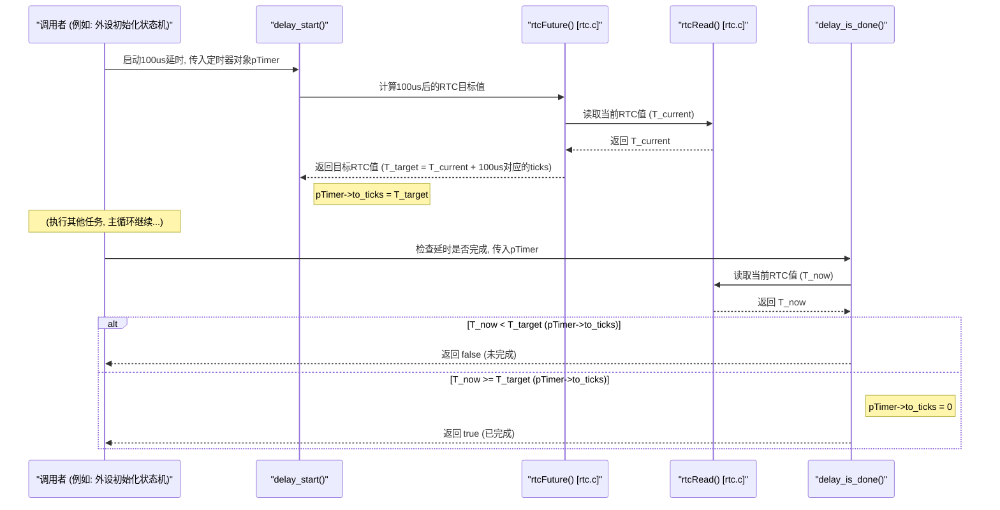

# Chapter 7: 定时与延时工具


在上一章 [硬件抽象与控制函数](06_硬件抽象与控制函数_.md) 中，我们了解了固件是如何通过抽象函数来与硬件寄存器交互的。我们已经知道，固件可以精确地控制硬件的每一个细节。但是，许多硬件操作并不是瞬间完成的。比如，我们可能需要给一个模块上电后等待它稳定，或者在执行一系列命令时，每条命令之间需要特定的时间间隔。固件是如何实现这些精确的“等待”和“按时行动”的功能呢？

这就是本章要向大家介绍的**定时与延时工具**。它们就像我们日常生活中的秒表和闹钟，让固件程序能够“把握时间”。

## 7.1 把握时机：为什么需要定时与延时？

想象一下你正在厨房里用微波炉热一杯牛奶。你把牛奶放进去，关上门，然后设置好加热时间，比如“1分钟”。按下启动按钮后，微波炉就开始工作了。你不会一直守在微波炉旁边盯着它，而是可能会去做点别的事情，比如准备麦片。你会时不时地听一下，或者看一下时间，直到微波炉发出“叮”的一声，告诉你牛奶热好了。

在固件的世界里，很多硬件操作也和热牛奶类似：
*   **启动外设**：比如给一个传感器上电后，它可能需要几十微秒甚至几毫秒才能稳定下来并准备好工作。
*   **硬件通信**：与外部芯片通信时，可能需要在发送一个命令后等待一小段时间，才能接收响应。
*   **时序控制**：某些硬件需要按照严格的时序规范来操作，比如在设置某个寄存器位后，必须等待几个时钟周期才能设置另一个位。

如果固件在发出指令后不进行适当的等待，就直接执行下一步操作，很可能会因为硬件尚未准备好而导致错误或失败。**定时与延时工具**就是为了解决这个问题而存在的。它们允许固件：

*   **精确等待**：在执行某个操作后，暂停一段时间。
*   **周期执行**：每隔一段时间执行一次某个任务。

这确保了硬件有足够的时间完成其任务，或者满足特定的时序要求，从而保证整个系统的稳定和可靠。

## 7.2 核心概念解析

在我们深入了解这些工具如何使用之前，先来认识几个核心概念：

### 7.2.1 实时计数器 (RTC - Real-Time Counter)

我们固件的心脏里有一个非常精确的“时钟”——CPU的**实时计数器 (RTC)**。它是一个特殊的硬件计数器，从CPU上电启动开始，就不停地以一个恒定的速率（通常是CPU的主频）进行计数。你可以把它想象成一个永远不会停歇的秒表，忠实地记录着从开机到现在一共经过了多少个“时钟滴答声”（ticks）。

这个RTC是固件中所有定时和延时功能的基础。我们所有的“等待XX微秒”或“XX毫秒后执行”都是基于这个RTC的计数值来实现的。

### 7.2.2 轮询式延时 (Polled Delay)

这是我们固件中最常用的一种延时方式。它的工作方式有点像你等公交车：

1.  你想等待一段时间，比如100微秒。
2.  你启动一个“延时定时器”，告诉它你的目标是在100微秒之后（就像你知道公交车大概什么时候到）。
3.  然后，你的程序并不会傻傻地一直卡在那里。在主控制循环的每次迭代中，它会回来“看一眼”这个定时器，问：“时间到了吗？”（就像你时不时看一下公交站台的显示屏）。
4.  一旦定时器说“时间到了！”，你的程序就可以继续执行之前因等待而暂停的任务了。

这种方式的好处是，在等待的时候，CPU并没有完全“卡死”，它仍然可以响应主控制循环中的其他模块的请求（比如处理另一个通道的紧急事件）。我们称这种延时为**非阻塞 (non-blocking)** 延时，因为它不会阻塞整个系统的运行。

### 7.2.3 阻塞式延时 (Blocking Delay)

有时候，我们需要非常短暂但极其精确的延时，而且在这段延时期间，我们不希望CPU分心去做任何其他事情。这时就会用到**阻塞式延时**。它就像你设定一个10秒倒计时的闹钟，然后你就一直盯着秒针走完这10秒，期间什么也不干。

这种延时会“阻塞”CPU，使其无法处理其他任务。因此，它通常只用于非常短的、对时序要求极为严格的场景，比如在写入某个硬件寄存器后，需要确保几个时钟周期的稳定时间。

### 7.2.4 CPU时钟频率 (CPU Clock Frequency)

RTC计数的是“时钟滴答声”（ticks），但我们程序员更习惯用微秒 (µs) 或毫秒 (ms) 这样的时间单位。要在这两者之间进行转换，固件必须知道CPU的时钟频率。CPU时钟频率告诉我们CPU每秒钟能产生多少个“滴答声”，单位通常是兆赫兹 (MHz)。例如，如果CPU频率是100MHz，那就意味着每秒有1亿个滴答声，每个滴答声就是10纳秒。

固件会使用这个频率信息将我们指定的微秒数转换成RTC需要计数的滴答数。

## 7.3 如何使用定时与延时工具？

现在我们来看看在 `source` 项目中，这些定时和延时工具是如何被使用的。

### 7.3.1 非阻塞延时：`delay_start` 与 `delay_is_done`

这是实现非阻塞延时的标准组合，它们定义在 `delay.c` 文件中。我们经常在状态机中使用它们。

**场景**：假设我们正在初始化一个外部设备。在给设备上电后，我们需要等待100微秒，确保设备内部电路稳定后才能进行下一步配置。

我们可以这样实现：

```c
// 假设我们有一个外设初始化的状态机变量
// typedef enum {
//     PERIPH_STATE_IDLE,
//     PERIPH_STATE_POWER_ON,
//     PERIPH_STATE_WAIT_STABLE,
//     PERIPH_STATE_CONFIG,
//     PERIPH_STATE_DONE
// } PeriphInitState_t;
// static PeriphInitState_t gPeriphState = PERIPH_STATE_IDLE;

// 需要一个 tDelayTimer_t 类型的变量来管理延时
static tDelayTimer_t gDeviceStableTimer;

// 在某个周期性调用的初始化函数中：
void initialize_peripheral_task() {
    switch (gPeriphState) {
        case PERIPH_STATE_IDLE:
            // ...准备工作...
            gPeriphState = PERIPH_STATE_POWER_ON;
            break;

        case PERIPH_STATE_POWER_ON:
            // 执行给外设上电的操作
            // set_peripheral_power(true); // 假设的函数
            // log_event("外设已上电"); // 示意

            // 启动一个100微秒的延时，等待设备稳定
            delay_start(&gDeviceStableTimer, 100); // 单位是微秒
            gPeriphState = PERIPH_STATE_WAIT_STABLE;
            break;

        case PERIPH_STATE_WAIT_STABLE:
            // 检查延时是否结束
            if (delay_is_done(&gDeviceStableTimer)) {
                // 100微秒延时已到，设备应该稳定了
                // log_event("外设稳定延时完成"); // 示意
                gPeriphState = PERIPH_STATE_CONFIG;
            }
            // 如果 delay_is_done() 返回 false，说明时间还没到
            // 这个函数本次调用就会结束，主循环会继续，下次再来检查
            break;

        case PERIPH_STATE_CONFIG:
            // ...执行配置外设的操作...
            // log_event("外设配置完成"); // 示意
            gPeriphState = PERIPH_STATE_DONE;
            break;

        case PERIPH_STATE_DONE:
            // 初始化完成
            break;
    }
}
```

**代码解释**：
*   我们首先定义了一个状态机 `gPeriphState` 和一个 `tDelayTimer_t` 类型的定时器变量 `gDeviceStableTimer`。这个结构体（定义在 `delay.h` 中）用来存储延时的状态。
*   在 `PERIPH_STATE_POWER_ON` 状态，我们给外设上电后，调用 `delay_start(&gDeviceStableTimer, 100)`。这会告诉系统：“请帮我启动一个100微秒的计时器，并把它的状态记录在 `gDeviceStableTimer` 里。”
*   然后状态切换到 `PERIPH_STATE_WAIT_STABLE`。
*   在 `PERIPH_STATE_WAIT_STABLE` 状态，每次 `initialize_peripheral_task` 函数被（主循环）调用时，它都会执行 `delay_is_done(&gDeviceStableTimer)` 来检查计时器是否到期。
    *   如果 `delay_is_done()` 返回 `true`，说明100微秒已经过去，我们就可以进入下一个状态 `PERIPH_STATE_CONFIG`。
    *   如果返回 `false`，说明时间还没到，这个 `switch` 语句会结束，`initialize_peripheral_task` 函数也可能随之返回。主控制循环会继续执行其他任务，并在下一轮再次调用 `initialize_peripheral_task`，再次检查 `delay_is_done()`。
*   这就是非阻塞延时的工作方式：**启动计时，然后周期性检查，等待期间不阻塞其他任务**。

### 7.3.2 取消延时：`delay_cancel`

如果我们启动了一个延时，但在延时结束前，由于某种原因（比如收到一个中止命令），我们不再需要这个延时了，这时就可以使用 `delay_cancel()`。

```c
// 假设在 PERIPH_STATE_WAIT_STABLE 状态时，我们收到了一个外部中止信号
// if (gPeriphState == PERIPH_STATE_WAIT_STABLE && check_abort_signal()) {
//     delay_cancel(&gDeviceStableTimer); // 取消之前启动的稳定延时
//     log_event("外设初始化被中止"); // 示意
//     gPeriphState = PERIPH_STATE_IDLE; // 或者某个错误状态
// }
```
`delay_cancel()` 会将定时器标记为无效，这样 `delay_is_done()` 就不会错误地在未来某个时间点返回 `true`。

### 7.3.3 短时阻塞延时：`waitX2ApbClks`

`waitX2ApbClks` 函数（定义在 `utility.c`）用于实现非常短的、基于APB总线时钟周期的阻塞式延时。APB总线通常用于连接一些低速外设，其时钟频率可能远低于CPU主频。

**场景**：在通过 [硬件抽象与控制函数](06_硬件抽象与控制函数_.md) 写入某个寄存器后，硬件手册规定需要等待至少8个APB时钟周期，新的配置才能生效。

```c
// 假设 SOME_FEATURE_CTRL_REG 是一个控制寄存器
// 假设 ENABLE_BIT 是其中一个位域
// WRITE_REG_FIELD_NEW(MODULE_BASE, SOME_FEATURE_CTRL_REG, ENABLE_BIT, 1);

// 等待 2^3 = 8 个APB时钟周期
// 参数 3 表示指数，即延时 2 的 3 次方个 APB 时钟周期
waitX2ApbClks(3);

// printf("特性已启用，并精确等待了8个APB时钟周期。\n"); // 示意
// 现在可以继续执行依赖于此配置的操作了
```
**代码解释**：
*   `waitX2ApbClks(3)` 会使CPU暂停执行，精确地等待 `2^3 = 8` 个APB时钟周期。
*   在这期间，CPU不会做其他事情。由于这种延时非常短（通常是纳秒或微秒级别），并且用于满足严格的硬件时序，所以这种阻塞是可以接受的。

### 7.3.4 带延时的循环：`delayLoop`

`delayLoop` 函数（定义在 `utility.c`）是一个非常方便的工具，它允许你周期性地执行一个回调函数，并在每次执行之间插入一个非阻塞的延时，直到回调函数指示任务完成。

**场景**：我们需要轮询检查某个硬件标志位，看一个异步操作是否已完成。我们不希望一直快速轮询浪费CPU资源，而是希望每隔50微秒检查一次。

```c
// 首先，我们需要一个回调函数，它返回 true 表示条件满足，false 表示未满足
static bool check_operation_complete_status() {
    // return (READ_REG_FIELD_NEW(HW_STATUS_REG_BASE, STATUS_REG, OPERATION_DONE_FLAG) == 1);

    // 为了演示，我们让它在被调用几次后返回true
    static int s_op_check_count = 0;
    s_op_check_count++;
    if (s_op_check_count >= 5) {
        // printf("操作完成标志被检测到!\n"); // 示意
        s_op_check_count = 0; // 重置以便下次使用
        return true; // 操作完成
    }
    // printf("等待操作完成 (第 %d 次检查)...\n", s_op_check_count); // 示意
    return false; // 操作未完成
}

// 需要为 delayLoop 定义一个状态机变量
static tDelayLoop_t gOperationCheckFsm;
// static bool gIsOperationFinished = false; // 一个标志，表示操作是否最终完成

// 在某个任务函数中（会被主循环周期性调用）
void monitor_operation_task() {
    if (!gIsOperationFinished) {
        // 调用 delayLoop，传入状态机变量、回调函数和延时间隔（50微秒）
        bool vNowDone = delayLoop(&gOperationCheckFsm, check_operation_complete_status, 50);

        if (vNowDone) {
            // printf("delayLoop报告任务完成!\n"); // 示意
            gIsOperationFinished = true;
            // 在这里可以执行操作完成后的处理逻辑
        }
        // 如果 vNowDone 是 false，说明回调还没返回true，或者正在延时中
        // monitor_operation_task 函数会返回，等待主循环下次调用
    }
}
```
**代码解释**：
*   `tDelayLoop_t gOperationCheckFsm;` 定义了 `delayLoop` 内部状态机所需的数据结构。
*   `delayLoop(&gOperationCheckFsm, check_operation_complete_status, 50)` 的含义是：
    *   使用 `gOperationCheckFsm` 来管理状态。
    *   重复调用 `check_operation_complete_status()` 函数。
    *   如果该函数返回 `false`，则等待50微秒后再次调用它。
    *   这个过程会一直持续，直到 `check_operation_complete_status()` 返回 `true`。
    *   当回调函数返回 `true` 时，`delayLoop` 本身也会返回 `true`。
*   `delayLoop` 本身也是非阻塞的。在等待50微秒期间，或者在回调函数执行时，它不会阻塞主循环。

## 7.4 内部实现：定时器是如何运转的？

现在我们来看看这些定时和延时工具在底层是如何与RTC硬件协作的。

### 7.4.1 RTC模块 (`rtc.c`)：时间之源

RTC模块是所有时间相关功能的基础。

*   **`rtcInit()` - 初始化RTC**
    这个函数必须在固件启动的早期被调用（通常在 `main()` 函数的开头，如我们在 [主控制循环与请求处理](02_主控制循环与请求处理_.md) 中看到的）。

    ```c
    // 来自 rtc.c
    static uint32_t gCpuClkFreq = 0; // 全局变量，存储CPU时钟频率 (MHz)

    void rtcInit(void)
    {
        // 启用RTC硬件，并取消其复位状态
        // AUX_RTC_CTRL 是ARC处理器中RTC控制寄存器的地址/标识
        // _sr 是一个特殊的ARC汇编指令，用于写入辅助寄存器 (Set Register)
        _sr(1, AUX_RTC_CTRL);

        // 从PMD控制层获取CPU的实际时钟频率 (单位: MHz)
        // 这个频率对于后续将“滴答数”转换为微秒至关重要
        gCpuClkFreq = pmdControl_GetCpuClkFreq();
    }
    ```
    **解释**：
    1.  `_sr(1, AUX_RTC_CTRL)`: 这条指令直接操作硬件，将值 `1` 写入到名为 `AUX_RTC_CTRL` 的RTC控制寄存器中。通常，写入 `1` 会使能RTC并让它开始计数。
    2.  `gCpuClkFreq = pmdControl_GetCpuClkFreq()`: 获取CPU的时钟频率（比如200MHz），并保存在全局变量 `gCpuClkFreq` 中。这个值在后续将RTC的“滴答数”转换成我们常用的时间单位（如微秒）时会用到。

*   **`rtcRead()` - 读取当前RTC计数值**
    这个函数返回RTC当前的64位计数值。

    ```c
    // 来自 rtc.c
    uint64_t rtcRead(void)
    {
        uint64_t vRtcVal;
        uint32_t vRtcCtrl;

        // 原子地读取64位实时计数器
        // RTC计数值通常由两个32位寄存器组成 (高位和低位)
        // 为防止读取过程中发生翻转导致数据不一致，需要一种原子读取机制
        // 这里的do-while循环是ARC处理器推荐的原子读取RTC的方式
        do
        {
            vRtcVal = _lr(AUX_RTC_LOW); // _lr 读取低32位 (Load Register)
            vRtcVal |= ((uint64_t)_lr(AUX_RTC_HIGH) << 32); // 读取高32位并合并
            vRtcCtrl = _lr(AUX_RTC_CTRL); // 再次读取控制寄存器
        } while (!(vRtcCtrl & 0x80000000)); // 检查控制寄存器的某个标志位，确保读取稳定

        return vRtcVal;
    }
    ```
    **解释**：
    由于RTC是一个64位的计数器，但在32位架构的CPU上，可能需要分两次读取（一次低32位，一次高32位）。为了防止在两次读取之间RTC的值发生变化（尤其是低位翻转到高位时），这里采用了一个循环读取的机制，直到RTC控制寄存器中的一个特定状态位（`0x80000000` 位）表明刚刚读取的高低位组合是稳定和一致的。

*   **`rtcFuture(uint32_t aDelay)` - 计算未来的RTC计数值**
    这个函数计算从当前时刻起，经过 `aDelay` 微秒后，RTC应该达到的计数值。

    ```c
    // 来自 rtc.c
    // aDelay 的单位是微秒 (us)
    uint64_t rtcFuture(uint32_t aDelay)
    {
        // 当前RTC计数值 + (延时微秒数 * CPU频率MHz)
        // 因为 gCpuClkFreq 的单位是 MHz (百万次/秒),
        // 所以 aDelay (us) * gCpuClkFreq (滴答/us) = 总共需要的滴答数
        return rtcRead() + (uint64_t)aDelay * cpuFreq(); // cpuFreq() 返回 gCpuClkFreq
    }
    ```
    **解释**：
    计算公式是：`当前RTC值 + (aDelay_us * CPU频率_MHz)`。
    例如，如果CPU频率是200MHz，那么1微秒对应200个RTC滴答。如果要延时100微秒，那么就需要增加 `100 * 200 = 20000` 个滴答。`rtcFuture` 就是用当前RTC值加上这个增量。

*   **`rtcElapsed(uint64_t aStartValue)` - 计算经过的时间**
    这个函数不直接用于延时，但可用于测量某段代码执行了多长时间。

    ```c
    // 来自 rtc.c
    // aStartValue 是过去某个时间点的RTC计数值
    uint64_t rtcElapsed(uint64_t aStartValue)
    {
        uint64_t elapsedCycles = rtcRead() - aStartValue; // 计算经过的RTC滴答数
        return elapsedCycles / cpuFreq(); // 将滴答数转换为微秒
    }
    ```

### 7.4.2 轮询式延时模块 (`delay.c`)：非阻塞等待的实现者

`delay.c` 中的函数利用了 `rtc.c` 提供的功能来实现非阻塞延时。

*   **`delay_start(tDelayTimer_t *const delay, uint32_t aTargetTimeInUs)`**

    ```c
    // 来自 delay.c
    // tDelayTimer_t 结构体定义通常在 delay.h 中:
    // typedef struct tDelayTimer
    // {
    //     uint64_t to_ticks; // 存储延时结束时，RTC应该达到的目标计数值
    // } tDelayTimer_t;

    void delay_start(tDelayTimer_t *const delay, uint32_t aTargetTimeInUs)
    {
        // 调用 rtcFuture() 计算出 aTargetTimeInUs 微秒之后RTC的目标计数值
        // 并将这个目标值存储在传入的 delay 结构体的 to_ticks 成员中
        delay->to_ticks = rtcFuture(aTargetTimeInUs);
    }
    ```
    **解释**：当调用 `delay_start` 时，它只是简单地计算出“未来”那个时间点的RTC计数值，并将其保存在用户提供的 `tDelayTimer_t` 结构中。它本身不进行任何等待。

*   **`delay_is_done(tDelayTimer_t *const delay)`**

    ```c
    // 来自 delay.c
    bool delay_is_done(tDelayTimer_t *const delay)
    {
        uint64_t timer_ticks = rtcRead(); // 获取当前的RTC计数值

        // 如果 to_ticks 为0，说明定时器未启动或已被取消/用过，直接认为完成
        if (delay->to_ticks == 0) return 1; // true

        // 比较当前RTC值与存储的目标RTC值
        if (timer_ticks >= delay->to_ticks)
        {
            delay->to_ticks = 0; // 时间已到，清零目标值，表示此定时器已“消费”
            return 1; // true, 延时完成
        }

        return 0; // false, 延时未完成
    }
    ```
    **解释**：当调用 `delay_is_done` 时，它会读取当前的RTC值，并与之前 `delay_start` 时存入 `delay->to_ticks` 的目标值进行比较。如果当前值已经达到或超过目标值，就说明延时结束了。为了防止一个已完成的定时器在后续的 `delay_is_done` 调用中仍然返回 `true`，一旦延时完成，它会把 `delay->to_ticks` 清零。

*   **`delay_cancel(tDelayTimer_t *const delay)`**

    ```c
    // 来自 delay.c
    void delay_cancel(tDelayTimer_t *const delay)
    {
        // 取消定时器最简单的方法就是将其目标计数值清零
        // 这样下次调用 delay_is_done 时，如果to_ticks是0，会直接返回true（已完成）
        // 或者如果之前未到期，由于to_ticks变为0，timer_ticks >= 0 也会成立（如果 timer_ticks 非0）
        // 实际代码中，delay_is_done 会先检查 to_ticks 是否为0
        delay->to_ticks = 0;
    }
    ```
    **解释**：取消一个延时定时器就是将其内部存储的目标RTC计数值 `to_ticks` 设为0。这样，`delay_is_done` 在检查时就会认为这个定时器（如果之前未启动或已完成）是“已完成”状态。

下面是一个序列图，展示了非阻塞延时的工作流程：


### 7.4.3 `waitX2ApbClks(uint16_t aCycles)` (`utility.c`)：忙等待的实现

这个函数通过一个精确计数的循环来实现阻塞延时。

```c
// 来自 utility.c
void waitX2ApbClks(uint16_t aCycles) // aCycles 是2的幂的指数
{
    uint32_t vI;    // 循环计数器

    // 循环次数为 2^aCycles
    for (vI = 0; vI < (1UL << aCycles); vI++)
    {
        // 调用 pmdControl_GetCycleCount()
        // 这个函数本身可能是读取某个硬件计数器，或者执行一些耗时固定的操作
        // 其目的是让单次循环体消耗掉大约一个APB时钟周期的时间
        // 通过重复这个操作，就实现了指定数量的APB时钟周期的延时
        pmdControl_GetCycleCount(); // 读寄存器以消耗时间
    }
}
```
**解释**：
这是一个**忙等待 (busy-wait)** 循环。CPU会一直执行 `pmdControl_GetCycleCount()` 这个操作，直到循环结束。`pmdControl_GetCycleCount()` 可能是读取一个CPU内部的周期计数器或其他能引入微小固定延时的操作。通过精确控制循环次数，就可以达到近似于 `2^aCycles` 个APB时钟周期的延时。由于它占用了CPU，所以只适合非常短的延时。

### 7.4.4 `delayLoop(tDelayLoop_t* apFsm, bool (*aCallback)(), uint32_t aDelayUs)` (`utility.c`)：状态机与延时的结合

`delayLoop` 巧妙地将一个简单的两状态状态机与我们之前学到的 `delay_start` 和 `delay_is_done` 结合起来。

```c
// 来自 utility.c (结构简化，枚举值可能不同)
// tDelayLoop_t 结构体 (通常在 utility.h 或对应的头文件中)
// typedef enum eDelayLoopState_Internal {
//     DELAY_LOOP_STATE_EXECUTE_CALLBACK,
//     DELAY_LOOP_STATE_WAIT_DELAY
// } eDelayLoopState_Internal_t;
//
// typedef struct tDelayLoop
// {
//     eDelayLoopState_Internal_t mState; // 存储内部状态
//     tDelayTimer_t mTimer;             // 内嵌一个非阻塞延时定时器
// } tDelayLoop_t;

bool delayLoop(tDelayLoop_t* apFsm, bool (*aCallback)(), uint32_t aDelayUs)
{
    bool vDone = false; // 标记整个delayLoop是否完成
    switch (apFsm->mState)
    {
        case eDelayLoopState_Run: // 对应上面的 DELAY_LOOP_STATE_EXECUTE_CALLBACK
        {
            vDone = aCallback(); // 执行用户提供的回调函数
            if (!vDone) { // 如果回调函数说“还没完事呢”
                delay_start(&apFsm->mTimer, aDelayUs);   // 启动一个 aDelayUs 微秒的延时
                apFsm->mState = eDelayLoopState_Wait;    // 切换到等待延时状态
            }
            // 如果回调返回true (vDone为true)，则整个delayLoop完成
            break;
        }

        case eDelayLoopState_Wait: // 对应上面的 DELAY_LOOP_STATE_WAIT_DELAY
        {
            if (delay_is_done(&apFsm->mTimer)) { // 检查延时是否结束
                apFsm->mState = eDelayLoopState_Run; // 延时结束，切换回执行回调状态
                                                     // 注意：此时vDone仍为false，
                                                     // 下次调用delayLoop时会再次执行回调
            }
            // 如果延时未结束，vDone仍为false，函数直接返回
            break;
        }

        default: // 首次调用或状态异常时，强制进入执行回调状态
        {
            apFsm->mState = eDelayLoopState_Run;
            break;
        }
    }
    return vDone; // 只有当回调函数返回true时，vDone才为true
}
```
**解释**：
`delayLoop` 的核心就是一个两状态（`eDelayLoopState_Run` 和 `eDelayLoopState_Wait`）的状态机。
1.  初始或从等待延时结束后，进入 `eDelayLoopState_Run` 状态。在此状态下，它执行用户传入的 `aCallback` 函数。
2.  如果 `aCallback` 返回 `true`，表示任务完成，`delayLoop` 也返回 `true`。
3.  如果 `aCallback` 返回 `false`，表示任务尚未完成，`delayLoop` 就会调用 `delay_start` 来启动一个 `aDelayUs` 的延时，并将状态切换到 `eDelayLoopState_Wait`。然后 `delayLoop` 返回 `false`。
4.  在 `eDelayLoopState_Wait` 状态，`delayLoop` 会调用 `delay_is_done` 来检查延时是否到期。
5.  如果延时未到期，`delayLoop` 返回 `false`。
6.  如果延时到期，它会将状态切换回 `eDelayLoopState_Run`，然后返回 `false`。这样，在下一次 `delayLoop` 被调用时，就会再次执行 `aCallback`。

这个机制确保了回调函数会以大约 `aDelayUs` 的间隔被重复调用，直到它返回 `true`，并且整个过程是非阻塞的。

## 7.5 总结

在本章中，我们学习了固件中用于实现精确时间控制的**定时与延时工具**：

*   **RTC (实时计数器)** 是所有定时功能的基础，它提供了一个高精度的硬件时间基准。固件通过 `rtcInit` 初始化它，通过 `rtcRead` 读取当前计数值，并通过 `rtcFuture` 结合CPU频率来计算未来特定时间的计数值。
*   **轮询式非阻塞延时** (`delay_start`, `delay_is_done`, `delay_cancel`) 是最常用的延时方式。它允许固件在等待期间继续处理其他任务，非常适合在状态机中使用。
*   **短时阻塞延时** (`waitX2ApbClks`) 用于需要CPU暂停执行、满足严格硬件时序的极短延时。
*   **带延时的循环工具** (`delayLoop`) 提供了一个便捷的非阻塞方式，用于以固定时间间隔重复调用一个检查函数，直到条件满足。

我们现在知道了固件是如何精确地控制时间，以及如何利用这些工具来协调与硬件的交互。但是，在固件的复杂运行过程中，可能会发生各种各样的事件，有些是正常的流程指示，有些可能是错误或需要注意的警告。为了方便开发人员调试问题、追踪系统状态，固件需要一种能够记录这些关键事件的机制。

在下一章 [事件日志记录](08_事件日志记录_.md) 中，我们将一起探索固件是如何实现这一重要的日志功能的。

---

Generated by [AI Codebase Knowledge Builder](https://github.com/The-Pocket/Tutorial-Codebase-Knowledge)