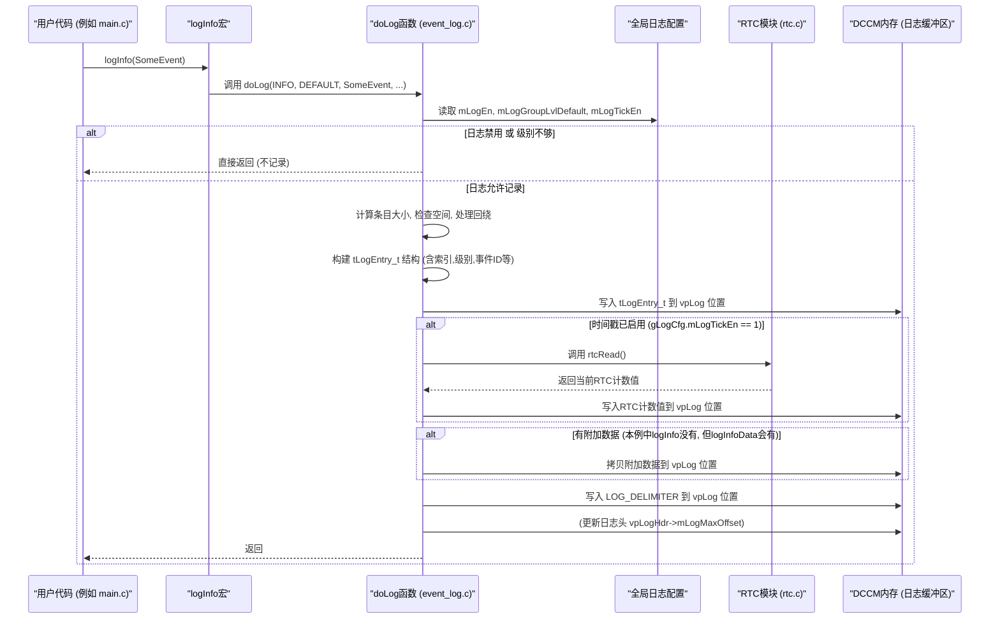

# Chapter 8: 事件日志记录


欢迎来到 `source` 项目固件教程的最后一章！在上一章 [定时与延时工具](07_定时与延时工具_.md) 中，我们学习了固件是如何利用实时计数器 (RTC) 和各种延时函数来精确控制时间的。这些工具对于协调复杂的硬件操作至关重要。现在，我们已经掌握了固件如何配置、如何运行其主循环、如何与硬件交互以及如何管理时间，但当固件运行时，我们如何知道它内部发生了什么？如果出现问题，我们又该如何追踪呢？

这就是本章要介绍的**事件日志记录**功能。它就像是飞机的“黑匣子”，为我们提供了一个诊断工具，用于记录固件运行过程中的重要事件、警告或错误信息。

## 8.1 为什么需要“黑匣子”？事件日志的重要性

想象一下，你正在调试一个复杂的固件程序。程序在某个特定条件下行为异常，但你很难复现或者直接观察到问题发生时的内部状态。或者，你希望了解固件在长时间运行后，各个模块的初始化顺序、关键校准步骤是否成功完成，以及是否出现过任何不常见的警告。

如果没有一种机制来记录这些信息，调试和分析将会变得异常困难，就像在没有仪表盘的情况下驾驶飞机一样。

**事件日志记录**就是为了解决这些问题而设计的。它允许固件在运行的关键点：
*   记录重要的状态变化（例如，初始化完成）。
*   标记发生的警告或错误（例如，某个校准超时）。
*   保存一些关键数据以供后续分析（例如，某个配置参数的值）。

这些日志信息通常被存储在微控制器的一块特定内存区域（在我们的项目中是 DCCM - Data Closely Coupled Memory，数据紧耦合内存）。开发人员可以在固件运行后，通过调试工具或外部接口读取这块内存，从而了解固件执行的具体情况和潜在问题点。这对于调试、性能分析和验证固件行为都非常有价值。

## 8.2 核心概念解析

让我们来了解一下事件日志记录系统中的几个核心概念。

### 8.2.1 日志条目 (`tLogEntry_t`)

每一次记录的事件都会形成一个**日志条目 (Log Entry)**。一个典型的日志条目包含了关于该事件的多种信息，例如：
*   **索引 (Index)**: 一个唯一的序号，表示这是第几条日志。
*   **时间戳 (Timestamp)**: 事件发生的时间。如果启用了时间戳记录，通常会记录下当时的 [RTC (实时计数器)](07_定时与延时工具_.md) 值。
*   **事件级别 (Level)**: 表明事件的重要性，比如错误、警告、信息或调试。
*   **事件组 (Group)**: 表明事件属于哪个模块或功能区域，比如 RX（接收器）、TX（发送器）、PLL（锁相环）等。
*   **事件ID (Event ID)**: 一个预定义的数字，唯一标识具体发生了什么事件（例如，`CpuReset`、`InitDone`）。
*   **通道号 (Lane Number)**: 如果事件与特定的通信通道相关，则记录通道号。
*   **附加数据 (Optional Data)**: 有时除了事件本身，我们还想记录一些额外的数据，比如某个变量的值或者一段简短的文本描述。日志条目可以包含这些附加数据及其大小。

### 8.2.2 日志级别 (`enum tLogLevel_t`)

日志级别用于区分事件的严重程度，帮助开发人员快速筛选和关注重要的信息。常见的级别有：
*   `eLogError`: 严重错误，可能导致系统功能异常。
*   `eLogWarning`: 警告信息，表明可能存在潜在问题，但系统仍可运行。
*   `eLogInfo`: 常规信息，用于记录系统状态或重要操作的完成（例如，初始化完成）。
*   `eLogDebug`: 详细的调试信息，通常在开发阶段用于追踪更细致的程序流程。

系统可以配置每个日志组只记录高于某个级别的事件，从而控制日志的详细程度。

### 8.2.3 日志组 (`enum tLogGroup_t`)

为了更好地组织和过滤日志，事件被划分到不同的**日志组**。每个组对应固件的一个主要功能模块或子系统。例如：
*   `eLogGroup_Default`: 通用或未分类事件。
*   `eLogGroup_Cm`: 通用模块（Common Module，通常指PLL等共享资源）相关事件。
*   `eLogGroup_Rx`: 接收器 (RX) 相关事件。
*   `eLogGroup_Tx`: 发送器 (TX) 相关事件。
*   还有更细分的组，如 `eLogGroup_RxPwrCtl` (RX电源控制)、`eLogGroup_TxCca` (TX连续校准) 等。

开发者可以为每个组独立设置日志级别，例如，对RX模块启用详细的调试日志，而对TX模块只记录错误和警告。

### 8.2.4 日志存储区 (DCCM) 与循环缓冲区

所有日志条目都存储在微控制器的一块特定高速内存区域，称为 DCCM。这块内存的大小是固定的。当日志条目不断写入，存满这块区域后，新的日志会从头开始覆盖最早的日志。这种机制被称为**循环缓冲区 (Circular Buffer)**。
它确保了即使在长时间运行后，我们总能看到最新的日志信息，尽管可能会丢失一些最旧的记录。

### 8.2.5 日志配置 (`gLogCfg`)

固件提供了一个全局配置结构体 `gLogCfg`（在 `event_log.c` 中定义），允许用户在固件运行前（类似于 [固件配置管理](01_固件配置管理_.md) 中讨论的 `gFwCfg`）调整日志系统的行为。通过修改 `gLogCfg` 中的成员，可以：
*   **启用/禁用日志 (`mLogEn`)**: 完全打开或关闭日志记录功能。
*   **启用/禁用时间戳 (`mLogTickEn`)**: 控制是否在每个日志条目中包含RTC时间戳。
*   **设置各组的日志级别 (`mLogGroupLvlDefault`, `mLogGroupLvlRx`, 等)**: 为每个日志组指定要记录的最低日志级别。

### 8.2.6 日志头 (`tLogHdr_t`)

在日志存储区的起始位置，有一个**日志头 (Log Header)** 结构。它包含了一些关于整个日志缓冲区的元信息，例如：
*   当前日志的总条目数 (`mLogIdx`)。
*   日志缓冲区中已使用的最大偏移量 (`mLogMaxOffset`)，可以帮助判断缓冲区是否曾被写满。

## 8.3 如何使用事件日志记录？

固件代码通过调用特定的函数或宏来记录事件。最核心的函数是 `doLog()`，但为了方便使用，通常会封装一系列宏。

### 8.3.1 核心记录函数：`doLog()`

`doLog()` 函数（定义在 `event_log.c`）是所有日志记录操作的基础。它负责接收事件的详细信息（级别、组、事件ID、是否与通道相关、附加数据及其大小），然后根据配置判断是否需要记录，并最终将日志条目写入DCCM的循环缓冲区中。

一般情况下，固件开发人员不直接调用 `doLog()`，而是使用更方便的宏。

### 8.3.2 便捷的日志宏

在 `event_log.h` 头文件中，定义了一系列宏，如 `logError()`, `logWarning()`, `logInfo()`, `logDebug()`，以及它们带有附加数据记录能力的版本，如 `logInfoData()`。

**示例：记录一个简单的“信息”级别事件**

在 `main.c` 的初始化部分，我们看到了这样的日志记录：
```c
// 来自 main.c (简化片段)
#include "event_log.h" // 引入日志宏定义

int main(void) {
    // ... 其他初始化 ...
    rtcInit(); // 初始化RTC，日志时间戳依赖它

    // 记录CPU复位事件 (这是一个“信息”级别的事件)
    // CpuReset 是一个在 event_log_defs.h 中定义的枚举值 (tLogEvent_t)
    logInfo(CpuReset); 
    
    // ... 记录固件版本信息 ...
    logInfo(InitDone); // 记录初始化完成事件

    while(1) {
        // ... 主循环 ...
    }
    return 0;
}
```
**解释**：
*   `logInfo(CpuReset)`：这个宏会展开成对 `doLog()` 函数的调用。
    *   它会自动将日志级别设置为 `eLogInfo`。
    *   事件组可能默认为 `eLogGroup_Default` (或由宏内部逻辑决定)。
    *   事件ID就是 `CpuReset`。
    *   它通常不记录特定通道号和附加数据。
*   当这段代码执行时，如果日志功能被启用，并且默认组的日志级别允许记录“信息”级别的事件，那么一条关于“CPU复位”的日志就会被写入DCCM。

**示例：记录带有附加数据的事件**

`main.c` 中也展示了如何记录包含额外数据的日志：
```c
// 来自 main.c (简化片段)
#include "fw_build_info.h" // 包含 gFwVersion 定义
// ...

// 记录固件年份信息 (gFwVersion.mYear 是一个 uint32_t)
logInfoData(FwYear, (char*)&gFwVersion.mYear, sizeof(gFwVersion.mYear));
// 记录固件版本号的补丁部分 (gFwVersion.mPatchVersion 是一个 uint32_t)
logInfoData(FwVesion, (char*)&gFwVersion.mPatchVersion, sizeof(gFwVersion.mPatchVersion));
```
**解释**：
*   `logInfoData(FwYear, (char*)&gFwVersion.mYear, sizeof(gFwVersion.mYear))`：
    *   `FwYear`: 事件ID。
    *   `(char*)&gFwVersion.mYear`: 指向要记录的数据（固件年份）的指针。这里进行了类型转换为 `char*`，因为 `doLog` 接收的是字节指针。
    *   `sizeof(gFwVersion.mYear)`: 要记录的数据的大小（通常是4字节，对于一个 `uint32_t`）。
*   这条日志不仅记录了 `FwYear` 这个事件，还会把 `gFwVersion.mYear` 的实际值也存入日志条目中。

### 8.3.3 配置日志系统 (`gLogCfg`)

日志系统的行为可以通过修改全局配置结构体 `gLogCfg` 来控制。这个结构体在 `event_log.c` 中定义并初始化。

```c
// 来自 event_log.c (gLogCfg 的定义)
#pragma data("log_cfg_lut", LIT) // 编译器指令，将gLogCfg放入特定内存段
__attribute__((used)) const volatile tLogCfg_t gLogCfg =
{
    // .mLogStartAddr 和 .mLogEndAddr 由链接器符号 _event_log_start 和 _event_log_end 确定
    // 它们定义了日志缓冲区的物理地址范围 (相对于DCCM基址)
    .mLogStartAddr            = (uint32_t)_event_log_start - CPU_DCCM_BASE + PMD_DCCM_BASE,
    .mLogEndAddr              = (uint32_t)_event_log_end - CPU_DCCM_BASE + PMD_DCCM_BASE,
    
    .mLogEn                   = 0, // 默认禁用日志, 设置为 1 来启用
    .mLogTickEn               = 0, // 默认禁用时间戳, 设置为 1 来启用
    
    // 各个日志组的默认日志级别，LOG_LEVEL_DEFAULT 通常是一个预设值 (例如 eLogInfo)
    .mLogGroupLvlDefault      = LOG_LEVEL_DEFAULT,
    .mLogGroupLvlCm           = LOG_LEVEL_DEFAULT,
    .mLogGroupLvlRx           = LOG_LEVEL_DEFAULT,
    .mLogGroupLvlTx           = LOG_LEVEL_DEFAULT,
    // ... 其他日志组的级别设置 ...
};
#pragma data()
```
**如何修改配置**：
与 [固件配置管理](01_固件配置管理_.md) 中讨论的 `gFwCfg` 类似，`gLogCfg` 的值通常在固件加载到内存后、CPU开始执行固件主逻辑之前，由外部系统（如主处理器或调试工具通过JTAG/APB接口）修改。
例如，要启用日志并为RX组开启调试级别的日志，外部系统可以将：
*   `gLogCfg.mLogEn` 设置为 `1`。
*   `gLogCfg.mLogTickEn` 设置为 `1` (如果需要时间戳)。
*   `gLogCfg.mLogGroupLvlRx` 设置为 `eLogDebug` (其对应的数值)。

固件启动后，`doLog()` 函数会读取这些配置值来决定其行为。

## 8.4 内部实现：日志是如何被记录下来的？

现在，我们来深入了解 `doLog()` 函数是如何将事件信息变成一条条具体的日志条目存储到内存中的。

### 8.4.1 非代码视角的工作流程

当固件代码调用一个日志宏（比如 `logInfo(MyEvent)`）时，大致会发生以下步骤：

1.  **宏展开**：`logInfo(MyEvent)` 宏被C预处理器展开，变成对 `doLog()` 函数的调用，并传入相应的参数（如级别=INFO，组=DEFAULT，事件ID=MyEvent，无附加数据等）。
2.  **首次调用初始化 (在 `doLog()` 内部)**：
    *   如果这是 `doLog()` 第一次被调用（通过一个静态标志 `vInitDone` 判断），它会初始化日志头（`vpLogHdr`），设置初始日志索引为1，并将日志写入指针 `vpLog` 指向日志缓冲区的起始位置（紧随日志头之后）。
    *   `vInitDone` 标志被设为 `true`。
3.  **后续调用**：日志索引 `vpLogHdr->mLogIdx` 递增。
4.  **配置检查**：
    *   检查 `gLogCfg.mLogEn` 是否为1。如果日志被禁用，函数直接返回，不记录任何内容。
    *   根据传入的日志组（`aGroup`），从 `gLogCfg` 中获取该组配置的日志级别。
    *   比较传入的事件级别（`aLevel`）与该组配置的级别。如果事件级别低于配置级别（例如，事件是DEBUG级别，但组只配置记录INFO及以上级别），则函数直接返回。
5.  **计算条目大小**：根据是否启用了时间戳 (`gLogCfg.mLogTickEn`) 和是否有附加数据 (`aDataSize`)，计算这条日志条目将占用的总字节数。
6.  **空间检查与回绕 (Wrap-around)**：
    *   检查当前日志写入指针 `vpLog` 之后剩余的空间是否足够容纳新的日志条目。
    *   如果空间不足，将 `vpLog` 重置到日志缓冲区的起始位置（紧随日志头之后），实现循环缓冲区的“回绕”效果。这意味着新的日志将开始覆盖最旧的日志。
    *   （还有一个检查是确保日志条目本身不会太大，超过整个缓冲区的容量。）
7.  **构建日志条目 (`tLogEntry_t`)**：
    *   创建一个 `tLogEntry_t` 类型的临时变量。
    *   将事件的各种信息（当前日志索引、附加数据大小、组、级别、事件ID、通道信息、是否启用时间戳等）填充到这个结构体的相应位域中。`tLogEntry_t` 通常是一个包含多个位域的联合体或结构体，以便有效地打包信息。
8.  **写入日志条目到内存**：
    *   将构建好的 `tLogEntry_t` 结构体（通常是64位，分两次32位写入）写入到 `vpLog` 指向的内存位置。
    *   `vpLog` 指针向后移动相应的字节数。
9.  **写入时间戳 (如果启用)**：
    *   如果 `gLogCfg.mLogTickEn` 为1，调用 `rtcRead()` (来自 [定时与延时工具](07_定时与延时工具_.md)) 获取当前64位RTC计数值。
    *   将这个64位时间戳（分两次32位写入）写入到紧随日志条目之后的内存位置。
    *   `vpLog` 指针再次向后移动。
10. **写入附加数据 (如果有)**：
    *   如果 `aData` 不是 `NULL` 且 `aDataSize` 大于0，则将 `aData` 指向的内容逐字节拷贝到当前 `vpLog` 指向的内存位置，总共拷贝 `aDataSize` 字节。
    *   为了保持后续日志条目的对齐（通常是32位对齐），可能会在附加数据之后填充一些零字节。
    *   `vpLog` 指针向后移动相应的字节数。
11. **写入分隔符**：
    *   在日志条目的末尾（附加数据之后，或时间戳之后，或基本条目之后，取决于哪些被启用了）写入一个预定义的32位分隔符 `LOG_DELIMITER`。这个分隔符有助于外部工具解析日志时识别每条日志的边界。
    *   `vpLog` 指针向后移动4字节。
12. **更新日志头**：
    *   更新日志头中的 `mLogMaxOffset`，记录下日志缓冲区中曾经达到的最大写入偏移量。

### 8.4.2 序列图示例

下面是一个简化的序列图，展示了当调用 `logInfo(SomeEvent)` 时，固件内部的大致流程：



### 8.4.3 深入 `event_log.c` 代码

让我们看看 `doLog` 函数中的一些关键部分。

*   **初始化与索引增加**：
    ```c
    // 来自 event_log.c
    // vpLogHdr 指向日志缓冲区的头部，用于存储元信息
    static tLogHdr_t * const vpLogHdr = (tLogHdr_t *)((uint32_t)_event_log_start);
    // vpLog 是当前的日志写入指针
    static uint32_t *vpLog;
    static bool vInitDone = false; // 标记是否已执行过首次初始化

    if (!vInitDone) // 首次调用
    {
        vpLogHdr->mLogIdx       = 1; // 初始日志索引为1
        // mLogMaxOffset 记录日志区域的最大偏移量，初始为头部大小
        vpLogHdr->mLogMaxOffset = (int32_t)sizeof(tLogHdr_t); 
        // vpLog 指向紧随头部之后的内存区域
        vpLog     = (uint32_t *)(LOG_START); // LOG_START 通常是 (_event_log_start + sizeof(tLogHdr_t))
        vInitDone = true;
    }
    else // 非首次调用
    {
        vpLogHdr->mLogIdx++; // 日志索引递增
    }
    ```
    这里，`_event_log_start` 是一个由链接器定义的符号，表示日志缓冲区在DCCM中的起始地址。`LOG_START` 是一个宏，通常指向日志数据实际开始写入的位置（即跳过 `tLogHdr_t` 头部）。

*   **配置检查 (日志级别)**：
    ```c
    // 来自 event_log.c
    // ... (省略了判断 gLogCfg.mLogEn 的部分，但实际存在) ...
    
    bool    vAbort = false; // 标记是否有无效的组
    uint8_t vGroupLevel;  // 存储该组配置的日志级别

    switch (aGroup) // 根据传入的事件组 aGroup
    {
        case eLogGroup_Default:
            vGroupLevel = gLogCfg.mLogGroupLvlDefault; // 获取默认组的配置级别
            break;
        // ... 其他 case 对应不同的日志组 ...
        case eLogGroup_Rx:
            vGroupLevel = gLogCfg.mLogGroupLvlRx; // 获取RX组的配置级别
            break;
        // ...
        default:
            vAbort = true; // 无效的日志组
            break;
    }

    // 如果事件的级别 (aLevel) 低于该组配置的级别 (vGroupLevel)，则不记录
    // 例如，如果 aLevel 是 DEBUG (数值可能为3)，而 vGroupLevel 是 INFO (数值可能为2)
    // 那么 (uint8_t)aLevel > vGroupLevel 为 true (3 > 2)，则不记录
    if ((uint8_t)aLevel > vGroupLevel || vAbort) 
    {
        return; // 直接返回，不记录此事件
    }
    ```
    这段代码根据事件所属的组，从 `gLogCfg` 中读取该组允许的最低日志级别。如果当前事件的级别不够高（即级别值大于配置值，因为通常Error级别值最小，Debug级别值最大），则直接返回。

*   **循环缓冲区回绕**：
    ```c
    // 来自 event_log.c
    // vLogEntrySize 是计算得到的当前日志条目所需总大小
    // _event_log_end 是链接器定义的日志缓冲区结束地址
    // vpLog 是当前写入指针
    
    // 计算从当前写入点到缓冲区末尾还剩多少空间 (减4是为了最后的delimiter或对齐)
    int32_t vLogRemaining = (int32_t)_event_log_end - (int32_t)vpLog - 4; 
    
    if (vLogEntrySize > (uint32_t)vLogRemaining) // 如果剩余空间不够存放新条目
    {
        // 回绕：将写入指针重置到日志数据的起始位置
        vpLog = (uint32_t *)(LOG_START); 
    }
    ```
    这里实现了循环缓冲区的核心逻辑：当缓冲区尾部空间不足时，写入指针 `vpLog` 会被重置到缓冲区的开始（数据区），新的日志会覆盖旧的日志。

*   **构建并写入日志条目元数据 (`tLogEntry_t`)**：
    `tLogEntry_t` 是一个巧妙设计的结构体（通常使用联合体和位域），它将多个信息片段打包到64位（两个32位字）中。
    ```c
    // 来自 event_log.h (概念性结构，实际定义可能更复杂)
    // typedef struct {
    //     uint64_t mIdx      : 16; // 日志索引
    //     uint64_t mDataSize : 8;  // 附加数据大小
    //     uint64_t mGroup    : 5;  // 日志组
    //     uint64_t mLevel    : 2;  // 日志级别
    //     uint64_t mLaneNum  : 3;  // 通道号
    //     uint64_t mLane     : 1;  // 是否为通道特定事件
    //     uint64_t mTickEn   : 1;  // 时间戳是否启用
    //     uint64_t mEvent    : 10; // 事件ID
    //     uint64_t mReserved : 18; // 保留位
    // } tLogEntryBits_t;
    //
    // typedef union {
    //     tLogEntryBits_t mFields; // 按位域访问
    //     uint32_t mBits[2];       // 按两个32位字访问，方便写入内存
    // } tLogEntry_t;

    // 来自 event_log.c
    tLogEntry_t vLogEntry = { { // 使用C99复合字面量初始化联合体的位域部分
                                .mIdx      = vpLogHdr->mLogIdx,
                                .mDataSize = aDataSize, // 传入的附加数据大小
                                .mGroup    = (uint32_t)aGroup,
                                .mLevel    = (uint32_t)aLevel,
                                .mLaneNum  = aLane ? gActiveLane : 0U, // 如果是通道事件，记录当前活动通道
                                .mLane     = (uint32_t)aLane,
                                .mTickEn   = (uint32_t)vTickEn, // vTickEn 来自 gLogCfg.mLogTickEn
                                .mEvent    = (uint32_t)aEvent,
                            } };

    // 将打包好的两个32位字写入内存
    *vpLog++ = vLogEntry.mBits[0]; // 写入低32位，vpLog指针后移一个字
    *vpLog++ = vLogEntry.mBits[1]; // 写入高32位，vpLog指针后移一个字
    ```
    通过位域，可以在有限的空间内存放大量信息。

*   **写入时间戳和附加数据**：
    这部分代码会检查 `gLogCfg.mLogTickEn` 和 `aDataSize`，如果需要，则分别调用 `rtcRead()` 获取并写入时间戳，以及拷贝附加数据。拷贝附加数据时，还会处理字节对齐问题，确保 `vpLog` 始终指向32位边界。

*   **写入分隔符和更新最大偏移**：
    ```c
    // 来自 event_log.c
    *vpLog++ = LOG_DELIMITER; // 写入一个固定的32位分隔符，标记日志条目结束

    // 更新日志头中的 mLogMaxOffset，记录日志缓冲区曾使用到的最大深度
    // 这有助于判断缓冲区是否曾经被完全写满过
    vpLogHdr->mLogMaxOffset = ((int32_t)vpLog - (int32_t)_event_log_start > vpLogHdr->mLogMaxOffset) ? 
                              (int32_t)vpLog - (int32_t)_event_log_start : 
                              vpLogHdr->mLogMaxOffset;
    ```

通过这一系列精心设计的步骤，`doLog` 函数实现了高效、灵活且信息丰富的事件日志记录功能。外部工具可以通过读取DCCM中从 `_event_log_start` 到 `_event_log_end` 的内存区域，然后解析这些包含元数据、可选时间戳、可选附加数据和分隔符的日志条目，来重构固件的运行历史。

## 8.5 总结

在本章中，我们一起探索了 `source` 固件的“黑匣子”——**事件日志记录**系统。我们学习到：

*   **目的**：事件日志记录为固件提供了一个重要的诊断工具，用于记录运行过程中的关键事件、警告和错误，帮助开发人员调试和分析固件行为。
*   **核心组件**：日志条目包含时间戳、级别、组、事件ID和可选数据。日志级别和组帮助分类和过滤信息。日志存储在DCCM的循环缓冲区中，由日志头进行管理。日志行为通过 `gLogCfg` 全局配置结构体控制。
*   **使用方法**：固件通过 `logInfo()`, `logError()`, `logInfoData()` 等便捷宏来记录事件，这些宏最终调用核心的 `doLog()` 函数。
*   **内部实现**：`doLog()` 函数负责检查配置、管理循环缓冲区、构建包含丰富元信息的日志条目、写入时间戳和附加数据，并在末尾添加分隔符。它依赖 [RTC模块](07_定时与延时工具_.md) 提供时间戳，并通过 [固件配置管理](01_固件配置管理_.md) 类似的方式允许外部系统配置其行为。

理解了事件日志记录机制，我们就拥有了洞察固件内部运作的有力工具。

---

至此，我们已经完成了 `source` 项目固件入门教程的所有章节。从 [固件配置管理](01_固件配置管理_.md) 开始，我们逐步学习了固件是如何初始化的，它的 [主控制循环](02_主控制循环与请求处理_.md) 如何驱动整个系统，[PMD层如何通过状态机](03_pmd层请求与状态机_.md) 处理复杂的硬件请求，并深入了解了像 [时钟调理校准](04_时钟调理校准__clk_cond_cal__.md) 和 [信道估计](05_信道估计__channel_estimation__.md) 这样的关键功能。我们还探究了固件与硬件之间的桥梁——[硬件抽象与控制函数](06_硬件抽象与控制函数_.md)，以及确保精确时序的 [定时与延时工具](07_定时与延时工具_.md)，最后是本章介绍的事件日志记录。

希望这个系列教程能帮助你对 `source` 项目的固件有一个初步但全面的认识。固件的世界广阔而深邃，这仅仅是一个开始。祝你在未来的探索中一切顺利！

---

Generated by [AI Codebase Knowledge Builder](https://github.com/The-Pocket/Tutorial-Codebase-Knowledge)