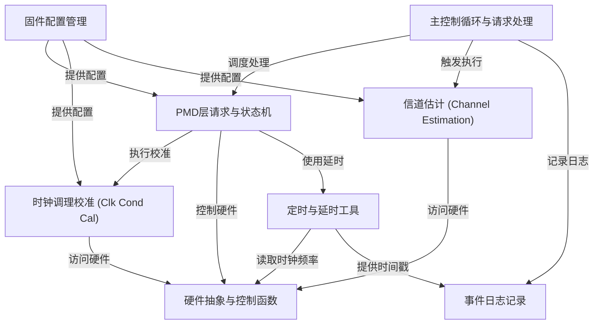

# Tutorial: source

这是一个用于高速通信接口（如SerDes PHY）的**固件**项目。它的核心是一个*主控制循环*，负责初始化硬件，并持续监听和处理来自不同硬件模块（如接收器RX、发送器TX、锁相环PLL）的请求。
该固件通过管理复杂的**状态机**来执行各种操作，例如上电、速率配置和关键的*校准程序*（如时钟调理和信道估计），以确保信号传输的质量和稳定性。
它还包含用于硬件控制、定时、配置管理和事件日志记录的辅助功能，是整个物理层芯片正常工作的“大脑”。

**Source Repository:** [None](None)

## Chapters

1. [固件配置管理
](01_固件配置管理_.md)
2. [主控制循环与请求处理
](02_主控制循环与请求处理_.md)
3. [PMD层请求与状态机
](03_pmd层请求与状态机_.md)
4. [时钟调理校准 (Clk Cond Cal)
](04_时钟调理校准__clk_cond_cal__.md)
5. [信道估计 (Channel Estimation)
](05_信道估计__channel_estimation__.md)
6. [硬件抽象与控制函数
](06_硬件抽象与控制函数_.md)
7. [定时与延时工具
](07_定时与延时工具_.md)
8. [事件日志记录
](08_事件日志记录_.md)

---

Generated by [AI Codebase Knowledge Builder](https://github.com/The-Pocket/Tutorial-Codebase-Knowledge)