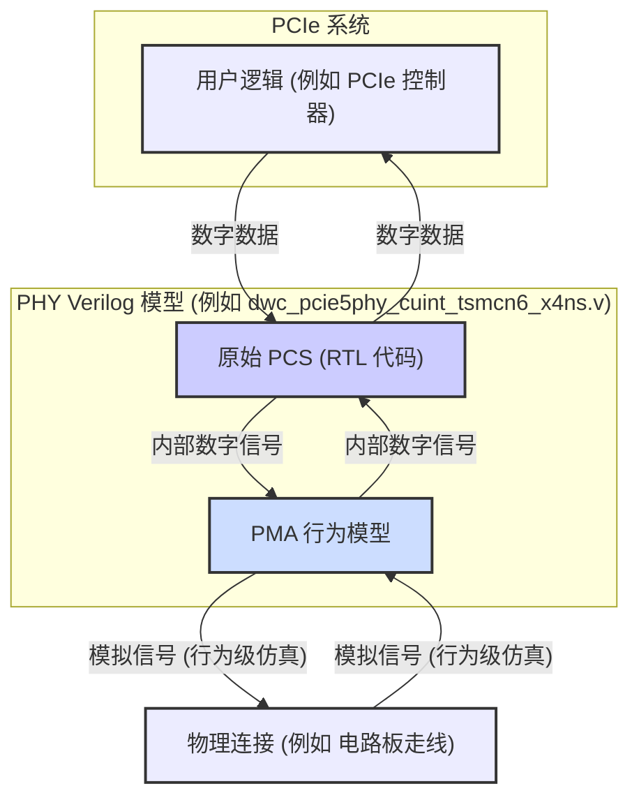

# Chapter 1: PHY Verilog 模型

欢迎来到 `verilog_model` 项目教程的第一章！在本章中，我们将一起探索什么是 PHY Verilog 模型，为什么它如此重要，以及它如何帮助我们在复杂的芯片设计流程中领先一步。

## 什么是 PHY？为什么需要一个模型？

想象一下，您正在设计一辆超级跑车。在真正投入巨资去制造发动机、底盘和各种昂贵部件之前，您肯定希望先在计算机上进行模拟，看看各个部分是否能协同工作，性能是否达标，对吧？

在电子世界中，尤其是设计像 PCIe 5.0 这样的高速接口时，情况非常相似。PCIe（Peripheral Component Interconnect Express）是一种广泛用于计算机内部连接高速组件（如显卡、固态硬盘）的总线标准。而 PHY（Physical Layer，物理层）则是这个连接的“马前卒”，它负责处理实际的电信号发送和接收，确保数据能够在物理介质（比如电路板上的铜线）上正确传输。

设计和制造一个 PHY 芯片非常复杂且成本高昂。如果在芯片制造出来之后才发现设计缺陷，那损失就太大了！因此，工程师们迫切需要一种方法，在设计早期就能验证 PHY 的功能是否符合预期。

这就是 **PHY Verilog 模型** 发挥作用的地方。

## PHY Verilog 模型：您的数字双胞胎

本项目提供的核心数字模型，正是用于在设计早期验证 **PCIe 5.0 PHY**（物理层）功能的工具。您可以把它想象成是物理芯片在计算机中的一个“**数字双胞胎**”。这个“双胞胎”用 Verilog HDL（硬件描述语言）编写，允许工程师在制造实际芯片之前，通过仿真来测试其逻辑行为。

这个模型主要由两大部分组成：

1.  **[原始 PCS (Raw PCS - Physical Coding Sublayer)](02_原始_pcs__raw_pcs___physical_coding_sublayer__.md) 的 RTL 代码**：
    *   PCS 层负责数据在进入物理介质前后的编码和解码、加扰和解扰等数字逻辑处理。
    *   RTL (Register Transfer Level) 代码是一种比较接近实际硬件电路描述的 Verilog 代码，它可以被综合工具转换为门级网表，最终用于芯片制造。您可以把它看作是 PHY 数字逻辑部分的详细蓝图。

2.  **[PMA 行为模型 (PMA Behavioral Model - Physical Medium Attachment)](03_pma_行为模型__pma_behavioral_model___physical_medium_attachment__.md)**：
    *   PMA 层则更接近物理介质，处理与模拟信号相关的部分，比如串行化和解串行化（SerDes）、驱动器和接收器等。
    *   这里的“行为模型”意味着它主要描述 PMA 的功能和行为（输入什么，输出什么，遵循什么时序），而不是精确到每一个晶体管的模拟特性。这对于数字仿真来说已经足够，并且能大大加快仿真速度。它好比是对 PHY 与外部物理世界接口功能的一个高效模拟。

将这两部分结合起来，就构成了完整的 PHY Verilog 模型。在我们的交付成果中，这个完整的 PHY 模型通常表现为一个 Verilog 文件，例如名为 `dwc_pcie5phy_cuint_tsmcn6_x4ns.v`（其中 `N` 代表通道数）。

上图展示了 PHY Verilog 模型在整个系统中的位置。用户设计的 PCIe 控制器等逻辑部分会与 PHY 模型进行交互，PHY 模型内部的 PCS 和 PMA 部分协同工作，模拟数据在物理层上的收发过程。

## 使用 PHY Verilog 模型解决什么问题？

主要目标是**功能验证**。假设您是一位数字设计工程师，正在设计一个与 PCIe 5.0 PHY 对接的 IP（比如一个高性能 SSD 的控制器）。您需要确保您的设计能够正确地与 PHY 进行数据交换和控制信令交互。

通过使用 PHY Verilog 模型，您可以：

1.  **搭建仿真环境**：将您的设计和 PHY Verilog 模型一起放入一个数字仿真器中（例如 Synopsys VCS）。
2.  **发送测试激励**：模拟各种操作场景，比如链路初始化、数据传输、低功耗状态切换等。
3.  **观察和分析结果**：检查 PHY 模型的输出是否符合预期，您的设计是否能够正确响应 PHY 的状态。
4.  **早期发现和修复错误**：如果在仿真中发现逻辑错误或不兼容问题，您可以在设计早期就进行修复，避免了后期昂贵的代价。

例如，您可以测试在发送数据时，您的控制器是否正确地将数据包传递给 PHY 模型，PHY 模型是否按 PCIe 规范对数据进行编码并通过其 PMA 部分“发送”出去。同样，您可以测试当 PHY 模型“接收”到数据时，它是否能正确解码并将数据传递给您的控制器。

## PHY Verilog 模型内部一瞥

虽然我们将在后续章节详细介绍 PCS 和 PMA，但这里我们先简单了解一下它们在项目文件结构中的位置：

*   **原始 PCS (Raw PCS) 的 Verilog RTL**：
    *   通常位于：`./Latest/phy/rtl` 目录。
    *   核心文件可能类似于：`dwc_pcie5_phy_xn_ns_pcs_raw_xN.v` (顶层 RTL 文件) 和 `dwc_pcie5_phy_xn_ns.v` (实例化 PMA 和 Raw PCS 的 PHY 顶层封装)。
    *   这部分代码是可综合的，意味着它可以被工具转换成实际的电路门连接。

*   **PMA 的 Verilog 行为模型**：
    *   通常位于：`./Latest/pma/behavior` 目录。
    *   核心文件可能类似于：`dwc_pcie5_phy_xn_ns_gtech.v` (PMA 顶层文件，实例化数字部分的 GTECH 模型和模拟子模块的行为模型)。
    *   这部分包含了一些通用 GTECH 门级网表（用于数字部分）和一个**不可综合**的模拟电路行为模型。这意味着它专注于模拟功能，而非精确的模拟电路实现。

还有一些重要的包含文件（通常是宏定义）位于 `./Latest/phy/include` 和 `./Latest/pcie/include` 目录，它们被 PCS、PMA 和仿真文件所使用。

**重要提示：关于模型的精度**

值得注意的是，PHY Verilog 模型是使用四状态（0, 1, X-未知, Z-高阻）逻辑仿真器进行仿真的。因此，许多需要精确模拟电压和电流等模拟特性的 PHY 功能，在这个模型中可能无法完全精确地体现。例如：

*   接收和发送 I/O 终端的精确模拟。
*   终端电阻的精确调谐和测量。
*   某些模拟测试总线的行为。

我们将在 [仿真模型局限性](09_仿真模型局限性_.md) 章节中更详细地讨论这些方面。但对于早期逻辑功能验证来说，这个模型已经提供了巨大的价值。它并不旨在进行详尽的 PHY 特性测试，而是帮助您验证您的逻辑与 PHY 的协同工作情况。

## 总结

在本章中，我们初步认识了 PHY Verilog 模型的概念。我们了解到：

*   PHY Verilog 模型是 PCIe 5.0 PHY 物理芯片的“数字双胞胎”，用于在设计早期进行功能验证。
*   它主要由两部分构成：可综合的 [原始 PCS (Raw PCS - Physical Coding Sublayer)](02_原始_pcs__raw_pcs___physical_coding_sublayer__.md) RTL 代码和行为级的 [PMA 行为模型 (PMA Behavioral Model - Physical Medium Attachment)](03_pma_行为模型__pma_behavioral_model___physical_medium_attachment__.md)。
*   通过这个模型，工程师可以在芯片制造前，在仿真环境中测试其设计的逻辑行为，从而尽早发现和修复问题。

现在我们对 PHY Verilog 模型有了整体的了解。在下一章中，我们将深入探讨它的第一个主要组成部分：[原始 PCS (Raw PCS - Physical Coding Sublayer)](02_原始_pcs__raw_pcs___physical_coding_sublayer__.md)。

---

Generated by [AI Codebase Knowledge Builder](https://github.com/The-Pocket/Tutorial-Codebase-Knowledge)