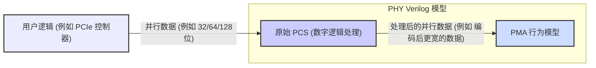
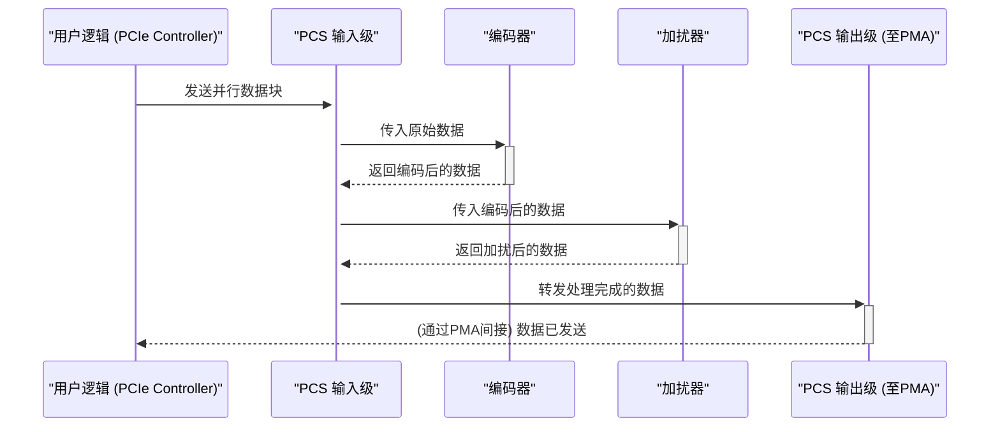

# Chapter 2: 原始 PCS (Raw PCS - Physical Coding Sublayer)


欢迎来到 `verilog_model` 项目教程的第二章！在[上一章：PHY Verilog 模型](01_phy_verilog_模型_.md)中，我们对 PHY Verilog 模型有了一个整体的认识，知道了它是由原始 PCS 的 RTL 代码和 PMA 的行为模型组成的“数字双胞胎”。现在，我们将深入探索这个“数字双胞胎”的第一个核心部件——原始 PCS。

## 原始 PCS 是什么？它解决了什么问题？

想象一下，您是一位外交官，需要通过一条不是很可靠的跨国电话线发送一份重要的加密电报。在您把电报内容念给接线员（负责将声音转换成电信号并通过线路发送）之前，您需要做几件事情：

1.  **编码**：您可能会用一种特殊的代码（比如摩斯电码的变种）来表示您的消息，确保即使电话线有些杂音，对方也能更容易地识别每个字符。
2.  **格式化/特殊处理**：您可能会在消息的开头加上特定的序列，告诉对方“这是消息的开始”，在结尾加上“消息结束”。为了防止消息听起来过于单调重复（这可能会让对方的解码设备失锁），您可能会对消息内容做一些“扰乱”处理，但这种扰乱是对方知道如何恢复的。

原始 PCS (Physical Coding Sublayer - 物理编码子层) 在 PHY 中扮演的就是类似这位外交官助手的角色。它是 PHY 模型中负责**数字逻辑处理**的部分。在您的数据（比如来自 PCIe 控制器的数据）真正交给 PMA (Physical Medium Attachment) 层进行串行化并转换成模拟信号发送出去之前，PCS 会对这些纯数字数据进行一系列重要的“预处理”工作。

**核心任务**：确保数据以正确的格式、经过适当的编码和处理，为接下来在物理介质上的可靠传输做好准备。

您可以将原始 PCS 看作是 PHY 的“**数字信息处理器**”。它处理的是纯粹的数字比特流，执行如数据编码、加扰、以及在数据串行化之前的一些其他数字逻辑操作。

## 原始 PCS 的核心职能

原始 PCS 主要承担以下几种关键的数字处理任务：

1.  **数据编码 (Data Encoding)**：
    *   **目的**：这可不是为了加密不让别人看懂，而是为了让信号在物理线路上传输时特性更好。例如，常用的 8b/10b 或 128b/130b 编码可以将8位数据转换成10位码字（或128位转130位）。
    *   **为什么需要？**
        *   **直流平衡 (DC Balance)**：确保在一长串数据中，逻辑‘1’和逻辑‘0’的数量大致相等。这有助于防止信号在传输过程中发生电压漂移，让接收端更容易区分高低电平。想象一下，如果一直发送高电平，参考地电压可能会慢慢“浮动”，导致判断错误。
        *   **时钟恢复 (Clock Recovery)**：编码后的数据流中会有足够多的电平跳变（0变1或1变0）。接收端可以利用这些跳变来精确地同步自己的时钟，确保正确采样数据。如果数据长时间不变（如一长串0或一长串1），接收端可能会“跟丢”时钟。
    *   **类比**：就像乐谱中的节拍标记，编码确保了数据流有清晰的“节奏感”，让接收方能跟上。

2.  **加扰 (Scrambling)**：
    *   **目的**：通过一个特定的伪随机序列与原始数据进行异或 (XOR) 操作，打乱数据中可能存在的重复模式。
    *   **为什么需要？**
        *   **减少电磁干扰 (EMI)**：如果数据中存在固定的重复模式（比如反复发送同一个字符），可能会在特定频率上产生较强的电磁辐射，干扰其他设备。加扰可以使频谱更加平坦，减少EMI。
        *   **避免长连“0”或长连“1”**：即使经过编码，某些特定的数据序列组合也可能导致编码后出现不利于时钟恢复的模式。加扰进一步随机化数据。
    *   **类比**：想象一下您在演讲。如果您的演讲稿中某个词语或短句重复出现太多次，听众可能会觉得枯燥甚至走神。加扰就像是用同义词替换或者调整句式，使得整体内容听起来更“活泼”和“均匀”，但核心意思不变，因为听众（接收端）也知道您是如何“润色”的，可以反向理解。接收端的解扰器会使用相同的伪随机序列将数据恢复原状。

3.  **其他数字通路处理**：
    *   这包括在数据进入串行器（由PMA负责）之前的一些准备工作，例如数据对齐、多通道（Lane）数据的分发与汇总、状态机管理等。

下图展示了原始 PCS 在 PHY 模型中的位置和基本数据流：


在这个流程中，用户逻辑（比如一个 PCIe 控制器）发送并行数据给 PCS。PCS 内部对这些数据进行编码、加扰等操作，然后将处理后的（通常是位宽更大的）并行数据传递给 [PMA 行为模型](03_pma_行为模型__pma_behavioral_model___physical_medium_attachment__.md)。PMA 接下来会将这些并行数据转换成高速串行数据流。

## 原始 PCS 是“可综合的”Verilog RTL

在[上一章](01_phy_verilog_模型_.md)我们提到，原始 PCS 是用 Verilog HDL 编写的 **RTL (Register Transfer Level) 代码**。一个非常重要的特性是，这部分代码是**可综合 (Synthesizable)** 的。

这是什么意思呢？

*   **RTL 代码**：它描述了数字电路中数据如何在寄存器之间传输和处理。可以把它看作是数字逻辑功能的行为描述，但比纯粹的行为描述更接近硬件实现。
*   **可综合**：意味着这份 Verilog 代码可以被一种叫做“逻辑综合工具”（Synthesis Tool）的软件读取和理解。这个工具能够自动地将 RTL 代码转换成更底层的门级网表（Gate-level Netlist）。门级网表是由基本的逻辑门（如与门 AND, 或门 OR, 非门 NOT, 触发器 Flip-Flops 等）和它们之间的连接组成的。这个网表最终可以用来指导物理芯片的制造过程。

**类比**：
*   **RTL 代码** 就像是一份非常详细的食谱，说明了需要哪些食材（数据）、以及如何一步步处理这些食材（逻辑操作）。
*   **逻辑综合工具** 就像是一位经验丰富的大厨，能够根据这份食谱，精确地知道需要用哪些厨具（逻辑门）、以及如何摆放和连接它们（门级网表），最终做出美味的菜肴（芯片功能）。
*   **不可综合的行为模型**（我们将在下一章讨论 PMA 时遇到）则更像是在描述菜肴的风味和外观（“我想要一道酸甜口的，颜色鲜艳的菜”），而不具体说明制作步骤和厨具。

因为原始 PCS 的代码是可综合的，所以 `verilog_model` 提供的这部分 RTL 代码，不仅仅是为了仿真，它也代表了实际芯片中数字部分的真实逻辑设计蓝图。

## 原始 PCS 在项目中的位置

根据项目文档和我们之前的介绍，原始 PCS 的 Verilog RTL 文件通常位于：

*   `./Latest/phy/rtl` 目录。

其中，关键文件可能包括：

*   `dwc_pcie5_phy_xn_ns_pcs_raw_xN.v`：这是针对特定通道数（xN，例如 x4 表示4通道）的原始 PCS 的顶层 RTL 文件。它包含了 PCS 的核心数字逻辑。
*   `dwc_pcie5_phy_xn_ns.v`：这是整个 PHY 的顶层封装文件，它会实例化（调用和连接）原始 PCS 模块和 [PMA 行为模型](03_pma_行为模型__pma_behavioral_model___physical_medium_attachment__.md) 模块。

我们来看一个非常简化的、概念性的 Verilog 代码片段，来感受一下 PCS 模块的输入输出可能是什么样的。**注意：这并非实际代码，仅为示意。**

```verilog
// 伪代码 - 概念性展示 Raw PCS 的接口和主要任务
module raw_pcs_conceptual (
    // 时钟和复位信号
    input  logic clk,
    input  logic reset_n,

    // 从上层 (例如 PCIe 控制器) 接收的并行数据
    input  logic [127:0] parallel_data_in,      // 假设输入128位并行数据
    input  logic         data_in_valid,         // 输入数据有效信号

    // 发送给 PMA 层的处理后的并行数据
    output logic [129:0] processed_data_out,    // 经过128b/130b编码后，数据位宽增加
    output logic         data_out_valid         // 输出数据有效信号
);

    // 内部连线和寄存器声明 (示例)
    logic [129:0] encoded_data;
    logic [129:0] scrambled_data;

    // 1. 数据编码模块 (概念)
    // 实际编码逻辑会复杂得多，这里仅为示意
    // some_128b130b_encoder encoder_unit (
    //     .clk(clk),
    //     .reset_n(reset_n),
    //     .data_in(parallel_data_in),
    //     .encoded_data_out(encoded_data)
    // );

    // 2. 加扰模块 (概念)
    // 实际加扰逻辑会使用LFSR等，这里仅为示意
    // some_scrambler scrambler_unit (
    //     .clk(clk),
    //     .reset_n(reset_n),
    //     .data_in(encoded_data), // 将编码后的数据进行加扰
    //     .scrambled_data_out(scrambled_data)
    // );

    // 简化赋值：假设编码和加扰的结果直接输出
    assign processed_data_out = scrambled_data; // 在实际设计中，这里会有更复杂的逻辑
    assign data_out_valid = data_in_valid;    // 有效信号也可能经过流水线处理

endmodule
```

**代码解释**：

*   `module raw_pcs_conceptual (...) endmodule`：定义了一个名为 `raw_pcs_conceptual` 的 Verilog 模块。
*   `input logic clk, reset_n`：这些是标准的时钟和异步低电平复位信号，几乎所有数字逻辑模块都会有。
*   `input logic [127:0] parallel_data_in`：这表示从上一级模块（比如 PCIe 控制器）传入的128位并行数据。
*   `input logic data_in_valid`：一个控制信号，表明 `parallel_data_in` 上的数据何时是有效的。
*   `output logic [129:0] processed_data_out`：这是 PCS 处理后输出的并行数据。注意位宽从128位变成了130位，这暗示了可能进行了128b/130b编码。
*   `output logic data_out_valid`：表明 `processed_data_out` 上的数据何时是有效的。
*   注释中的 `some_128b130b_encoder` 和 `some_scrambler` 代表了执行编码和加扰功能的子模块或逻辑块。在实际的 RTL 设计中，这些会是非常复杂的标准逻辑。

这个例子非常简化，真正的 PCS RTL 代码会包含成百上千行代码，处理各种状态、模式控制、错误检测等。但核心思想就是接收并行数据，进行数字处理（编码、加扰等），然后输出处理后的并行数据。

## PCS 内部数据处理流程（概念性）

我们可以用一个简单的序列图来概念性地展示数据在 PCS 内部主要的处理步骤。假设一个数据包从 PCIe 控制器发送过来：



**图解步骤**：

1.  **用户逻辑 (Ctlr)** 将一批并行数据发送给 PCS。
2.  **PCS 输入级 (PCS_Input)** 接收数据，并可能进行一些初步的缓冲或对齐。
3.  数据被送往 **编码器 (Encoder)**，执行例如 128b/130b 的编码。
4.  编码后的数据再被送往 **加扰器 (Scrambler)**，进行加扰处理。
5.  经过所有数字处理后，数据到达 **PCS 输出级 (PCS_Output)**，准备传递给下一级的 [PMA 行为模型](03_pma_行为模型__pma_behavioral_model___physical_medium_attachment__.md)。

这只是一个高度简化的视图。真实的 PCS 内部会有更复杂的状态机、控制逻辑、针对不同速率和模式的配置等。

## 总结

在本章中，我们深入了解了 `verilog_model` 中的一个关键组成部分——原始 PCS (Physical Coding Sublayer)。我们学习到：

*   原始 PCS 是 PHY 中负责**数字逻辑处理**的部分，可以看作是 PHY 的“数字信息处理器”。
*   它的核心功能包括**数据编码**（如8b/10b, 128b/130b）和**数据加扰**，目的是改善信号传输特性、帮助时钟恢复和减少EMI。
*   PCS 处理的是**并行数据**，并将处理后的并行数据传递给 PMA 进行串行化。
*   `verilog_model` 中的原始 PCS 是以**可综合的 Verilog RTL 代码**形式提供的，这意味着它可以被转换为实际的硬件电路。
*   我们了解了它在项目中的典型文件路径和核心文件名，并通过一个概念性的代码片段理解了其基本接口。

现在我们已经对 PHY 的数字处理核心 PCS 有了清晰的认识。接下来，数据将从 PCS 流向 PHY 的另一半——PMA 层，它负责与物理介质打交道，进行数模转换和串行化等操作。

在下一章中，我们将一起探索 [PMA 行为模型 (PMA Behavioral Model - Physical Medium Attachment)](03_pma_行为模型__pma_behavioral_model___physical_medium_attachment__.md)，看看它是如何模拟 PHY 的模拟特性的。

---

Generated by [AI Codebase Knowledge Builder](https://github.com/The-Pocket/Tutorial-Codebase-Knowledge)