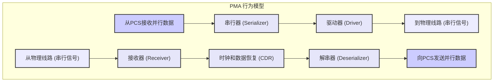
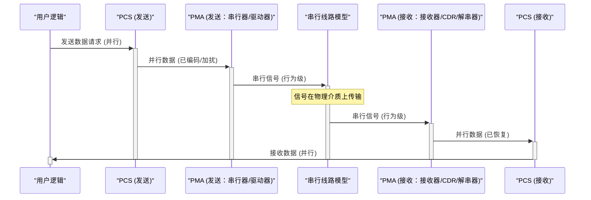

# Chapter 3: PMA 行为模型 (PMA Behavioral Model - Physical Medium Attachment)


欢迎来到 `verilog_model` 项目教程的第三章！在上一章 [原始 PCS (Raw PCS - Physical Coding Sublayer)](02_原始_pcs__raw_pcs___physical_coding_sublayer__.md) 中，我们学习了 PHY 的数字心脏——PCS 如何对数据进行编码和加扰等数字处理。现在，这些经过精心准备的数字数据包需要被转换成能够在物理电缆或电路板走线上飞驰的信号。这个关键的转换任务就交给了我们本章的主角——PMA 行为模型。

## PMA 是什么？它解决了什么问题？

想象一下，在 [原始 PCS (Raw PCS - Physical Coding Sublayer)](02_原始_pcs__raw_pcs___physical_coding_sublayer__.md) 中，我们的数据就像一份用标准语言（数字比特）写好的、内容也经过润色（编码和加扰）的稿件。现在，我们需要把这份稿件通过一种特殊的“吼<y_bin_338>”或者“信号灯”系统（物理介质）远距离发送出去，并且对方也能准确接收和理解。

PMA (Physical Medium Attachment - 物理介质连接层) 就扮演着这个“吼<y_bin_338>操作员”或“信号灯控制员”的角色。它是 PHY 中最接近物理传输媒介的部分，负责**将 PCS 处理后的纯数字并行数据转换成适合在物理线路上传输的串行模拟信号形式，反之亦然，从物理线路上接收信号并转换回数字数据交给 PCS**。

然而，真正精确地模拟这些复杂的模拟电路行为（比如晶体管级别的电压电流变化）对于数字仿真来说太慢也太复杂了。因此，在我们的 `verilog_model` 中，PMA 是一个**行为模型**。

**核心问题**：如何高效地在数字仿真环境中模拟数字信号与物理世界（模拟信号）之间的转换和接口？

PMA 行为模型就像是 PHY 的“**模拟接口**”或者“**翻译官**”，它使用简化的方法来模拟实际PMA硬件的功能，让我们可以在数字仿真器中验证整个数据链路的逻辑正确性，而无需陷入复杂且耗时的模拟电路仿真。

## PMA 的核心功能

PMA 层虽然是行为模型，但它需要模拟以下关键的硬件功能：

1.  **串行器 (Serializer - Ser)**:
    *   **功能**：将来自 PCS 的并行数据（例如，经过128b/130b编码后的130位宽数据）转换成高速的单比特串行数据流。
    *   **类比**：想象你有一大把硬币（并行数据），串行器就像一个点币机，把它们一个接一个地快速数出去（串行数据）。
    *   **方向**：发送路径 (TX)。

2.  **解串器 (Deserializer - Des)**:
    *   **功能**：将从物理线路接收到的高速串行数据流转换回并行数据，并交给 PCS 处理。
    *   **类比**：与串行器相反，它就像一个自动收银机，接收一串连续投入的硬币，然后整理成一堆（并行数据）。
    *   **方向**：接收路径 (RX)。

3.  **驱动器 (Driver)**:
    *   **功能**：在发送数据时，增强串行信号的强度，使其有足够的“力量”在物理介质（如铜线）上传输一定距离而不失真。
    *   **类比**：就像一个扩音器，把你的声音放大，让远处的人也能听清楚。
    *   **方向**：发送路径 (TX)。

4.  **接收器 (Receiver)**:
    *   **功能**：在接收数据时，能够检测并放大从物理介质传来的可能已经衰减的微弱信号。
    *   **类比**：就像一个高灵敏度的麦克风，能够捕捉到微弱的声音并将其放大。
    *   **方向**：接收路径 (RX)。

5.  **时钟和数据恢复 (CDR - Clock and Data Recovery)**:
    *   **功能**：在接收端，从接收到的串行数据流中提取出时钟信号。这个时钟信号对于正确地采样数据至关重要，因为它告诉接收器何时去“读取”串行流中的每一位。
    *   **重要提示**：在行为模型中，CDR 的功能通常是**高度简化**的。它可能不会模拟真实 CDR 电路中复杂的锁相环 (PLL) 行为或抖动特性，而是以一种功能等效的方式保证数据能够被正确地恢复。
    *   **方向**：接收路径 (RX)。

下面是一个PMA内部主要功能模块的示意图：



## “行为模型”的真正含义

我们在第一章就提到PMA是“行为模型”，这与 [原始 PCS (Raw PCS - Physical Coding Sublayer)](02_原始_pcs__raw_pcs___physical_coding_sublayer__.md) 的“RTL代码”有显著区别：

*   **PCS (RTL 代码)**: 是可综合的，描述了数字逻辑的寄存器传输级别实现，可以被工具转换为门级电路，最终用于制造芯片。它关注的是“如何精确实现数字逻辑”。
*   **PMA (行为模型)**: 主要是**不可综合 (Non-synthesizable)** 的。它关注的是“**模块做什么 (what it does)**”，而不是“**如何用晶体管精确实现 (how it's made at transistor level)**”。

**为什么PMA是行为模型？**

1.  **模拟特性复杂**：PMA 涉及大量复杂的模拟电路设计（如高精度时钟、信号放大、阻抗匹配等）。用数字 Verilog 精确描述这些是非常困难的，而且数字仿真器也无法处理真实的电压和电流。
2.  **仿真速度**：即使能够用某种方式描述，对这些模拟电路进行精确仿真也会非常非常慢。对于验证大规模数字系统来说，这种速度是不可接受的。

**PMA行为模型的构成**：

根据项目文档 (Verilog Model Description, Page 2 "Overview")，PMA 的 Verilog 行为模型通常包含：
*   **GTECH 通用门 (Generic GTECH gates) 的网表**：用于PMA内部的一些数字控制部分。GTECH 门是标准的、与特定工艺无关的逻辑门，可以被综合，但这部分通常只占PMA模型的一小部分。
*   **不可综合的模拟电路行为代码**：这是PMA模型的核心，用Verilog的行为级语句（如 `initial`, `always`, 延时 `#`, `task` 等）来描述串行器、解串器、驱动器、接收器等模拟模块的功能。

**优点**：
*   **仿真速度快**：因为它不模拟底层的模拟细节，所以仿真速度比混合信号仿真快得多。
*   **专注于功能验证**：使得数字设计工程师可以专注于验证其设计的逻辑是否能与PHY正确交互，而不用担心模拟细节。

**缺点**：
*   **不精确模拟电路特性**：它无法精确反映许多真实的模拟特性，例如：
    *   精确的输入/输出阻抗匹配。
    *   精确的电压和电流值。
    *   信号抖动 (jitter) 和噪声 (noise) 的影响。
    *   一些模拟测试总线的真实行为。
    我们将在 [仿真模型局限性](09_仿真模型局限性_.md) 章节详细讨论这些。

**类比**：PMA行为模型就像电影里的**特技替身**。替身演员会做出和主角一样的动作（功能），让拍摄（仿真）能够顺利进行。但替身演员毕竟不是主角本人（真实的模拟电路），在细微之处（精确的模拟参数）会有差异。

## PMA 模型在系统中的位置和交互

PMA 是 PHY 不可或缺的一部分，它充当了数字世界 (PCS) 和模拟世界 (物理线路) 之间的桥梁。

```mermaid
graph TD
    A["用户逻辑 (PCIe Controller IP)"]
    PCS["原始 PCS (RTL 代码)"]
    PMA["PMA 行为模型"]
    B["串行线路模型 (模拟物理连接)"]

    subgraph "PHY["PHY Verilog 模型 (例如 dwc_pcie5phy_cuint_tsmcn6_x4ns.v)"]"
        PCS
        PMA
    end

    A -- "并行数字数据" --> PCS
    PCS -- "处理后的并行数字数据" --> PMA
    PMA -- "串行信号 (行为级)" --> B
    B -- "串行信号 (行为级)" --> PMA
    PMA -- "恢复的并行数字数据" --> PCS
    PCS -- "并行数字数据" --> A

    style A fill:#lightgrey,stroke:#333,stroke-width:2px
    style PCS fill:#ccf,stroke:#333,stroke-width:2px
    style PMA fill:#cdf,stroke:#333,stroke-width:2px
    style B fill:#f9f,stroke:#333,stroke-width:2px
```

如上图所示，用户设计的逻辑（如 PCIe 控制器）通过 PCS 与 PMA 进行交互。数据从 PCS 流入 PMA，PMA 将其转换为适合物理线路的串行形式（行为级模拟），然后通过 [串行线路建模](04_串行线路建模_.md)（我们将在下一章讨论）进行传输。反向路径也是类似的。

在 `verilog_model` 项目中，完整的 PHY 模型（例如 `dwc_pcie5phy_cuint_tsmcn6_x4ns.v`）会同时实例化 PCS 模块和 PMA 模块，并将它们连接起来。

## PMA 行为模型内部一瞥

PMA 的行为模型虽然简化了模拟电路，但其内部逻辑仍然是为了功能对等。

**文件位置**：
根据项目文档 (Verilog Model Description, Page 2 "Overview" 和 Page 5 "Verilog Model Files and Simulators")：
*   PMA 的 Verilog 行为模型通常位于：`./Latest/pma/behavior`
*   PMA 的顶层文件（实例化GTECH模型和模拟子模块的行为模型）可能类似于：`dwc_pcie5_phy_xn_ns_gtech.v` (其中 `xN` 代表通道数)。

**数据转换的概念**：
*   **并行到串行**：PMA 从 PCS 接收并行数据总线（例如 `tx_data_from_pcs[129:0]`）。在PMA内部，行为逻辑会模拟串行器，将这些并行位逐个地在每个时钟周期（或者更快的串行时钟周期）发送到代表物理线路的输出端口上，例如 `serial_tx_p` 和 `serial_tx_n`（通常是差分信号）。
*   **串行到并行**：PMA 从代表物理线路的输入端口（例如 `serial_rx_p` 和 `serial_rx_n`）接收串行比特流。行为逻辑模拟CDR恢复时钟和数据，然后解串器将这些比特组装成并行数据总线（例如 `rx_data_to_pcs[129:0]`）并发送给 PCS。

**简化表示的串行信号**：
由于数字仿真器只能处理 0, 1, X (未知), Z (高阻) 四种状态，PMA 模型会用这些状态来近似表示物理线路上的模拟信号。例如，一个差分信号的“逻辑1”可能表示为 `tx_p = 1` 而 `tx_n = 0`。我们将在下一章 [串行线路建模](04_串行线路建模_.md) 中看到更多这方面的内容。

**概念性的 Verilog 接口**：
下面是一个**极度简化**的PMA模块接口伪代码，仅用于展示其与PCS和物理线路的基本连接概念。**实际的 PMA 模型要复杂得多。**

```verilog
// 伪代码 - PMA 行为模型概念性接口
// 真实模型会复杂得多，包含大量控制信号和多通道逻辑
module pma_behavioral_conceptual (
    // 时钟和复位
    input  logic clk_parallel,       // 并行数据域时钟 (来自PCS)
    input  logic clk_serial,         // 串行数据域时钟 (PMA内部或外部提供)
    input  logic reset_n,

    // 从 PCS 接收的发送数据 (并行)
    input  logic [129:0] tx_parallel_data_from_pcs,
    input  logic         tx_data_valid_from_pcs,

    // 发送到物理线路的串行数据 (差分对)
    output logic         serial_tx_p, // 正端
    output logic         serial_tx_n, // 负端

    // 从物理线路接收的串行数据 (差分对)
    input  logic         serial_rx_p,
    input  logic         serial_rx_n,

    // 发送给 PCS 的接收数据 (并行)
    output logic [129:0] rx_parallel_data_to_pcs,
    output logic         rx_data_valid_to_pcs
);

    // 内部行为逻辑 (高度简化)
    // 1. 串行器逻辑:
    //    - 当 tx_data_valid_from_pcs 为高时，锁存 tx_parallel_data_from_pcs
    //    - 使用 clk_serial 将锁存的并行数据逐位通过 serial_tx_p/n 发送出去
    //    - (行为模型会用Verilog任务或状态机来模拟这个过程)
    //    Example: serial_tx_p <= current_bit; serial_tx_n <= !current_bit;

    // 2. 解串器和CDR逻辑:
    //    - 使用 clk_serial (或从serial_rx_p/n恢复的行为时钟) 采样 serial_rx_p/n
    //    - 将串行比特流组装成 rx_parallel_data_to_pcs
    //    - 当一个完整的数据块组装完毕，置高 rx_data_valid_to_pcs
    //    - (行为模型会模拟CDR的功能，确保正确采样)

    // ... 更多控制逻辑和状态机 ...

endmodule
```
**代码解释**：
*   `tx_parallel_data_from_pcs`：从PCS传来的并行数据。
*   `serial_tx_p`, `serial_tx_n`：PMA发送出去的差分串行信号。
*   `serial_rx_p`, `serial_rx_n`：PMA接收到的差分串行信号。
*   `rx_parallel_data_to_pcs`：PMA传给PCS的并行数据。
*   内部注释简要说明了串行化和解串化（包括CDR）的行为逻辑是如何**概念性地**工作的。实际的 `dwc_pcie5_phy_xn_ns_gtech.v` 文件会包含复杂的 GTECH 实例和用 `/* synthesis translate_off */` 和 `/* synthesis translate_on */` 包围的不可综合行为代码块。

**概念性数据流（时序图）**
下面是一个简化的时序图，展示了数据在发送和接收过程中如何流经PMA：


这个图清晰地展示了PMA在发送（TX）和接收（RX）路径中的中转作用。

## PMA 模型的简化特性与局限

正如项目文档 (Verilog Model Description, Page 3 "Verilog Function") 中提到的，由于 PMA 模型是一个四状态（0, 1, X, Z）的数字模型，很多真实的模拟特性无法精确体现。例如：

*   **收发器的 I/O 端接电阻**：这些电阻的精确值和调谐在模型中是简化的。
*   **接收器电气空闲检测器的电压阈值设置**。
*   **发射器均衡设置**（如预加重、摆幅、后加重）对串行信号波形的确切影响。
*   **接收器均衡器设置**（如 AFE CTLE 增益、VGA 增益、DFE 系数）的精确自适应过程。

文档中的 `Table 7-1 Transmitter Model Serial Encodings` (Verilog Model Description, Page 4) 给出了一个例子，说明如何用数字状态来表示串行线上的差分信号：

| 输出    | `txX_p` | `txX_m` | 描述                       |
| :------ | :------ | :------ | :------------------------- |
| 差分 1  | 1       | 0       | 表示逻辑 '1'               |
| 差分 0  | 0       | 1       | 表示逻辑 '0'               |
| 无信号，共模 | 0       | 0       | 线路保持共模电平 (简化表示) |
| 无信号，非共模 | Z       | Z       | 线路高阻态 (简化表示)     |

这再次强调了PMA行为模型是为了**功能仿真**，而非精确的模拟特性分析。更详细的局限性将在 [仿真模型局限性](09_仿真模型局限性_.md) 章节中讨论。

## 总结

在本章中，我们探索了 PHY 模型的“模拟接口”——PMA 行为模型。我们了解到：

*   PMA 负责将数字并行数据与物理介质上的串行信号进行转换，其核心功能包括串行化/解串行化 (SerDes)、驱动/接收和行为级的时钟数据恢复 (CDR)。
*   它是一个**行为模型**，使用 GTECH 通用门和不可综合的 Verilog 代码来模拟功能，而不是精确的电路级实现。这使得数字仿真快速高效。
*   PMA 模型简化了许多复杂的模拟特性，专注于在数字仿真环境中验证数据通路的逻辑正确性。
*   它位于 PCS 和物理线路之间，是 `verilog_model` 中 PHY 不可或缺的组成部分，其实现文件通常在 `./Latest/pma/behavior` 目录下，如 `dwc_pcie5_phy_xn_ns_gtech.v`。

理解了 PCS 如何处理数字数据，以及 PMA 如何（在行为层面）将这些数据转换为串行信号并与外部世界交互后，我们自然会好奇这些“串行信号”在仿真中是如何表示和传输的。

在下一章中，我们将详细介绍 [串行线路建模](04_串行线路建模_.md)，看看如何在 Verilog 仿真中模拟这些高速串行连接。

---

Generated by [AI Codebase Knowledge Builder](https://github.com/The-Pocket/Tutorial-Codebase-Knowledge)