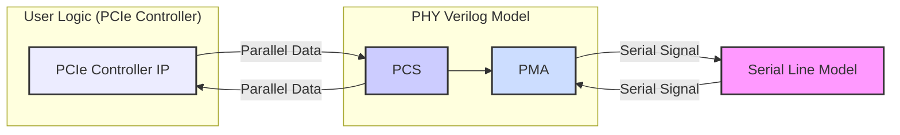
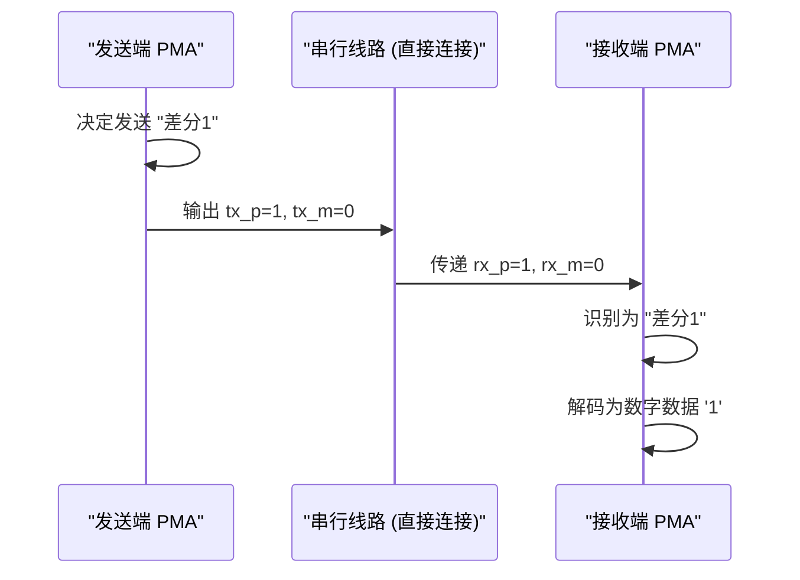

# Chapter 4: 串行线路建模


欢迎来到 `verilog_model` 教程的第四章！在上一章中，我们一起探索了 [PMA 行为模型 (PMA Behavioral Model - Physical Medium Attachment)](03_pma_行为模型__pma_behavioral_model___physical_medium_attachment__.md)，了解了它如何将来自 [原始 PCS (Raw PCS - Physical Coding Sublayer)](02_原始_pcs__raw_pcs___physical_coding_sublayer__.md) 的并行数字数据转换为（行为级模拟的）串行信号，准备发送到物理线路上。

现在，一个有趣的问题来了：这些本应是连续变化的模拟信号（比如电压高低）在纯数字的 Verilog 仿真世界中是如何被表示和理解的呢？本章将为你揭开“串行线路建模”的神秘面纱。

## 为什么要对串行线路进行“建模”？

想象一下，你正在用积木（代表数字逻辑0和1）来搭建一个场景，其中有两个人需要通过“对讲机”（代表串行线路）通话。真正的对讲机传递的是连续的声音波形（模拟信号），但你的积木世界里只有“开”和“关”两种状态。你怎么用积木来模拟通话内容呢？

这就是串行线路建模要解决的核心问题。Verilog 仿真器，比如我们常用的那些，它们的世界是由离散的逻辑状态构成的：
*   `0` (逻辑低)
*   `1` (逻辑高)
*   `X` (未知状态)
*   `Z` (高阻态)

这些状态无法直接表示真实物理世界中串行线路上连续变化的电压值。然而，为了在数字仿真环境中验证整个 PHY 的功能，我们需要一种方法来“翻译”或“表示”这些模拟信号。

**串行线路建模** 就定义了如何用这些离散的逻辑状态来表示差分串行线路（例如 PHY 输出的 `txX_p` 和 `txX_m` 引脚，或输入的 `rxX_p` 和 `rxX_m` 引脚）上的信号状态。例如，它会规定用 `1` 和 `0` 的特定组合来代表一个差分“1”或差分“0”。这就像是用一种简化的“**数字手语**”，在数字仿真环境中传递本应是连续变化的模拟信号信息。

通过这种建模，即使我们不能完美复制所有模拟细节，也足以让发送端 PMA 和接收端 PMA 在仿真中正确地“沟通”，从而验证它们之间的数字逻辑交互是否正确。

## 数字手语：如何表示差分信号

高速串行通信（如 PCIe）通常使用**差分信号**。这意味着信号是通过一对线缆（例如 `tx_p` 代表正端，`tx_n` 代表负端）传输的，数据的值取决于这两条线缆之间的电压差。

*   如果 `tx_p` 的电压显著高于 `tx_n`，这可能代表逻辑 '1'。
*   如果 `tx_p` 的电压显著低于 `tx_n`，这可能代表逻辑 '0'。

在我们的 Verilog 模型中，这种电压差被简化为逻辑状态的组合。正如在 `verilog_model.pdf` 文档中（第4页，表7-1）所述，以及我们在上一章 [PMA 行为模型](03_pma_行为模型__pma_behavioral_model___physical_medium_attachment__.md) 中提到的，发送器模型输出的串行信号编码如下：

**表 4-1: 发送器模型串行编码 (基于 Table 7-1 of verilog_model.pdf)**

| 输出状态             | `txX_p` (正端信号) | `txX_m` (负端信号) | 描述                                     |
| :------------------- | :----------------- | :----------------- | :--------------------------------------- |
| **差分 1 (Differential 1)** | `1`                | `0`                | 表示逻辑 '1'                             |
| **差分 0 (Differential 0)** | `0`                | `1`                | 表示逻辑 '0'                             |
| 无信号，保持共模电压 | `0`                | `0`                | 线路保持共模电平 (一种简化的中间状态表示) |
| 无信号，非共模电压   | `Z`                | `Z`                | 线路处于高阻态 (例如，未驱动状态的简化表示) |

**解读这张表**：

*   当 PMA 的发送端想要发送一个逻辑“1”时，它会驱动其 `txX_p` 输出为逻辑 `1`，同时驱动 `txX_m` 输出为逻辑 `0`。
*   当它想要发送一个逻辑“0”时，则驱动 `txX_p` 为 `0`，`txX_m` 为 `1`。
*   其他状态（如 `0,0` 或 `Z,Z`）代表一些特殊的线路情况，例如电气空闲 (Electrical Idle) 或线路未被驱动。

**接收端的理解**：
相应的，PMA 的接收端模型被设计为仅将“差分 1” (`rxX_p=1, rxX_m=0`) 和“差分 0” (`rxX_p=0, rxX_m=1`) 的编码解释为有效的信号电平，并据此恢复出原始的数字数据。

这种简化的表示方法使得我们可以在数字仿真器中有效地模拟串行数据的传输和接收，而无需处理复杂的模拟波形。

## 串行线路模型在仿真中的应用

那么，在实际的 Verilog 仿真测试平台 (testbench) 中，这个“串行线路模型”是如何体现的呢？最简单的形式，它可以是**直接的连线**。

想象一下，你有一个发送端 PHY 模型 (`phy_tx_instance`) 和一个接收端 PHY 模型 (`phy_rx_instance`)。发送端 PHY 的串行输出引脚 (`tx_p_out`, `tx_n_out`) 需要连接到接收端 PHY 的串行输入引脚 (`rx_p_in`, `rx_n_in`)。

```verilog
// 伪代码 - 顶层仿真模块示意
module top_simulation_environment;

    // 假设这些是连接到 PHY 模型的信号线
    // ... 其他控制和数据信号 ...

    // 从发送端 PMA 输出的串行信号
    wire lane0_tx_p;
    wire lane0_tx_n;

    // 输入到接收端 PMA 的串行信号
    wire lane0_rx_p;
    wire lane0_rx_n;

    // 实例化发送端 PHY (内部包含PMA)
    phy_model phy_tx_instance (
        // ... 其他端口连接 ...
        .tx0_p_out(lane0_tx_p), // PMA的差分正端输出
        .tx0_n_out(lane0_tx_n)  // PMA的差分负端输出
        // ...
    );

    // **串行线路建模 - 最简单的形式：直接连接**
    // 将发送PMA的输出直接连接到接收PMA的输入
    // 这模拟了一个理想的、无损耗、无延迟的信道
    assign lane0_rx_p = lane0_tx_p;
    assign lane0_rx_n = lane0_tx_n;

    // 实例化接收端 PHY (内部包含PMA)
    phy_model phy_rx_instance (
        // ... 其他端口连接 ...
        .rx0_p_in(lane0_rx_p), // PMA的差分正端输入
        .rx0_n_in(lane0_rx_n)  // PMA的差分负端输入
        // ...
    );

endmodule
```

**代码解释**：

*   `phy_tx_instance` 的 `.tx0_p_out` 和 `.tx0_n_out` 是其 PMA 发送串行数据所使用的引脚。根据我们上面讨论的编码，它们会输出 `1/0` 或 `0/1` 的组合。
*   `assign lane0_rx_p = lane0_tx_p;` 和 `assign lane0_rx_n = lane0_tx_n;` 这两行就是最基础的串行线路模型。它们简单地将发送端的输出直接“电线连接”到接收端的输入。
*   `phy_rx_instance` 的 `.rx0_p_in` 和 `.rx0_n_in` 接收这些 `1/0` 或 `0/1` 的信号，其内部的 PMA 接收逻辑会根据同样的编码规则来解码数据。

**数据流示意图**：



在这个简单的模型中，如果发送端 PMA 输出 `lane0_tx_p = 1` 和 `lane0_tx_n = 0` 来表示一个“差分 1”，那么接收端 PMA 将会原封不动地在 `lane0_rx_p` 上看到 `1`，在 `lane0_rx_n` 上看到 `0`，并将其正确解码为数字“1”。

**更复杂的线路模型？**

虽然上面展示的是最简单的直接连接，理论上串行线路模型可以更复杂，例如：
*   引入固定的**延时 (delay)** 来模拟信号在物理介质上传播所需的时间。
*   （在更高级的仿真中）甚至可能引入简化的**噪声模型**或**抖动模型**。

然而，对于 `verilog_model` 项目提供的这种用于**功能验证**的数字模型，其主要目标是验证数字逻辑的正确交互。因此，通常采用简单的直接连接或带有时序控制的连接，而不是试图精确复制所有复杂的模拟线路特性。模型的焦点在于确保当发送端“说”一个比特时，接收端能正确“听”到这个比特。具体的模拟物理特性，如阻抗匹配、信号衰减、眼图张开度等，超出了这种四状态数字行为模型的范畴，相关局限性将在 [仿真模型局限性](09_仿真模型局限性_.md) 章节中讨论。

## 内部实现：为什么这样工作？

这个“数字手语”系统之所以能工作，是因为发送端 PMA 和接收端 PMA 在设计时就“约定”了这套编码和解码规则。

**发送过程回顾**：
1.  [原始 PCS (Raw PCS - Physical Coding Sublayer)](02_原始_pcs__raw_pcs___physical_coding_sublayer__.md) 将并行数据交给 [PMA 行为模型 (PMA Behavioral Model - Physical Medium Attachment)](03_pma_行为模型__pma_behavioral_model___physical_medium_attachment__.md)。
2.  PMA 内部的串行器将并行数据转换为串行比特流。
3.  对于串行流中的每一个比特：
    *   如果比特是 `1`，PMA 行为逻辑驱动 `txX_p = 1`, `txX_m = 0`。
    *   如果比特是 `0`，PMA 行为逻辑驱动 `txX_p = 0`, `txX_m = 1`。

**通过“线路”（我们的简单 `assign` 语句）**：
4.  这些 `0` 和 `1` 的状态被直接传递到接收端 PMA 的输入引脚 `rxX_p` 和 `rxX_m`。

**接收过程回顾**：
5.  接收端 PMA 的行为逻辑（模拟 CDR 和解串器）在每个采样时刻查看 `rxX_p` 和 `rxX_m` 的状态。
    *   如果它看到 `rxX_p = 1` 且 `rxX_m = 0`，它就将其解码为数字 `1`。
    *   如果它看到 `rxX_p = 0` 且 `rxX_m = 1`，它就将其解码为数字 `0`。
6.  解码后的串行比特流被重新组装成并行数据，并传递给接收端的 PCS。

**序列图：一次比特传输的“对话”**


这个序列图展示了当发送端 PMA 想要发送一个“差分1”时，信号是如何通过简单的线路模型到达接收端 PMA 并被正确理解的。对于“差分0”，过程类似，只是 `p` 和 `m` 的逻辑值相反。

## 总结

在本章中，我们了解了串行线路建模的核心概念：

*   **问题**：Verilog 数字仿真器无法直接表示模拟信号的连续电压值。
*   **解决方案**：使用离散的逻辑状态 (`0`, `1`) 的特定组合来代表差分串行线路上的信号状态（例如，`tx_p=1, tx_m=0` 代表差分“1”）。这就像一种“数字手语”。
*   **实现**：在仿真测试平台中，最简单的串行线路模型可以是发送端 PMA 输出到接收端 PMA 输入的直接 Verilog `assign` 连接。
*   **目的**：这种建模方式使得我们能够在纯数字仿真环境中验证 PHY 端到端的数据传输功能，即使它简化了许多真实的模拟物理特性。

理解了如何在数字仿真中表示串行信号后，我们就可以开始搭建更完整的仿真环境来测试我们的 PHY 模型了。

在下一章中，我们将探讨 [仿真文件与环境](05_仿真文件与环境_.md)，看看实际运行这些模型需要哪些文件以及如何配置仿真环境。

---

Generated by [AI Codebase Knowledge Builder](https://github.com/The-Pocket/Tutorial-Codebase-Knowledge)