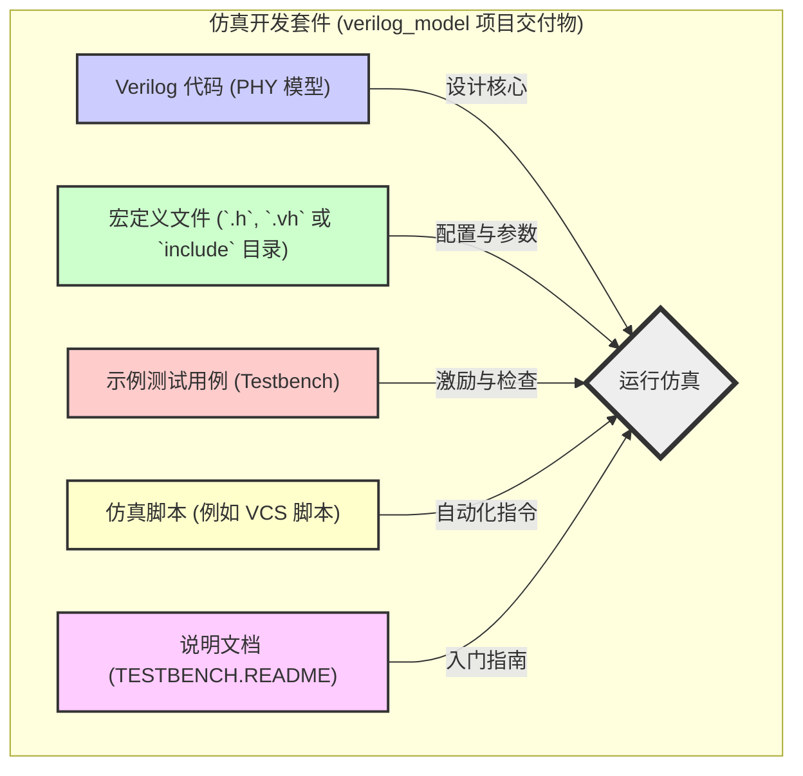
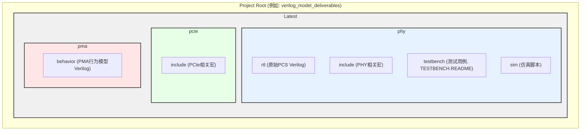
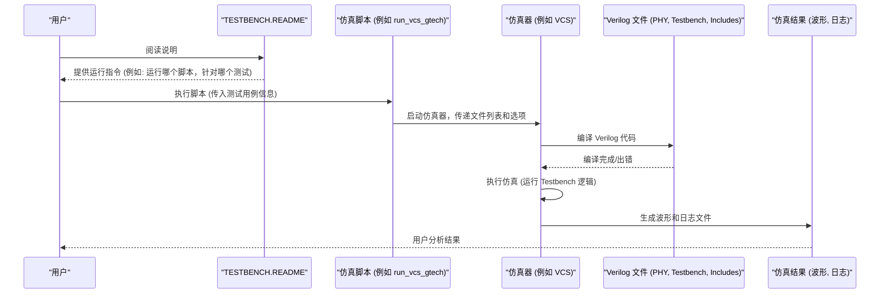

# Chapter 5: 仿真文件与环境


欢迎来到 `verilog_model` 教程的第五章！在上一章 [串行线路建模](04_串行线路建模_.md) 中，我们学习了如何在数字仿真环境中表示和连接 PHY 输出和输入的串行信号。我们理解了如何用 `0` 和 `1` 的组合来代表差分信号，从而在 Verilog 世界中模拟这些高速线路上的数据传输。

现在，我们已经了解了 PHY 模型的各个组成部分（[原始 PCS](02_原始_pcs__raw_pcs___physical_coding_sublayer__.md)、[PMA 行为模型](03_pma_行为模型__pma_behavioral_model___physical_medium_attachment__.md)）以及它们之间的接口。但仅仅拥有模型本身还不够，我们还需要一个“实验室”来运行它，观察它的行为。本章将带您探索 `verilog_model` 项目提供的仿真文件和整体环境，这就像是您拿到一套电子产品的开发套件，里面不仅有核心部件，还有配套的工具、示例和说明书，帮助您快速上手。

## 为什么需要了解仿真文件和环境？

想象一下，您刚刚购买了一套非常棒的乐高积木，目标是搭建一个宏伟的城堡。除了积木本身（这好比是我们的 PHY Verilog 模型），您可能还会得到一本详细的搭建手册、一些推荐的工具（比如一个方便拆卸积木的小撬棍），甚至还有一些已经搭建好的小部件作为示例。

同样，`verilog_model` 项目不仅仅提供了 PHY 的 Verilog 代码，还提供了一整套文件和目录结构，用于帮助您：
1.  **搭建仿真平台**：将 PHY 模型与测试激励（testbench）连接起来。
2.  **运行仿真**：通过脚本自动完成编译、链接和执行过程。
3.  **分析结果**：查看波形、检查日志，验证 PHY 功能是否符合预期。

理解这些文件的组织方式和各自的用途，是您能够成功运行仿真并进行有效调试的基础。如果您不清楚哪个文件是设计代码，哪个文件是测试代码，哪个文件是运行指令，那么就很难开始您的验证工作。

**核心目标**：让您熟悉项目交付物中的关键文件类型及其作用，为实际运行仿真做好准备。

## 仿真“开发套件”的核心组件

`verilog_model` 提供的仿真环境就像一个精心准备的开发套件。让我们打开这个套件，看看里面都有哪些宝贝：



下面我们逐一介绍这些组件：

### 1. Verilog 代码 (PHY 模型本身)

这是我们整个教程的核心，也是您进行仿真的主要对象。正如我们在前面章节中详细讨论过的：
*   **[原始 PCS (Raw PCS - Physical Coding Sublayer)](02_原始_pcs__raw_pcs___physical_coding_sublayer__.md) 的 RTL 代码**:
    *   位于：`./Latest/phy/rtl` 目录 (根据 `verilog_model.pdf` 第2页 "Overview" 和 第5页 Table 7-2)。
    *   例如：`dwc_pcie5_phy_xn_ns_pcs_raw_xN.v` (PCS 顶层) 和 `dwc_pcie5_phy_xn_ns.v` (PHY 顶层封装，实例化 PCS 和 PMA)。
    *   这是 PHY 的数字逻辑部分，是可综合的。
*   **[PMA 行为模型 (PMA Behavioral Model - Physical Medium Attachment)](03_pma_行为模型__pma_behavioral_model___physical_medium_attachment__.md)**:
    *   位于：`./Latest/pma/behavior` 目录 (根据 `verilog_model.pdf` 第2页 "Overview" 和 第5页 Table 7-2)。
    *   例如：`dwc_pcie5_phy_xn_ns_gtech.v` (PMA 顶层)。
    *   这是 PHY 的模拟接口部分的行为级描述，主要用于功能仿真，通常不可综合。

这些 Verilog 文件定义了 PHY 的行为和结构，是仿真器需要“理解”和“执行”的对象。

### 2. 宏定义文件 (Include Files)

在 Verilog 设计中，经常会用到宏定义（类似于 C 语言中的 `#define`）来定义常量、参数或者可重用的代码片段。这些宏可以控制模型的某些行为或者配置。
*   **位置**：
    *   `./Latest/phy/include` (用于 Raw PCS, PMA 和仿真文件)
    *   `./Latest/pcie/include` (用于 PCIe PCS 和仿真文件)
    (根据 `verilog_model.pdf` 第5页 Table 7-2)
*   **作用**：这些文件（通常以 `.h` 或 `.vh` 结尾，或者直接放在 `include` 目录下被 `-I` 选项指定）会被 Verilog 编译器在编译设计代码和测试平台代码之前预处理。它们确保了设计和测试之间配置的一致性。
*   **例子**：一个宏可能定义了 PHY 支持的最大速率，或者某个内部定时器的参数。在后续章节 [快速仿真模式](06_快速仿真模式_.md) 中，我们会看到特定的宏如何影响仿真行为。

### 3. 示例测试用例 (Testbench)

测试用例，通常称为 "testbench"，是用 Verilog 编写的，专门用于测试我们的 PHY 模型（通常称为 DUT - Design Under Test，待测设计）的代码。
*   **位置**：`./Latest/phy/testbench` 目录 (根据 `verilog_model.pdf` 第6页 Table 7-3)。
*   **作用**：
    *   **实例化 DUT**：在 testbench 中，我们会创建一个 PHY 模型的实例。
    *   **产生激励 (Stimulus)**：模拟来自 PCIe 控制器或其他相关组件的输入信号，驱动 PHY 模型。例如，发送数据包、改变控制信号等。
    *   **检查响应 (Checking)**：观察 PHY 模型的输出信号，验证其行为是否符合预期。例如，检查接收到的数据是否正确，状态信号是否按规范变化。
    *   **报告结果**：输出测试通过或失败的信息。
*   **类比**：如果 PHY 模型是一辆新车，那么 testbench 就是一个专业的试车员和测试场地。试车员会驾驶这辆车在各种路况下行驶（产生激励），并记录车辆的性能数据（检查响应）。

项目提供的示例测试用例是您学习如何与 PHY 模型交互、以及如何验证其功能的绝佳起点。

### 4. 仿真脚本 (Simulation Scripts)

手动去编译所有的 Verilog 文件、设置仿真参数、然后启动仿真器是一件繁琐且容易出错的事情。仿真脚本就是用来自动化这个过程的。
*   **位置**：`./Latest/phy/sim` 目录 (根据 `verilog_model.pdf` 第6页 Table 7-3)。
*   **类型**：这些通常是针对特定仿真器（例如 Synopsys VCS）的脚本。文档中提到了 `run_vcs_gtech` 和 `regression_gtech.csh` 等。
*   **作用**：
    *   **编译**：告诉仿真器需要编译哪些 Verilog 源文件 (PHY 模型, testbench, include 文件)。
    *   **指定顶层模块**：通常是 testbench 模块。
    *   **设置仿真选项**：例如仿真时间、波形转储、宏定义传递等。
    *   **运行仿真**：启动仿真器执行。
    *   **回归测试 (Regression)**：像 `regression_gtech.csh` 这样的脚本通常会运行一系列不同的测试用例，以确保对代码的修改没有破坏已有的功能。
*   **类比**：如果 testbench 是菜谱，Verilog 文件是食材，仿真器是厨房电器，那么仿真脚本就是大厨的指令清单，详细说明了如何一步步准备食材、设置电器并烹饪出菜肴。

对于初学者来说，您可能不需要从头编写这些脚本，而是直接使用项目提供的脚本来运行示例测试。

### 5. 说明文档 (TESTBENCH.README)

这是整个“开发套件”的“快速入门指南”或“说明书”。
*   **位置**：`./Latest/phy/testbench/TESTBENCH.README` (根据 `verilog_model.pdf` 第6页 Table 7-3)。
*   **重要性**：**这通常是您开始运行仿真的第一站！**
*   **内容**：这份文档会解释：
    *   如何设置仿真环境。
    *   如何运行提供的示例测试用例。
    *   可用的测试用例及其目的。
    *   可能需要的环境变量或宏定义。
    *   如何查看仿真结果。
*   **类比**：就像您拿到任何新设备，首先要阅读的就是快速入门指南。`TESTBENCH.README` 就是 PHY 仿真环境的快速入门指南。

**强烈建议您在尝试运行任何仿真之前，仔细阅读 `TESTBENCH.README` 文件。**

## 目录结构概览

了解这些文件类型后，我们来看看它们在项目中的大致存放位置。基于 `verilog_model.pdf` 文档，一个简化的目录结构可能如下所示：



*   `Latest/phy/rtl`: 存放 [原始 PCS (Raw PCS - Physical Coding Sublayer)](02_原始_pcs__raw_pcs___physical_coding_sublayer__.md) 的 Verilog RTL 代码。
*   `Latest/pma/behavior`: 存放 [PMA 行为模型 (PMA Behavioral Model - Physical Medium Attachment)](03_pma_行为模型__pma_behavioral_model___physical_medium_attachment__.md) 的 Verilog 代码。
*   `Latest/phy/include` 和 `Latest/pcie/include`: 存放宏定义文件。
*   `Latest/phy/testbench`: 包含示例测试用例 (`.v` 文件) 和至关重要的 `TESTBENCH.README`。
*   `Latest/phy/sim`: 包含运行仿真的脚本 (例如针对 VCS 的 `.csh` 或其他脚本文件)。

这个结构帮助我们将设计文件、测试文件和配置文件清晰地组织起来。

## 如何着手运行一个仿真？（概念流程）

假设您是一位新手，想要第一次运行 `verilog_model` 的仿真。您会怎么做呢？

**第一步：找到并阅读 "导航图" —— `TESTBENCH.README`**

这个文件是您的向导。它会告诉您：
*   有哪些预置的测试用例？（例如，`test_phy_loopback`，`test_data_transfer` 等）
*   每个测试用例是做什么的？
*   如何运行特定的测试用例？（通常会指向 `sim` 目录下的某个脚本）
*   运行前是否需要设置特定的环境变量或编译时宏？

**第二步：根据 `README` 的指引，选择并运行仿真脚本**

`TESTBENCH.README` 可能会告诉您：“要运行 `loopback` 测试，请进入 `Latest/phy/sim` 目录，然后执行命令 `./run_vcs_gtech loopback_testcase.v`。” (这只是一个假设的命令格式)。

当您执行这个脚本时，背后会发生一系列事情：



**流程解读**：

1.  **用户** 阅读 `TESTBENCH.README`，了解如何操作。
2.  **用户** 根据指引，执行一个**仿真脚本**，并可能指定要运行的测试用例。
3.  **仿真脚本** 负责调用**仿真器**（如VCS）。它会告诉仿真器：
    *   需要编译哪些 **Verilog 文件** (PHY模型、您选择的测试用例、所有相关的宏定义文件)。
    *   哪个 Verilog 模块是顶层模块 (通常是测试用例模块)。
    *   其他编译和运行选项 (例如，要不要生成波形文件，仿真持续多久等)。
4.  **仿真器** 首先编译所有的 Verilog 代码。如果代码有语法错误，编译会失败。
5.  如果编译成功，**仿真器** 开始执行仿真。这意味着它会运行测试用例中的逻辑：
    *   测试用例会实例化 PHY 模型。
    *   测试用例会给 PHY 模型施加输入激励。
    *   测试用例会监测 PHY 模型的输出，并与期望值比较。
6.  在仿真过程中或仿真结束后，会生成**仿真结果**，通常包括：
    *   **波形文件** (例如 `.vpd` 或 `.fsdb` 文件)，您可以用波形查看工具打开，观察信号随时间的变化。
    *   **日志文件** (通常是 `.log` 文件)，里面可能包含测试用例打印的调试信息、错误信息或测试通过/失败的总结。
7.  **用户** 接着分析这些结果，判断 PHY 模型的行为是否正确。

**一个非常简化的脚本概念 (非实际代码)**：

想象一个名为 `run_my_test.sh` 的脚本，它可能包含类似这样的伪指令：

```bash
# 伪代码 - 概念性仿真脚本
# 1. 定义 Verilog 文件列表
VERILOG_FILES="-f phy_files.f -f testbench_files.f" 
# phy_files.f 可能包含:
#   ../../../Latest/phy/rtl/dwc_pcie5_phy_xn_ns_pcs_raw_xN.v
#   ../../../Latest/pma/behavior/dwc_pcie5_phy_xn_ns_gtech.v
# testbench_files.f 可能包含:
#   my_specific_test.v (您当前测试用例的顶层文件)

# 2. 定义顶层模块
TOP_MODULE="my_specific_test"

# 3. 定义编译时宏 (如果需要)
DEFINES="+define+ENABLE_FEATURE_X +define+TARGET_SPEED_Y"

# 4. 调用仿真器 (例如 VCS)
vcs $VERILOG_FILES $TOP_MODULE $DEFINES -R -l simulation.log 
# -R: 编译后立即运行
# -l simulation.log: 指定日志文件名
```
这个伪代码展示了脚本的核心任务：收集文件、定义参数、调用仿真器。实际的脚本（如 `run_vcs_gtech`）会更复杂，处理更多选项和错误检查，但基本原理是相通的。

您不需要一开始就深入理解脚本的每一行。关键是知道它们的存在，并通过 `TESTBENCH.README` 了解如何使用它们来运行预置的测试。

## 总结

在本章中，我们一起探索了 `verilog_model` 项目提供的“仿真开发套件”。我们了解到：

*   成功运行仿真不仅需要 PHY 的 Verilog 模型，还需要一个包含**宏定义文件、示例测试用例、仿真脚本**和**说明文档 (`TESTBENCH.README`)** 的完整环境。
*   这些文件通常按照一定的**目录结构**组织，方便管理和使用。关键目录包括 `rtl` (PCS), `behavior` (PMA), `include` (宏), `testbench` (测试代码和README), 和 `sim` (脚本)。
*   **`TESTBENCH.README`** 是您的入门向导，指导您如何运行示例仿真。
*   **仿真脚本** 自动化了编译和运行过程，使得执行仿真更加便捷。
*   典型的仿真流程包括：阅读 `README` -> 执行脚本 -> 脚本调用仿真器 -> 仿真器编译和运行代码 -> 生成结果 -> 用户分析。

现在，您对仿真所需的“装备”和“地图”应该有了一个清晰的认识。这为您在后续章节中尝试更具体的仿真模式打下了坚实的基础。

在下一章中，我们将讨论一个非常实用的主题：[快速仿真模式](06_快速仿真模式_.md)，学习如何通过特定的配置来缩短某些耗时较长的仿真过程，从而提高验证效率。

---

Generated by [AI Codebase Knowledge Builder](https://github.com/The-Pocket/Tutorial-Codebase-Knowledge)