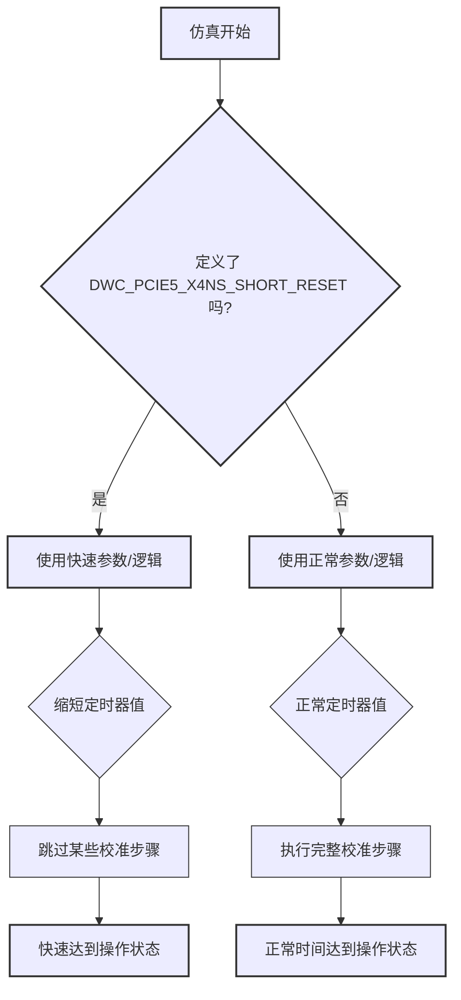

# Chapter 6: 快速仿真模式


欢迎来到 `verilog_model` 教程的第六章！在上一章 [仿真文件与环境](05_仿真文件与环境_.md) 中，我们了解了运行 PHY 模型仿真所需的各种文件和整体环境，包括设计代码、测试用例、宏定义以及仿真脚本。我们知道了，就像拥有一个完备的“实验室”一样，这些组件共同协作，才能让我们的 PHY 模型“跑起来”。

现在，想象一下，您急于测试 PHY 的核心数据收发功能，但每次启动仿真，都必须等待漫长的上电复位序列、链路训练等过程，就像看视频教程时必须看完每一秒的片头和无关介绍一样，是不是感觉有点耗时且不耐烦？如果能像视频“倍速播放”或者“跳过介绍”那样，直接进入核心内容就好了！

本章将介绍的“快速仿真模式”正是为了解决这个问题而设计的。

## 什么是快速仿真模式？它为什么重要？

在真实的硬件世界里，PHY 的某些操作，例如上电时的各种校准（Calibration）、PLL（锁相环）锁定、或者数据速率改变时的链路重新训练（Link Retraining），确实需要一段不可忽略的时间才能完成。这些过程对于保证物理链路的稳定性和性能至关重要。

然而，在**数字仿真**中，我们可能并不总是关心这些过程的精确时长或所有中间步骤。有时候，我们的主要目标是验证上层逻辑（比如 PCIe 控制器）与 PHY 之间的交互是否正确，或者数据通路本身是否通畅。在这种情况下，漫长的启动和校准时间会大大拖慢我们的仿真速度，降低验证效率。

**快速仿真模式 (Fast Simulation Mode)** 就是一种特殊的仿真配置，它允许我们通过预设的宏定义或直接向 PHY 内部的特定寄存器写入控制位，来**跳过或显著缩短**这些耗时的过程。

**核心优势：**

*   **大幅缩短仿真运行时间**：这是最直接的好处。通过跳过或加速耗时操作，整个仿真的总时间可以从几小时缩短到几分钟，甚至更快。
*   **提高验证效率**：仿真跑得快，意味着您可以在相同的时间内运行更多的测试，或者更快地迭代您的设计和测试用例。
*   **聚焦核心逻辑**：让您可以更快地进入到您真正关心的功能点的验证，比如数据传输、状态转换等。

可以将快速仿真模式类比为：
*   观看视频教程时的“**倍速播放**”或“**跳过片头**”功能。
*   玩游戏时的“**跳过新手教程**”或“**使用存档直接进入后续关卡**”。

它帮助我们更快地到达“剧情”的核心部分，而无需每次都从头开始经历完整的“开场动画”。

## 如何启用和使用快速仿真模式？

根据 `verilog_model.pdf` 文档（第7页，“Fast Simulation Mode”），主要有两种方法来启用或利用快速仿真模式相关的特性：

1.  **通过预定义的 Verilog 宏 (Macro)**：这是针对 Raw PCS 的 RTL 模型进行仿真时，一种简便的启用方式。
2.  **通过并行控制寄存器接口写入特定寄存器**：当 Raw PCS 已经被综合成门级网表，或者您需要更精细地控制某些快速行为时，可以使用这种方法。

接下来，我们将分别简单介绍这两种方法。更详细的寄存器配置将在下一章 [快速仿真寄存器配置](07_快速仿真寄存器配置_.md) 中讨论。

### 方法一：使用 `DWC_PCIE5_X4NS_SHORT_RESET` 宏

当您对 PHY 的原始 PCS 部分使用 RTL 代码进行仿真时（即 `Latest/phy/rtl` 目录下的代码），最简单的方法是定义一个名为 `DWC_PCIE5_X4NS_SHORT_RESET` 的 Verilog 宏。

*   **适用场景**：主要用于 Raw PCS 的 RTL 模型仿真，PMA 模型（GTECH 或门级）也支持此模式。
*   **如何定义**：通常在您的仿真脚本或仿真器的命令行选项中定义这个宏。例如，在使用 Synopsys VCS 仿真器时，您可能会在编译命令中加入类似 `+define+DWC_PCIE5_X4NS_SHORT_RESET` 的选项。

```bash
# 概念性 VCS 仿真命令 - 展示如何定义宏
# 请参考实际的仿真脚本 (例如 sim/run_vcs_gtech) 来了解确切的命令
# vcs <源文件列表> <顶层模块> +define+DWC_PCIE5_X4NS_SHORT_RESET <其他选项>
```
**当定义了 `DWC_PCIE5_X4NS_SHORT_RESET` 宏后，PHY 模型内部的逻辑会：**
*   自动缩短各种内部定时器的等待时间。
*   跳过或简化某些校准和训练序列。
*   更快地达到功能就绪状态。

例如，一个通常需要数万个时钟周期才能完成的校准过程，在定义了这个宏之后，可能只需要几十或几百个周期就能“假装”完成。

### 方法二：通过寄存器写入配置快速行为

在某些情况下，比如当 Raw PCS 已经被综合（不再是纯 RTL 代码），或者您希望对特定的快速行为有更细致的控制时，可以通过 PHY 的并行控制寄存器接口来写入特定的控制位，以达到快速仿真的效果。

`verilog_model.pdf` 文档（第7页）描述了一个大致的序列，用于在真实芯片或综合后的 PCS 中修改内部状态机操作以实现快速模式：

1.  将 `phy_reset` 以及所有通道的 `rxX_reset` 和 `txX_reset` 置为 `'1'` （复位状态）。
2.  等待一段时间（例如，上电后等待 10ns 或至少 10µs，以确保电源稳定）。
3.  将 `phy_reset` 置为 `'0'` （释放主复位）。
4.  等待至少 10 个 `phy_ref_dig_clk` 周期，以确保控制寄存器接口可以操作。
5.  在 `sram_ext_ld_done` 信号断言之前，向特定的寄存器字段写入值，以启用各种快速模式特性。具体要写入的寄存器和值在 `verilog_model.pdf` 的 **Table 7-4** 中有详细列表 (我们将在 [快速仿真寄存器配置](07_快速仿真寄存器配置_.md) 章节详细介绍)。
6.  将需要操作的通道的 `rxX_reset` 和 `txX_reset` 置为 `'0'` （释放通道复位）。

**概念性的 Testbench 代码片段 (写入寄存器)**：
下面是一个极度简化的伪代码，展示了在 testbench 中如何通过任务来模拟对 PHY 寄存器的写操作。

```verilog
// 伪代码 - 概念性展示在 testbench 中写入 PHY 寄存器
task write_phy_register (
    input [15:0] address, // 假设16位地址
    input [31:0] data     // 假设32位数据
);
    // 实际的寄存器写入会通过 PHY 的控制接口信号
    // 例如：等待 ack，处理时序等
    // 这里仅为示意
    `ifndef SYNTHESIS // 通常仿真代码才包含这些直接的内部操作
    $display("在地址 %h 写入数据 %h (快速仿真配置)", address, data);
    // phy_model_instance.internal_reg_path.register_array[address] = data; // 这是不切实际的简化
    // 真实场景下，你需要驱动 phy_ctrl_if_addr, phy_ctrl_if_wdata, phy_ctrl_if_write 等信号
    `endif
endtask

// 在 testbench 的初始化序列中:
initial begin
    // ... 其他复位和初始化步骤 ...

    // 步骤 5: 写入快速仿真相关的寄存器
    // 假设 0x100 寄存器的第 0 位是 FAST_RTUNE (来自 Table 7-4 的简化)
    // write_phy_register(16'h0100, 32'h00000001); // 设置 FAST_RTUNE = 1

    // ... 继续其他步骤 ...
end
```
**代码解释**：
*   这个 `write_phy_register` 任务只是一个概念，实际的寄存器访问需要遵循 PHY 模型提供的并行控制接口协议（例如，设置地址、数据、写使能信号，并等待响应）。
*   在 `initial` 块中，会在适当的时候调用这个任务来配置特定的寄存器位，以启用快速仿真特性。

**重要提示**：`verilog_model.pdf` (第12页) 指出，断言 `phy_reset` 会将寄存器重置为默认值。因此，要在快速仿真模式下保留设置，**每次 `phy_reset` 撤销后都必须重新写入启用快速仿真模式的寄存器**。

## 快速仿真模式的“幕后英雄”

那么，当启用了快速仿真模式后，PHY 模型内部到底发生了什么，使得仿真能够加速呢？

### 1. 条件编译与参数调整 (宏方式)

当使用 `DWC_PCIE5_X4NS_SHORT_RESET` 宏时，PHY 的 Verilog RTL 代码中通常会包含条件编译指令 (`` `ifdef``, `` `else``, `` `endif``)。



这些条件编译块会根据宏是否定义来选择不同的代码路径或参数值。

**概念性 Verilog 代码示例**：

```verilog
// 概念性代码 - 展示宏如何影响计时器参数
module some_phy_block (
    // ...端口...
);
    `ifdef DWC_PCIE5_X4NS_SHORT_RESET
        localparam PLL_LOCK_WAIT_CYCLES = 100;     // 快速模式：PLL锁定等待周期数大大缩短
        localparam CALIBRATION_TIMEOUT = 50;       // 快速模式：校准超时计数器
        `define SKIP_SOME_CAL_STEP                 // 快速模式：定义一个用于跳过步骤的宏
    `else
        localparam PLL_LOCK_WAIT_CYCLES = 500000;  // 正常模式：PLL锁定等待周期数
        localparam CALIBRATION_TIMEOUT = 20000;    // 正常模式：校准超时计数器
    `endif

    reg [19:0] pll_lock_counter;
    // ... 其他逻辑 ...

    always @(posedge clk or negedge rst_n) begin
        if (!rst_n) begin
            pll_lock_counter <= 0;
            // ...
        `ifndef SKIP_SOME_CAL_STEP // 如果没有定义跳过宏 (正常模式)
        // end else if (state == PERFORMING_DETAILED_CAL) begin
            // 执行详细的校准步骤...
        // end
        `endif
        // ...
        end else if (state == WAITING_FOR_PLL_LOCK) begin
            if (pll_lock_counter < PLL_LOCK_WAIT_CYCLES) begin
                pll_lock_counter <= pll_lock_counter + 1;
            end else begin
                // 达到计数值，认为PLL已锁定
                state <= PLL_LOCKED;
            end
        end
        // ...
    end
endmodule
```
**代码解释**：
*   `localparam PLL_LOCK_WAIT_CYCLES`: 这个参数根据宏 `DWC_PCIE5_X4NS_SHORT_RESET` 是否定义，被赋予不同的值。在快速模式下，等待周期数显著减少。
*   `` `define SKIP_SOME_CAL_STEP``: 在快速模式下，这个内部宏被定义，可以用于通过 `` `ifndef`` 来条件性地排除某些耗时的校准逻辑。
*   状态机 (`state == WAITING_FOR_PLL_LOCK`) 中的计数器会使用这个 `PLL_LOCK_WAIT_CYCLES` 参数。

### 2. 专用强制值模块 (RTL仿真)

`verilog_model.pdf` 文档（第7页）还提到了两个特殊的 Verilog 模块，它们用于在快速仿真模式下强制某些值，以加速频率调谐和 MPLL 校准：
*   `<phy_prefix>_force_freq_tune.v`: 基于参考时钟频率和 RX VCO 配置输入，强制 RX VCO 校准码。
*   `<phy_prefix>_mpll_coarse_tune.v`: 基于参考时钟频率和 MPLL 配置输入，强制 MPLL 校准码。

这些模块在运行 RTL 仿真时会自动加载，因为它们存在于 PHY RTL 封装中。但是，如果 Raw PCS 已经被综合，这些模块会被移除，如果仍想使用其功能，则需要在测试平台中像 PHY RTL 封装那样实例化并连接它们。

### 3. 寄存器字段控制 (寄存器写入方式)

当通过写入寄存器来启用快速模式时，PHY 内部的状态机会直接读取这些寄存器字段的值。这些字段通常作为标志位或参数，控制状态机是否跳过某些步骤、使用较短的延时，或直接认为某个耗时操作已完成。

例如，`verilog_model.pdf` 中 Table 7-4 列出的一个寄存器字段可能是 `FAST_MPLL_LOCK`。当这个位被设置为 `1` 时，控制 MPLL 锁定的状态机可能会跳过大部分锁定检测步骤，直接进入“已锁定”状态。

### 4. `phy_forces.v` 文件

`verilog_model.pdf`（第7页）提到一个名为 `phy_forces.v` 的文件（位于 `./phy/testbench/phy_forces.v`）。这个文件包含了一些 Verilog `force` 语句，这些语句在正常仿真模式和快速仿真模式下都可能需要，以确保仿真能够正常工作。具体使用方法和包含哪些 `force` 语句，建议查阅 `./phy/testbench/TESTBENCH.README` 文件。

`force` 语句可以直接将一个信号强制设置为某个值，这在仿真中可以用来模拟某些外部条件或绕过模型内部的某些逻辑。

## 快速仿真模式的优势与适用场景

**优势：**
*   **显著减少仿真时间**：这是最核心的优势，能够让您更快地得到仿真结果。
*   **提高回归测试效率**：在进行大规模回归测试时，如果大部分测试用例不需要验证完整的上电和校准序列，使用快速模式可以极大地缩短整个回归测试套件的运行时间。
*   **快速迭代设计**：当您主要关注 PHY 与上层逻辑的交互或数据通路时，可以快速跳过启动阶段，直接验证核心功能。

**适用场景：**
*   验证上层协议逻辑（如 PCIe 控制器）与 PHY 的接口交互。
*   验证数据通路在不同速率下的基本连通性。
*   功能覆盖率收集，其中许多测试场景不依赖于精确的启动时序。
*   调试特定的功能模块，而该模块的使能不依赖于完整的 PHY 初始化。

**不适用或需谨慎使用的场景：**
*   **验证 PHY 本身的上电复位序列**：如果您想验证 PHY 上电、复位、校准过程是否完全符合规范，那么不应使用快速模式，因为它会跳过或改变这些过程。
*   **验证精确的链路训练行为**：例如，PCIe 的链路训练涉及到复杂的 LTSSM（Link Training and Status State Machine）状态转换和定时，快速模式可能会简化这些。
*   **依赖精确模拟时序的特性**：某些 PHY 特性可能对校准结果或训练过程中的模拟参数非常敏感，快速模式的简化可能导致不准确的仿真结果。
*   **模拟真实的硬件行为**：快速仿真模式是为数字仿真加速而设计的，它并不代表真实硬件的行为，尤其是在那些被“加速”的过程中。

## 总结

在本章中，我们了解了 `verilog_model` 中的快速仿真模式：

*   **目的**：通过跳过或缩短 PHY 中耗时的操作（如校准、链路训练），来大幅减少仿真运行时间，提高验证效率。
*   **启用方式**：
    *   定义 `DWC_PCIE5_X4NS_SHORT_RESET` 宏（主要用于 Raw PCS RTL 仿真）。
    *   通过并行控制寄存器接口写入特定控制位。
*   **工作原理**：通过条件编译、参数调整、专用强制值模块以及寄存器控制内部状态机行为来实现加速。
*   **优势**：缩短仿真时间，提高效率，聚焦核心逻辑。
*   **局限性**：不适用于验证被加速过程本身的精确行为。

快速仿真模式是数字验证工程师的有力工具，它使我们能够更高效地进行功能验证。理解了如何“快进”之后，我们可能还想知道具体是哪些“按钮”（寄存器）可以让我们进行更精细的“快进”控制。

在下一章中，我们将深入探讨 [快速仿真寄存器配置](07_快速仿真寄存器配置_.md)，详细了解通过写寄存器启用快速仿真模式时，具体需要配置哪些寄存器及其字段。

---

Generated by [AI Codebase Knowledge Builder](https://github.com/The-Pocket/Tutorial-Codebase-Knowledge)