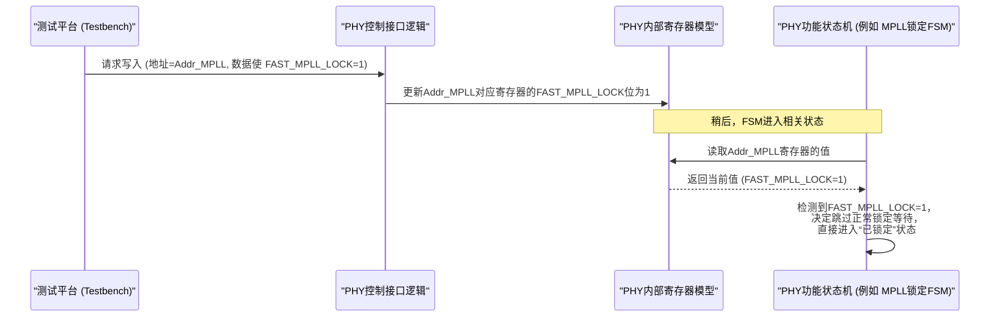

# Chapter 7: 快速仿真寄存器配置


欢迎来到 `verilog_model` 教程的第七章！在上一章 [快速仿真模式](06_快速仿真模式_.md) 中，我们学习了如何通过定义 `DWC_PCIE5_X4NS_SHORT_RESET` 宏来便捷地启用快速仿真，从而大幅缩短PHY模型中某些耗时操作的仿真时间。这种方法非常适合在对原始PCS（Raw PCS）进行RTL级仿真时使用。

但是，如果情况有所不同呢？比如，当我们的原始PCS部分已经被综合成了门级网表（gate-level netlist），或者我们希望对PHY的快速行为进行更精细、更个性化的控制，而不是简单地“一键加速”所有可加速部分时，我们该怎么办？这时，通过PHY的控制寄存器接口直接配置特定寄存器就成了一种更灵活、更强大的方法。

本章将带您深入了解如何通过直接写入PHY内部寄存器来启用和定制快速仿真效果。这就像从使用一个总的“快速模式”开关，进阶到了解并手动调节设备内部的多个精密旋钮和拨片，以达到您期望的特定“快速运行”状态。

## 为什么需要通过寄存器配置？

想象一下，您正在调试一个复杂的音响系统。系统提供了一个“一键优化”按钮，按下后会自动调整均衡器、音量等参数，让声音听起来“还不错”。这就像上一章我们讨论的 `DWC_PCIE5_X4NS_SHORT_RESET` 宏，简单方便。

但如果您是一位音响发烧友，可能觉得“一键优化”的效果并不完全符合您的口味。您可能想单独增强低音，或者稍微调整中高频的某个特定频段。这时，您就需要去操作均衡器上那些独立的推子和旋钮，进行精细调节。

通过寄存器配置快速仿真模式也是类似的道理：

1.  **门级网表仿真**：当原始PCS部分已经从RTL代码被综合工具转换成了实际的逻辑门连接（门级网表）后，之前通过 `+define` 方式定义的宏可能不再直接适用或作用方式有所改变。此时，通过寄存器接口写入配置是更可靠的方式。
2.  **精细化控制**：有时候，您可能不想“一揽子”地加速所有可加速的过程。例如，您可能只想加速PLL（锁相环）的锁定时间，但保持其他校准过程的正常速度以观察其行为。寄存器配置允许您有选择地启用或禁用特定的快速仿真特性。
3.  **模拟特定硬件场景**：在某些高级验证场景中，您可能需要模拟硬件通过固件（firmware）或软件配置PHY寄存器以进入某种特殊工作模式的过程。

**核心用例**：假设您正在对一个包含了PHY门级网表的系统进行仿真。您希望在不重新编译整个设计（即不通过添加宏定义）的情况下，让PHY的接收端VCO校准和MPLL（主锁相环）锁定过程显著加快，以便更快地开始数据传输测试。

## “藏宝图”：`verilog_model.pdf` 中的 Table 7-4

要手动配置这些“旋钮和开关”，我们首先需要一张“说明书”或者“地图”，告诉我们每个旋钮对应什么功能，以及应该如何设置。在 `verilog_model` 项目中，这份关键的“地图”就是 `verilog_model.pdf` 文档中的 **Table 7-4 "Registers for Fast Simulation Mode"** (第8-12页)。

这张表格详细列出了所有与快速仿真相关的寄存器及其内部的字段（Register Field），以及为了达到各种加速仿真效果，推荐向这些字段写入的值（通常是 `1'b1` 来启用快速模式）。

**Table 7-4 包含的关键信息**：

*   **寄存器名称 (Register)**：例如 `SUP_DIG_RTUNE_CONFIG`，`LANEX_DIG_TX_ROPLL_CTL_ROPLL_OVRD` 等。这些名称指明了PHY内部的具体寄存器模块。
*   **寄存器字段 (Register Field)**：例如 `FAST_RTUNE`，`FAST_MPLL_LOCK`，`FAST_ROPLL_PWRUP` 等。这些是寄存器内部的特定控制位或位组。
*   **推荐值 (Value to be programmed for SHORT_RESET)**：通常是 `1'b1`，表示将该字段设置为1以启用对应的快速功能。

把Table 7-4想象成一个大型调音台的面板图，上面标注了每一个推子和旋钮的功能。

## 如何操作：“拧动”寄存器旋钮

`verilog_model.pdf` 文档（第7页）提供了一个在真实芯片或综合后的PCS中修改内部状态机操作以实现快速模式的通用序列。在仿真环境中，我们的测试平台 (testbench) 需要模拟这个过程来写入寄存器。

**基本步骤** (根据 `verilog_model.pdf` 第7页)：

1.  **置位复位**：将主复位信号 `phy_reset` 以及所有要操作通道的 `rxX_reset` (接收端复位) 和 `txX_reset` (发送端复位) 设置为 `'1'` (复位状态)。
2.  **等待电源稳定**：等待一段时间。文档建议在上电后等待10纳秒（ns）或至少10微秒（µs），以确保电源稳定。在仿真中，这个等待时间可以根据需要调整。
3.  **释放主复位**：将 `phy_reset` 设置为 `'0'`。
4.  **等待控制接口就绪**：等待至少10个 `phy_ref_dig_clk` (PHY参考数字时钟) 周期。这是为了确保PHY内部的控制寄存器接口已经准备好接收命令。
5.  **写入快速仿真寄存器**：在 `sram_ext_ld_done` 信号断言之前（`sram_ext_ld_done` 通常表示SRAM中的配置加载完成），通过PHY的并行控制寄存器接口，向Table 7-4中列出的目标寄存器的特定字段写入推荐值。
6.  **释放通道复位**：将需要操作的通道的 `rxX_reset` 和 `txX_reset` 设置为 `'0'`，使这些通道开始工作。

**重要提示**：根据 `verilog_model.pdf` (第12页) 的说明，**断言 `phy_reset` 会将所有寄存器重置为其默认值**。这意味着，为了保持快速仿真模式的设置，**每次 `phy_reset` 信号从有效（例如 `'1'`）变为无效（例如 `'0'`）之后，都必须重新执行上述第5步，即重新写入那些用于启用快速仿真模式的寄存器值**。

### 示例：测试平台中的寄存器写入（概念性）

下面的Verilog伪代码展示了在测试平台中如何概念性地执行寄存器写入操作。请注意，这里**极度简化**了实际的PHY控制接口协议（例如APB、JTAG或PHY特定的并行接口），仅为示意。

```verilog
// 伪代码 - 在Testbench中概念性地写入PHY寄存器
// 假设PHY模型实例名为 phy_dut
// 假设PHY提供了一个简化的写任务接口用于仿真

// 任务：向PHY特定地址写入数据
task write_phy_register;
    input [15:0] addr; // 寄存器地址
    input [31:0] data; // 要写入的数据

    // 在真实的testbench中，这里会涉及到驱动PHY的
    // 控制总线信号，如地址线、数据线、写使能、时钟等，
    // 并遵循特定的时序协议。
    // 例如：
    // @(posedge phy_ctrl_clk);
    // phy_dut.ctrl_addr  = addr;
    // phy_dut.ctrl_wdata = data;
    // phy_dut.ctrl_write = 1'b1;
    // @(posedge phy_ctrl_clk); // 等待一个周期
    // phy_dut.ctrl_write = 1'b0;
    // while (!phy_dut.ctrl_ack) @(posedge phy_ctrl_clk); // 等待应答

    $display("[%0t ns] Testbench: 向PHY寄存器地址 %h 写入数据 %h (用于快速仿真)", $time, addr, data);
    // 实际的写入会通过模型暴露的接口，这里仅为示意
endtask

initial begin
    // 1. 置位复位
    phy_dut.phy_reset   = 1'b1;
    phy_dut.rx0_reset = 1'b1; // 假设操作lane 0
    phy_dut.tx0_reset = 1'b1;

    // 2. 等待电源稳定 (仿真中简化)
    #200ns; // 等待一段时间

    // 3. 释放主复位
    phy_dut.phy_reset = 1'b0;

    // 4. 等待控制接口就绪 (仿真中简化，通常需要几个phy_ref_dig_clk)
    repeat (15) @(posedge phy_dut.phy_ref_dig_clk);

    // 5. 写入快速仿真寄存器 (在 sram_ext_ld_done 断言前)
    //    示例：根据 Table 7-4 (verilog_model.pdf, p.8)
    //    寄存器: SUP_DIG_RTUNE_CONFIG, 字段: FAST_RTUNE, 值: 1'b1
    //    假设 SUP_DIG_RTUNE_CONFIG 的地址是 16'h0010
    //    假设 FAST_RTUNE 是该寄存器的第0位 (LSB)
    write_phy_register(16'h0010, 32'h00000001); // 设置 FAST_RTUNE = 1

    //    寄存器: SUP_DIG_MPLLA_MPLL_PWR_CTL_CAL_CTRL_1, 字段: FAST_MPLL_LOCK, 值: 1'b1
    //    假设地址是 16'h0020, FAST_MPLL_LOCK 是第1位
    write_phy_register(16'h0020, 32'h00000002); // 设置 FAST_MPLL_LOCK = 1

    // ... 根据Table 7-4写入其他需要的寄存器 ...
    // 例如，针对 RAWLANEAONX_DIG_FAST_FLAGS 寄存器 (Table 7-4, p.10)
    // 假设其地址为 16'h01A0
    // 我们想设置 FAST_RX_VCO_CAL = 1 (假设是第6位) 和 FAST_RX_PWRUP = 1 (假设是第8位)
    // data = (1 << 6) | (1 << 8) = 32'h00000140
    write_phy_register(16'h01A0, 32'h00000140);

    // (确保在 sram_ext_ld_done 信号变高之前完成所有写操作)
    // wait (phy_dut.sram_ext_ld_done == 1'b0); // 这是一个概念性的等待

    // 6. 释放通道复位
    phy_dut.rx0_reset = 1'b0;
    phy_dut.tx0_reset = 1'b0;

    // ... 后续的仿真操作 ...
end
```

**代码解释**：
*   `write_phy_register` 任务是一个高度简化的占位符。在真实的测试平台中，您需要根据PHY模型提供的具体控制接口（这可能在PHY的文档中有详细说明，或者需要查看PHY顶层模块的端口列表）来实现这个任务。
*   `initial` 块按照之前描述的顺序执行操作。
*   关键在于第5步：调用 `write_phy_register` 任务，将Table 7-4中指定的寄存器地址和数据值写入PHY。您需要查阅PHY的寄存器映射文档来确定Table 7-4中寄存器名称对应的实际地址。
*   **地址和位偏移**：上面的代码中，寄存器地址（如 `16'h0010`）和字段在数据中的位偏移（如 `FAST_RTUNE` 是第0位）是**纯粹假设的示例**。您**必须**参考您所使用的 `verilog_model` 版本的确切文档来获取这些信息。Table 7-4本身只列出寄存器名和字段名，具体地址和位位置通常在PHY数据手册的寄存器描述章节中。

## 幕后探秘：寄存器如何影响仿真

当测试平台通过控制接口向PHY内部的某个寄存器写入一个值（比如将 `FAST_MPLL_LOCK` 位设为1）后，PHY模型内部会发生什么呢？

1.  **控制接口逻辑接收**：PHY模型内部的控制接口逻辑（行为级或RTL级）会检测到写操作，捕获地址和数据。
2.  **内部寄存器更新**：该数据会被存入模型内部与该地址对应的模拟寄存器变量中。
3.  **状态机或逻辑读取**：PHY内部负责特定功能的状态机（FSM）或其他逻辑块会读取这些寄存器的值。
4.  **行为调整**：如果状态机发现某个“快速模式”控制位（如 `FAST_MPLL_LOCK`）被设置了，它就会改变自己的行为。例如：
    *   **跳过状态**：可能会跳过某些耗时的等待状态或校准子状态。
    *   **缩短计数器**：用于定时的内部计数器的目标值可能会变得非常小。
    *   **强制完成**：某些操作可能被标记为“立即完成”，而不是等待实际的完成条件。

**序列图：一次寄存器写操作如何影响PHY行为**



**概念性PHY内部逻辑 (伪代码)**

为了更直观地理解，下面是一个**极度简化且纯概念性**的Verilog片段，展示了一个寄存器位如何可能影响PHY内部逻辑：

```verilog
// 概念性PHY内部模块 - 非真实代码
module phy_some_fsm (
    input clk,
    input rst_n,
    // ... 其他输入 ...
    input fast_operation_enable_from_reg // 这个信号来自某个控制寄存器的字段
);

    localparam STATE_IDLE = 0;
    localparam STATE_WAIT_LONG_TIME = 1;
    localparam STATE_DONE = 2;

    reg [1:0] current_state, next_state;
    reg [15:0] wait_counter;

    localparam LONG_WAIT_VALUE = 16'd50000;
    localparam SHORT_WAIT_VALUE = 16'd10; // 快速模式下的等待值

    always @(posedge clk or negedge rst_n) begin
        if (!rst_n) begin
            current_state <= STATE_IDLE;
            wait_counter <= 0;
        end else begin
            current_state <= next_state;
            if (next_state == STATE_WAIT_LONG_TIME) begin
                // 如果是等待状态，计数器增加
                // 注意: 这里的条件判断比实际简单得多
                if (wait_counter < (fast_operation_enable_from_reg ? SHORT_WAIT_VALUE : LONG_WAIT_VALUE) ) begin
                    wait_counter <= wait_counter + 1;
                end else begin
                    wait_counter <= 0; // 清零计数器，准备下次使用
                end
            end else begin
                 wait_counter <= 0; // 其他状态下清零计数器
            end
        end
    end

    always @(*) begin // 组合逻辑定义下一个状态和输出
        next_state = current_state; // 默认保持当前状态
        case (current_state)
            STATE_IDLE: begin
                next_state = STATE_WAIT_LONG_TIME;
            end
            STATE_WAIT_LONG_TIME: begin
                if (wait_counter >= (fast_operation_enable_from_reg ? SHORT_WAIT_VALUE : LONG_WAIT_VALUE) -1 ) begin
                    next_state = STATE_DONE;
                end
            end
            STATE_DONE: begin
                // 操作完成
                next_state = STATE_IDLE; // 可以回到空闲或其他状态
            end
            default: next_state = STATE_IDLE;
        endcase
    end
endmodule
```

**代码解释**：
*   `fast_operation_enable_from_reg`：这个输入信号代表从某个控制寄存器读取到的快速模式使能位。
*   `wait_counter`：一个内部计数器。
*   `LONG_WAIT_VALUE` 和 `SHORT_WAIT_VALUE`：分别代表正常模式和快速模式下的等待计数值。
*   在 `STATE_WAIT_LONG_TIME` 状态下，计数器的目标值会根据 `fast_operation_enable_from_reg` 的值来选择。如果该位为1（快速模式），则使用 `SHORT_WAIT_VALUE`，状态机会更快地转换到 `STATE_DONE`。

这只是一个非常简单的例子。实际PHY模型中的状态机和控制逻辑会复杂得多，但基本原理是相似的：**寄存器中的特定位就像开关一样，控制着内部逻辑选择不同的执行路径或参数。**

**Table 7-4 中的“SKIP”系列字段**：
您会注意到Table 7-4中有很多以 `SKIP_` 开头的字段，例如 `SKIP_RX_AFE_ADAPT_STARTUP`，`SKIP_RX_DCC_CAL_STARTUP` 等。这些字段通常用于完全跳过某些特定的启动校准或适应算法步骤，从而进一步加速仿真。

## 选择合适的“旋钮”

查阅 `verilog_model.pdf` 中的Table 7-4，您会发现有大量的寄存器和字段可供配置。如何选择呢？

*   **通用加速**：如果您想获得与 `DWC_PCIE5_X4NS_SHORT_RESET` 宏类似的效果，那么您可能需要将Table 7-4中列出的**所有或大部分**字段都设置为推荐值（通常是 `1'b1`）。
*   **特定加速**：如果您只想加速某个特定过程，例如RX VCO校准，那么您可能只需要找到并设置与该功能相关的字段，比如 `RAWLANEAONX_DIG_FAST_FLAGS` 寄存器中的 `FAST_RX_VCO_CAL` 字段 (见Table 7-4, 第10页)。文档中 (第12页，第二个Note) 特别提到，为加快门级短复位仿真的RX VCO校准，建议定义 `FAST_RX_VCO_CAL` 宏或将 `FAST_RX_VCO_CAL` 寄存器字段设为1。
*   **文档指引**：仔细阅读 `verilog_model.pdf` 中关于快速仿真模式的描述，特别是Table 7-4下面的注释。这些注释通常会提供关于特定字段用途或特定场景下推荐设置的宝贵信息。例如，文档中提到对于DAC偏移校准，推荐定义 `FAST_RX_STARTUP_CAL` 宏或写入 `FAST_RX_STARTUP_CAL` 寄存器字段。

## 总结

在本章中，我们深入探讨了如何通过配置PHY内部寄存器来实现快速仿真：

*   **动机**：当无法使用宏定义（如在门级仿真中）或需要更精细控制时，寄存器配置是启用快速仿真的关键方法。
*   **核心工具**：`verilog_model.pdf` 文档中的 **Table 7-4** 是您的“操作手册”，列出了所有相关的快速仿真寄存器和字段。
*   **操作流程**：在测试平台中，遵循特定的复位和初始化序列，在 `sram_ext_ld_done` 断言前，通过PHY的控制接口写入Table 7-4中指定的寄存器值。特别注意 `phy_reset` 会重置寄存器，因此可能需要重复写入。
*   **内部机制**：写入的寄存器值被PHY内部的状态机和逻辑读取，从而改变其行为，例如跳过状态、缩短延时等，最终达到加速仿真的效果。
*   **灵活性**：您可以根据需要选择性地配置寄存器，以实现对特定过程的加速。

通过寄存器配置快速仿真模式，就像是为您的仿真过程配备了一个精密的“调速面板”，让您能够根据验证需求，灵活高效地控制仿真流程。

在了解了如何“加速”仿真之后，下一章我们将探讨一种与快速仿真相关的特殊模式——[中断禁用模式](08_中断禁用模式_.md)，看看它如何进一步优化特定场景下的仿真时间。

---

Generated by [AI Codebase Knowledge Builder](https://github.com/The-Pocket/Tutorial-Codebase-Knowledge)