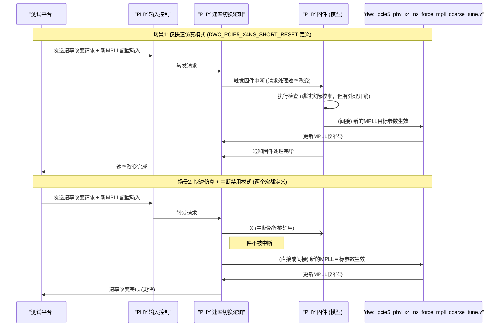

# Chapter 8: 中断禁用模式

欢迎来到 `verilog_model` 教程的第八章！在上一章 [快速仿真寄存器配置](07_快速仿真寄存器配置_.md) 中，我们学习了如何通过直接写入PHY内部寄存器来精细地控制和启用快速仿真特性，这为我们在门级仿真或需要特定加速场景时提供了强大的灵活性。

现在，我们来思考一个场景：假设您正在测试PHY在不同数据速率之间频繁切换的功能。即使我们已经启用了[快速仿真模式](06_快速仿真模式_.md)（通过宏定义或寄存器配置），PHY内部的固件（firmware）在每次感知到速率变化请求时，仍然可能会被中断。固件会执行一系列检查，判断是否需要进行某些校准或恢复操作（尽管在快速模式下，许多实际的校准步骤会被跳过）。这个固件中断和检查的过程，虽然比完整的校准快得多，但在需要极高仿真效率、特别是速率切换非常频繁的测试中，仍然可能累积成不可忽略的时间开销。

如果我们能让PHY在进行这些速率切换时，连固件的这些“例行检查”都暂时关闭，就像给一个正在执行紧急任务的机器人开启了“超级专注模式”，不受任何次要事件的打扰，那么速率切换过程是不是就能更快完成，从而进一步压缩我们的仿真时间呢？

本章将介绍的“中断禁用模式”就是为了实现这一目标而设计的。这是一种在快速仿真模式基础上的进一步优化选项。

## 什么是中断禁用模式？

中断禁用模式（Interrupt Disable Mode）正如其名，它的核心作用是在PHY进行速率改变等操作时，**禁用内部固件的中断处理流程**。

在正常的（即使是快速仿真）模式下，当PHY被请求改变其工作速率时，内部固件通常会被触发（中断）。这个固件会检查当前的配置，确定是否需要进行某些调整或校准（例如，重新加载某些参数，检查PLL状态等），即使在快速仿真模式下很多实际的校准步骤会被简化或跳过，固件的这个“响应和决策”过程本身还是会消耗一定的仿真时间。

通过启用中断禁用模式，我们告诉PHY：“在进行速率切换时，请不要打扰固件，直接按照预设的快速路径执行，固件相关的检查和校准请求都暂时忽略。”

**核心优势：**

*   **进一步缩短速率切换时间**：由于跳过了固件的中断响应和处理流程，速率切换可以更快完成。
*   **提高涉及频繁速率变化的仿真效率**：对于那些需要模拟PHY在多种速率间快速来回切换的测试场景，这种模式带来的时间节省尤为可观。

**一个生动的类比**：
想象一下，您正在指挥一艘高速快艇（PHY）执行一项紧急运输任务（数据传输）。
*   [快速仿真模式](06_快速仿真模式_.md) 就像是给快艇配备了超级引擎，让它能快速启动并达到最高速度。
*   然而，每次快艇需要调整航向或速度（速率切换）时，导航员（固件）仍然需要查看海图，与指挥中心确认一下（固件中断和检查）。
*   **中断禁用模式** 则更进一步，它相当于告诉导航员：“在这次任务中，所有预定的航向和速度调整，你都不需要再次确认，直接执行！我们已经预设好了最快的路径，无需任何额外的检查。”

这使得快艇在变换航向和速度时更加迅捷。

## 如何启用中断禁用模式？

启用中断禁用模式非常简单，通过定义一个特定的Verilog宏即可。根据 `verilog_model.pdf` 文档（第13页，“7.5.1 Interrupt Disable Mode”），你需要：

1.  **首先确保已经启用了快速仿真模式**：中断禁用模式是[快速仿真模式](06_快速仿真模式_.md)的一个附加选项。因此，您必须首先定义 `DWC_PCIE5_X4NS_SHORT_RESET` 宏。
2.  **额外定义 `DWC_PCIE5_X4NS_DISABLE_RATE_IRQ` 宏**：这个宏是开启中断禁用模式的关键。

也就是说，在您的仿真命令或脚本中，需要同时定义这两个宏。

**示例：在VCS仿真命令中定义宏**

```bash
# 概念性VCS仿真命令 - 展示如何同时定义两个宏
# 实际命令请参考项目中的仿真脚本 (例如 sim/run_vcs_gtech)
# vcs <源文件列表> <顶层模块> +define+DWC_PCIE5_X4NS_SHORT_RESET +define+DWC_PCIE5_X4NS_DISABLE_RATE_IRQ <其他选项>
```

**代码解释**：
*   `+define+DWC_PCIE5_X4NS_SHORT_RESET`：启用基础的快速仿真模式。
*   `+define+DWC_PCIE5_X4NS_DISABLE_RATE_IRQ`：在快速仿真模式的基础上，额外启用中断禁用模式。

当这两个宏都被定义后，PHY模型在仿真时的行为就会相应改变。

## 启用后的影响与注意事项

启用了中断禁用模式后，PHY的行为会有一些显著的变化，理解这些变化对于正确使用该模式至关重要：

1.  **固件在速率改变时不被中断**：这是该模式的核心效果。PHY在响应速率改变请求时，不会触发内部固件执行检查或校准恢复流程。
2.  **固件不执行校准或恢复**：在速率改变期间，固件不会进行任何校准或状态恢复操作。
3.  **MPLL/TX/RX Bank切换请求被固件忽略**：固件层面将不会处理这些切换请求。
4.  **MPLL校准码仍然更新**：这一点非常关键！即使固件被“禁用”了，MPLL（主锁相环）的校准码**仍然会得到正确的更新**。这是因为这些校准码是由一个名为 `dwc_pcie5_phy_x4_ns_force_mpll_coarse_tune.v` 的特殊Verilog文件驱动的（我们在[快速仿真模式](06_快速仿真模式_.md)章节中提到过它是“幕后英雄”之一）。这个文件会根据PHY的输入配置（例如目标速率相关的设置）强制设定正确的MPLL校准码，确保MPLL能锁定到新速率所需的频率。这个过程独立于被禁用的固件中断。
5.  **用户仍需正确配置PHY输入**：非常重要的一点是，即使MPLL校准码会被 `force_mpll_coarse_tune.v` 文件更新，**测试平台（用户）仍然有责任在请求速率改变时，向PHY模型提供正确的MPLL设置输入**（例如，与新速率对应的参考时钟分频比等控制信号）。中断禁用模式并不会自动帮你配置这些外部输入。如果外部输入配置不正确，即使 `force_mpll_coarse_tune.v` 尽力了，MPLL也可能无法锁定到正确的频率。
6.  **TX和RX DCC校准/恢复被移除**：根据文档（`verilog_model.pdf`，第13页的Note），定义 `DWC_PCIE5_X4NS_DISABLE_RATE_IRQ` 会导致在速率改变时，不再进行发送端（TX）和接收端（RX）的DCC（Duty Cycle Correction，占空比校正）校准和恢复。

**简而言之**：中断禁用模式让PHY在速率切换时“动作更快”，因为它跳过了固件的干预。但这种“快”依赖于 `force_mpll_coarse_tune.v` 模块来确保核心时钟（MPLL）的正确性，并且要求用户（测试平台）必须正确设置与新速率相关的PHY输入信号。同时，一些如DCC校准的特定调整会被牺牲。

## 内部实现机制（概念性）

当中断禁用模式相关的宏被定义后，PHY的Verilog RTL代码内部的条件编译指令（`` `ifdef``）会生效，从而改变代码的执行路径。

**概念性Verilog代码片段**：

想象一下PHY内部处理速率改变请求的某段逻辑：

```verilog
// 概念性代码 - 展示 DWC_PCIE5_X4NS_DISABLE_RATE_IRQ 宏如何影响逻辑
module phy_rate_change_controller (
    input clk,
    input rst_n,
    input rate_change_request,
    output logic rate_change_done,
    // ... 其他与固件交互的信号 ...
    output logic trigger_firmware_interrupt
);

    // ... 其他逻辑 ...

    always @(posedge clk or negedge rst_n) begin
        if (!rst_n) begin
            trigger_firmware_interrupt <= 1'b0;
            rate_change_done <= 1'b0;
        end else if (rate_change_request) begin
            // 速率改变请求到达

            `ifndef DWC_PCIE5_X4NS_DISABLE_RATE_IRQ  // 如果没有定义“中断禁用”宏
                // 正常（或仅快速仿真）模式：
                // 触发固件中断，让固件处理
                trigger_firmware_interrupt <= 1'b1;
                // 等待固件完成相关操作 (此处简化)
                // if (firmware_ack) rate_change_done <= 1'b1;
            `else
                // 中断禁用模式：
                // 不触发固件中断
                trigger_firmware_interrupt <= 1'b0;
                // 直接认为速率改变（的快速路径部分）已完成
                // (实际中，这里会有一系列不依赖固件的快速状态转换)
                rate_change_done <= 1'b1; // 极度简化
            `endif
            // ...
        end else begin
            trigger_firmware_interrupt <= 1'b0;
            // ...
        end
    end
endmodule
```

**代码解释**：
*   当 `DWC_PCIE5_X4NS_DISABLE_RATE_IRQ` **未定义**时，如果 `rate_change_request` 发生，`trigger_firmware_interrupt` 信号会被置位，以通知固件介入。
*   当 `DWC_PCIE5_X4NS_DISABLE_RATE_IRQ` **已定义**时，即使 `rate_change_request` 发生，`trigger_firmware_interrupt` 保持为低，固件的中断路径被绕过。速率改变的过程会遵循一个不依赖固件的、更快的路径（这里的 `rate_change_done <= 1'b1;` 是一个极度简化的表示）。

**数据流：速率改变请求的处理**

下面的序列图概念性地展示了在有无中断禁用模式时，速率改变请求的处理流程有何不同：



**图解解释**：
*   **场景1 (仅快速仿真)**：当速率改变请求发生时，PHY的速率切换逻辑会通知固件。固件进行（简化的）处理，并间接影响MPLL的设置（通过 `MPLL_Forcer`）。
*   **场景2 (快速仿真 + 中断禁用)**：当速率改变请求发生时，PHY的速率切换逻辑**绕过了固件的中断**。MPLL的更新主要依赖于测试平台提供的正确输入和 `MPLL_Forcer` 模块的强制作用。整个过程因为减少了固件的介入而更快。

## 何时使用中断禁用模式？

中断禁用模式是一个“双刃剑”，它在特定场景下非常有用，但也牺牲了一些东西：

**推荐使用场景**：
*   **验证涉及大量、快速的速率切换**：当您的测试主要关注PHY在不同速率间切换的逻辑本身，或者上层应用在这种切换下的响应，而不是固件在切换过程中的详细行为时。
*   **极致的仿真速度追求**：当每一微秒的仿真时间都很宝贵，且您确信固件在速率切换时的介入对于当前测试点不是必需的。
*   **回归测试中对速率切换覆盖率的快速收集**：如果大量回归测试涉及到速率切换，但不需要验证固件的详细校准逻辑。

**不推荐或需谨慎使用的场景**：
*   **验证固件在速率改变时的行为**：如果您需要精确验证固件是如何响应速率变化请求、执行哪些检查、以及如何控制校准和恢复流程的，那么不应使用此模式。
*   **调试与固件相关的速率切换问题**：如果速率切换失败，并且怀疑问题与固件处理有关，禁用固件中断会掩盖问题。
*   **依赖DCC校准的精确性**：由于此模式会移除速率改变时的TX/RX DCC校准，如果您的测试对占空比有严格要求，则需谨慎评估。

**核心权衡**：中断禁用模式用“牺牲固件在速率切换时的部分介入和特定校准（如DCC）”来换取“更快的速率切换仿真时间”。

## 总结

在本章中，我们深入了解了“中断禁用模式”：

*   它是在[快速仿真模式](06_快速仿真模式_.md)基础上的一个**进一步优化选项**，旨在缩短涉及PHY速率改变操作时的仿真时间。
*   通过同时定义 `DWC_PCIE5_X4NS_SHORT_RESET` 和 `DWC_PCIE5_X4NS_DISABLE_RATE_IRQ` 这两个宏来启用。
*   启用后，PHY内部固件在响应速率改变请求时**不会被中断**，相关的固件检查和校准流程会被跳过。
*   关键的MPLL校准码仍然会由 `dwc_pcie5_phy_x4_ns_force_mpll_coarse_tune.v` 文件根据PHY输入进行更新，但用户必须确保为PHY提供正确的外部MPLL配置输入。
*   此模式会移除速率改变时的TX和RX DCC校准和恢复。
*   它适用于追求极致仿真速度、特别是测试频繁速率切换且不侧重验证固件详细行为的场景。

中断禁用模式为我们提供了一个在特定条件下进一步压缩仿真时间的强大工具。了解这些加速仿真技巧的同时，我们也需要清楚，这些模型毕竟是实际硬件的抽象，它们会有其固有的局限性。

在下一章，也是本教程的最后一章，我们将一起探讨 [仿真模型局限性](09_仿真模型局限性_.md)，了解在使用这些Verilog模型进行仿真时，哪些方面可能无法完全精确地反映真实硬件的行为，以及我们应该如何客观看待仿真结果。

---

Generated by [AI Codebase Knowledge Builder](https://github.com/The-Pocket/Tutorial-Codebase-Knowledge)