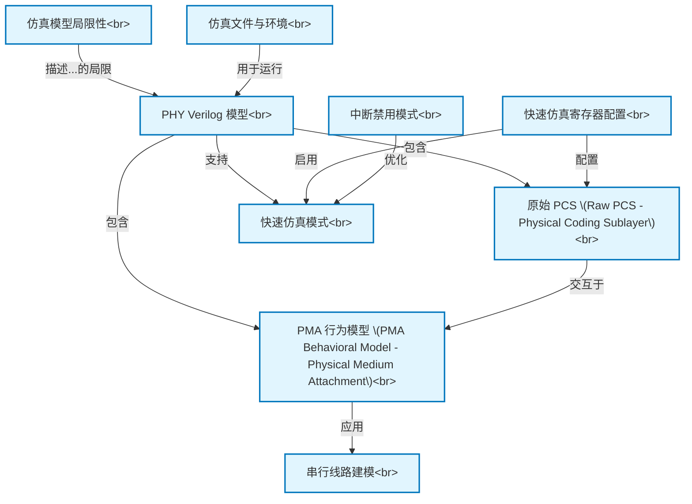

# Tutorial: verilog_model

该项目提供了一个 **PCIe 5.0 PHY (物理层)** 的*数字验证模型*。它主要由两部分构成：负责数字逻辑处理的 **原始PCS (Raw PCS)** 的RTL代码，以及模拟PHY模拟电路行为的 **PMA行为模型**。这个模型使得工程师能够在芯片实际制造之前，通过仿真来验证PHY的逻辑功能，并且支持*快速仿真模式*以显著缩短设计和验证周期。

**Source Repository:** [None](None)

## Chapters

1. [PHY Verilog 模型
](01_phy_verilog_模型_.md)
2. [原始 PCS (Raw PCS - Physical Coding Sublayer)
](02_原始_pcs__raw_pcs___physical_coding_sublayer__.md)
3. [PMA 行为模型 (PMA Behavioral Model - Physical Medium Attachment)
](03_pma_行为模型__pma_behavioral_model___physical_medium_attachment__.md)
4. [串行线路建模
](04_串行线路建模_.md)
5. [仿真文件与环境
](05_仿真文件与环境_.md)
6. [快速仿真模式
](06_快速仿真模式_.md)
7. [快速仿真寄存器配置
](07_快速仿真寄存器配置_.md)
8. [中断禁用模式
](08_中断禁用模式_.md)
9. [仿真模型局限性
](09_仿真模型局限性_.md)

---

Generated by [AI Codebase Knowledge Builder](https://github.com/The-Pocket/Tutorial-Codebase-Knowledge)